# 总体分层

​		总体分为业务层`(Biz)、RPC`层`、Remote`三层。

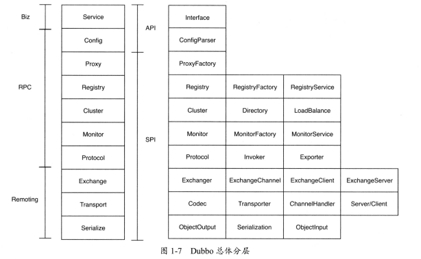

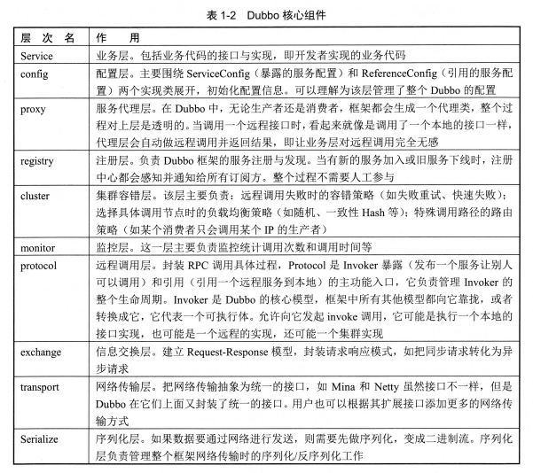

## 总体调用过程

​		首先，服务器端`(`服务提供者`)`在框架启动时，会初始化服务实例，通过`Proxy`组件调用具体协议`(Protocol)`，把服务端要暴露的接口封装成`Invoker(`真

实类型是`AbstractProxylnvoker`，然后转换成`Exporter`，这个时候框架会打开服务端口等并记录服务实例到内存中，最后通过`Registry`把服务元数据注册到注册

中心。

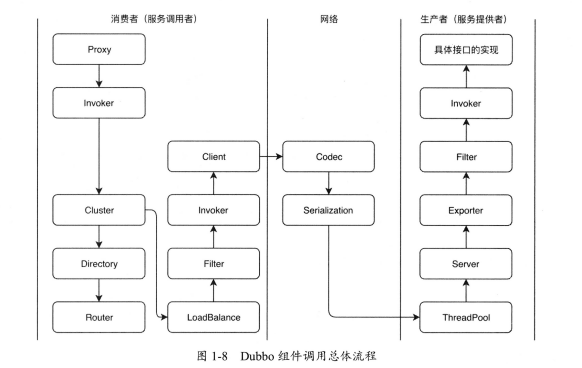

# Hello World

​		服务端：

```java
public interface HelloService {
    String sayHello();
}

// 配置服务,可以配置 methods 属性控制多个方法的超时时间，重试次数等信息
@DubboService
public class AnnotationHelloServiceImpl implements HelloService {
    @Override
    public String sayHello() {
        System.out.println("Hello World");
        return "Annotation, hello " + name;
    }
}
```

```java
@Configuration
@EnableDubbo(scanBasePackages = "org.apache.dubbo.samples.annotation.impl") // 配置扫描服务的包
@PropertySource("classpath:/spring/dubbo-provider.properties")
public class ProviderConfiguration {
    @Bean
    public ProviderConfig providerConfig() {
        ProviderConfig providerConfig = new ProviderConfig();
        providerConfig.setTimeout(1000); // 设置全局服务的超时时间
        return providerConfig;
    }
}
```

```properties
# dubbo-provider.properties
dubbo.application.name=samples-annotation-provider
dubbo.registry.address=zookeeper://${zookeeper.address:127.0.0.1}:2181
dubbo.protocol.name=dubbo
dubbo.protocol.port=20880
dubbo.provider.token=true
```

```java
public static void main(String[] args) throws Exception {
        AnnotationConfigApplicationContext context = new AnnotationConfigApplicationContext(ProviderConfiguration.class); // Spring加载IOC
        context.start();

        System.out.println("dubbo service started.");
        new CountDownLatch(1).await();
    }
```


​		消费端：

```java
@Component("annotationAction")
public class AnnotationAction {

    // 配置调用的远程服务，同样可以配置 methods 属性，这里配置的信息会覆盖服务器配置的信息
    @DubboReference(interfaceClass = HelloService.class, version = AnnotationConstants.VERSION)
    private HelloService helloService;

    public String doSayHello() {
        try {
            return helloService.sayHello();
        } catch (Exception e) {
            e.printStackTrace();
            return "Throw Exception";
        }
    }
}
```

```java
@Configuration
@EnableDubbo(scanBasePackages = "org.apache.dubbo.samples.annotation.action") // 配置扫描服务的包
@PropertySource("classpath:/spring/dubbo-consumer.properties")
@ComponentScan(value = {"org.apache.dubbo.samples.annotation.action"}) // Spring 扫描 Bean 的路径
public class ConsumerConfiguration {

}
```

```properties
# dubbo-consumer.properties
dubbo.application.name=samples-annotation-consumer
dubbo.registry.address=zookeeper://${zookeeper.address:127.0.0.1}:2181
dubbo.application.qosEnable=true
dubbo.application.qosPort=33333
dubbo.application.qosAcceptForeignIp=false
```

```java
public static void main(String[] args) {
        AnnotationConfigApplicationContext context = new AnnotationConfigApplicationContext(ConsumerConfiguration.class);
        context.start();
        final AnnotationAction annotationAction = (AnnotationAction) context.getBean("annotationAction");
		System.out.println("hello : " + annotationAction.doSayHello());
}
```


# 注册中心

​		`Dubbo`通过注册中心实现了分布式 环境中各服务之间的注册与发现，是各个分布式节点之间的纽带。作用：

​				1、动态加入：一个服务提供者通过注册中心可以动态地把自己暴露给其他消费者，无须消费者逐个去更新配置文件。

​				2、动态发现：一个消费者可以动态地感知新的配置、路由规则和新的服务提供者，无须重启服务使之生效。

​				3、动态调整：注册中心支持参数的动态调整，新参数自动更新到所有相关服务节点。

​				4、统一配置：避免了本地配置导致每个服务的配置不一致问题。

​		`ZooKeeper`是官方推荐的注册中心，在生产环境中有过实际使用，具体的实现在`Dubbo`源码的`dubbo-registry-zookeeper`模块中。阿里内部并没有使用

`Redis`作为注册中心，`Redis`注册中心并没有经过长时间运行的可靠性验证，其稳定性依赖于`Redis`本身。`Multicast`模式则不需要启动任何注册中心，只要通过

广播地址，就可以互相发现。服务提供者启动时，会广播自己的地址。消费者启动时，会广播订阅请求，服务提供者收到订阅请求，会根据配置广播或单播给订阅

者。不建议在生产环境使用。

​		`Dubbo`拥有良好的扩展性，如果以上注册中心都不能满足需求，那么可以基于`RegistryFactory`和`Registry`自行扩展。


## 工作流程

​		1、服务提供者启动时，会向注册中心写入自己的元数据信息，同时会订阅配置元数据信息。

​		2、消费者启动时，也会向注册中心写入自己的元数据信息，并订阅服务提供者、路由和配置元数据信息。

​		3、服务治理中心启动时，会同时订阅所有消费者、服务提供者、路由和配置元数据信息。

​		4、当有服务提供者离开或有新的服务提供者加入时，注册中心服务提供者目录会发生变化，变化信息会动态通知给消费者、服务治理中心。

​		5、当消费方发起服务调用时，会异步将调用、统计信息等上报给监控中心。

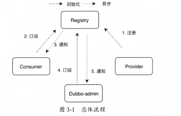


## 原理概述

​		`ZooKeeper`是树形结构的注册中心，每个节点的类型分为持久节点、持久顺序节点、临时节点和临时顺序节点。

​				持久节点：服务注册后保证节点不会丢失，注册中心重启也会存在。

​				持久顺序节点：在持久节点特性的基础上增加了节点先后顺序的能力。

​				临时节点：服务注册后连接丢失或`session`超时，注册的节点会自动被移除。

​				临时顺序节点：在临时节点特性的基础上增加了节点先后顺序的能力。

​		`Dubbo`使用`ZooKeeper`作为注册中心时，只会创建持久节点和临时节点两种，对创建的顺序并没有要求。

​		`ZooKeeper`的树形结构，分为四层：`root(`根节点`)`、`service(`接口名称`)`、四种服务目录`(providers、consumers、routers、configurations)`、服务目录

下具体的`Dubbo`服务`URL`。

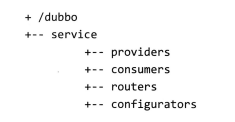

​				1、树的根节点是注册中心分组，下面有多个服务接口，分组值来自用户配置`<dubbo:registry>`中的`group`属性，默认是`/dubbo`。

​				2、服务接口下包含`4`类子目录，分别是`providers、consumers、routers、configurators`，这个路径是持久节点。

​				3、服务提供者目录`(/dubbo/service/providers)`下面包含的接口有多个服务者`URL`元数据信息。

​				4、服务消费者目录`(/dubbo/service/consumers)`下面包含的接口有多个消费者`URL`元数据信息。

​				5、路由配置目录`(/dubbo/service/routers)`下面包含多个用于消费者路由策略`URL`元数据信息。

​				6、动态配置目录`(/dubbo/service/configurators)`下面包含多个用于服务者动态配置`URL`元数据信息。

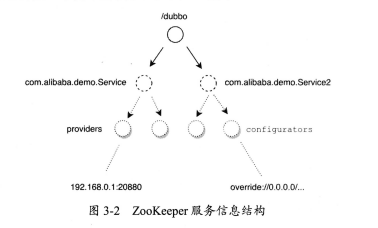

​		在`Dubbo`框架启动时，会根据用户配置的服务，在注册中心中创建`4`个目录，在`providers`和`consumers`目录中分别存储服务提供方、消费方元数据信息，

主要包括`IP`、端口、权重和应用名等数据。

​		在`Dubbo`框架进行服务调用时，用户可以通过服务治理平台下发路由配置。如果要在运行时改变服务参数，则用户可以通过服务治理平台下发动态配置。服

务器端会通过订阅机制收到属性变更，并重新更新已经暴露的服务。 


​		`Redis`注册中心也沿用了`Dubbo`抽象的`Root、Service、Type、URL`四层结构。但是由于`Redis`属于`NoSQL`数据库，数据都是以键值对的形式保存的，并不能

像`ZooKeeper`一样直接实现树形目录结构。因此，`Redis`使用了`key/Map`结构实现了这个需求，`Root、Service、Type`组合成`Redis`的`key`，`Redis`的`value`是一

个`Map`结构，`URL`作为`Map`的`key`，超时时间作为`Map`的`value`。

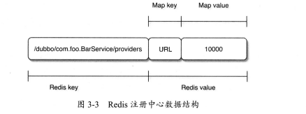

```java
public void doRegister(URL url) {
        String key = toCategoryPath(url); // 生成 redis 的 key
        String value = url.toFullString(); // 生成 URL
        String expire = String.valueOf(System.currentTimeMillis() + expirePeriod); // 超时时间
        try {
            redisClient.hset(key, value, expire); // 注册到 redis 注册中心
            redisClient.publish(key, REGISTER);
        } catch (Throwable t) {
            throw new RpcException("Failed to register service to redis registry. registry: " + url.getAddress() + ", service: " + url + ", cause: " + t.getMessage(), t);
        }
    }
```


## 订阅/发布

​		当一个已有服务提供者节点下线，或者一个新的服务提供者节点加入微服务环境时，订阅对应接口的消费者和服务治理中心都能及时收到注册中心的通知，并

更新本地的配置信息。如此一来，后续的服务调用就能避免调用已经下线的节点，或者能调用到新的节点。整个过程都是自动完成的，不需要人工参与。

​		服务提供者和消费者都需要把自己注册到注册中心。服务提供者的注册是为了让消费者感知服务的存在，从而发起远程调用；也让服务治理中心感知有新的服

务提供者上线。消费者的发布是为了让服务治理中心可以发现自己。

```java
zkClient.create(toUrlPath(url), url.getParameter(DYNAMIC_KEY, true)); // 发布，即调用 zookeeper 客户端在注册中心上创建一个目录
zkClient.delete(toUrlPath(url)); // 取消发布，即调用 zookeeper 客户端在注册中心上删除对应的目录
```


​		订阅通常有`pull`和`push`两种方式，一种是客户端定时轮询注册中心拉取配置，另一种是注册中心主动推送数据给客户端。这两种方式各有利弊，目前

`Dubbo`采用的是第一次启动拉取方式，后续接收事件重新拉取数据。 在服务暴露时，服务端会订阅`configurators`用于监听动态配置，在消费端启动时，消费端会

订阅`providers、routers`和`configuratops`这三个目录，分别对应服务提供者、路由和动态配置变更通知。

​		可以在`<dubbo:registry>`的`client`属性中设置`curator、zkclient`来使用不同的客户端实现库，如果不设置则默认使用`Curator`作为实现。

​		`ZooKeeper`注册中心采用的是事件通知`+`客户端拉取的方式，客户端在第一次连接上注册中心时，会获取对应目录下全量的数据。并在订阅的节点上注册一

个`watcher`，客户端与注册中心之间保持`TCP`长连接，后续每个节点有任何数据变化的时候，注册中心会根据`watcher`的回调主动通知客户端，客户端接到通知

后，会把对应节点下的全量数据都拉取过来。全量拉取有一个局限，当微服务节点较多时会对网络造成很大的压力。

​		`ZooKeeper`的每个节点都有一个版本号，当某个节点的数据发生变化`(`即事务操作`)`时， 该节点对应的版本号就会发生变化，并触发`watcher`事件，推送数

据给订阅方。版本号强调的是变更次数，即使该节点的值没有变化，只要有更新操作，依然会使版本号变化。

​		事务操作：客户端任何新增、删除、修改、会话创建和失效操作，都会被认为是事务操作，会由`ZooKeeper`集群中的`leader`执行。即使客户端连接的是非

`leader`节点，请求也会被转发给`leader`执行，以此来保证所有事物操作的全局时序性。由于每个节点都有一个版本号，因此可以通过`CAS`操作比较版本号来保证

该节点数据操作的原子性。

​		客户端第一次连上注册中心，订阅时会获取全量的数据，后续则通过监听器事件进行更新。 服务治理中心会处理所有`service`层的订阅，`service`被设置成

特殊值`*`。此外，服务治理中心除了订阅当前节点，还会订阅这个节点下的所有子节点：

```java
if (ANY_VALUE.equals(url.getServiceInterface())) {
		String root = toRootPath();
         boolean check = url.getParameter(CHECK_KEY, false);
         ConcurrentMap<NotifyListener,ChildListener> listeners = zkListeners.computeIfAbsent(url,k -> new ConcurrentHashMap<>()); //订阅所有数据
         ChildListener zkListener = listeners.computeIfAbsent(listener, k -> (parentPath, currentChilds) -> {
         		for (String child : currentChilds) { // 子节点有变化
                 	child = URL.decode(child);
                 	if (!anyServices.contains(child)) { // 当前子节点未被订阅，即是新节点，立即订阅
                    	anyServices.add(child);
                        subscribe(url.setPath(child).addParameters(INTERFACE_KEY, child,Constants.CHECK_KEY, String.valueOf(check)), k);
                    }
         		}
         });
		zkClient.create(root, false); // 创建持久节点
		List<String> services = zkClient.addChildListener(root, zkListener);
		if (CollectionUtils.isNotEmpty(services)) {
				for (String service : services) { // 遍历所有子节点进行订阅
					service = URL.decode(service);
					anyServices.add(service);
					subscribe(url.setPath(service).addParameters(INTERFACE_KEY, service,Constants.CHECK_KEY, String.valueOf(check)), listener);
				}
		}
}
```

​		普通消费者首先根据`URL`的类别得到一组需要订阅的路径。如果类别是`*`，则会订阅四种类型的路径`(providers、routers、consumers、configurators)`, 否

则只订阅`providers`路径：

```java
List<URL> urls = new ArrayList<>();
for (String path : toCategoriesPath(url)) { // 根据 URL 类别获取一组需要订阅的路径
	ConcurrentMap<NotifyListener, ChildListener> listeners = zkListeners.computeIfAbsent(url, k -> new ConcurrentHashMap<>());
	ChildListener zkListener = listeners.computeIfAbsent(listener, k -> new RegistryChildListenerImpl(url, path, k, latch));
	if (zkListener instanceof RegistryChildListenerImpl) {
		((RegistryChildListenerImpl) zkListener).setLatch(latch);
	}
	zkClient.create(path, false);
	List<String> children = zkClient.addChildListener(path, zkListener); // 订阅，返回该节点下的子路径并缓存
	if (children != null) {
		urls.addAll(toUrlsWithEmpty(url, path, children));
	}
}
notify(url, listener, urls); // I回调 NotifyListener,更新本地缓存信息
```

​		此处会根据`URL`中的`category`属性值获取具体的类别：`providers、routers、 consumers、configurators`，然后拉取直接子节点的数据进行通知`(notify)`。

如果是`providers`类别的数据，则订阅方会更新本地`Directory`管理的`Invoker`服务列表；如果是`routers`分类，则订阅方会更新本地路由规则列表；如果是

`configuators`类别，则订阅方会更新或覆盖本地动态参数列表。


​		`Redis`订阅发布使用的是过期机制和`publish/subscribe`通道。服务提供者发布服务，首先会在`Redis`中创建一个`key`，然后在通道中发布一条`register`事

件消息。 但服务的`key`写入`Redis`后，发布者需要周期性地刷新`key`过期时间，在`RedisRegistry`构造方法中会启动一个`expireExecutor`定时调度线程池，不断

调用`deferExpired()`方法去延续`key`的超时时间。如果服务提供者服务宕机，没有续期，则`key`会因为超时而被`Redis`删除，服务也就会被认定为下线。

​		订阅方首次连接上注册中心，会获取全量数据并缓存在本地内存中。后续的服务列表变化则通过`publish/subscribe`通道广播，当有服务提供者主动下线的时

候，会在通道中广播一条`unregister`事件消息，订阅方收到后则从注册中心拉取数据，更新本地缓存的服务列表。新服务提供者上线也是通过通道事件触发更新

的。

​		如果使用`Redis`作为服务注册中心，会依赖于服务治理中心。如果服务治理中心定时调度， 则还会触发清理逻辑：获取`Redis`上所有的`key`并进行遍历，如

果发现`key`已经超时，则删除`Redis`上对应的`key`。清除完后，还会在通道中发起对应`key`的`unregister`事件，其他消费者监听到取消注册事件后会删除本地对

应服务的数据，从而保证数据的最终一致。

```java
private void deferExpired() {
	for (URL url : new HashSet<>(getRegistered())) { // 获取所有已注册的 key ，进行遍历
		if (url.getParameter(DYNAMIC_KEY, true)) {
			String key = toCategoryPath(url);
			if (redisClient.hset(key, url.toFullString(), String.valueOf(System.currentTimeMillis() + expirePeriod)) == 1) {
				redisClient.publish(key, REGISTER); // 如果返回 1 ，说明 key 已经被删除，重新发布，在通道中广播
			}
		}
	}

	if (doExpire) {
		for (Map.Entry<URL, Long> expireEntry : expireCache.entrySet()) {
			if (expireEntry.getValue() < System.currentTimeMillis()) {
				doNotify(toCategoryPath(expireEntry.getKey()));
			}
		}
	}

	if (admin) { // 如果是服务治理中心，则还要清理过期的 key
		clean();
	}
}
```

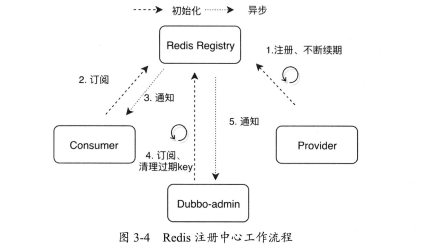

​		`Redis`客户端初始化的时候，需要先初始化`Redis`的连接池`jedisPools`，此时如果配置注册中心的集群模式为`<dubbo:registry cluster="replicate" />`，

则服务提供者在发布服务的时候，需要同时向`Redis`集群中所有的节点都写入，是多写的方式。但读取还是从一个节点中读取。 在这种模式下，`Redis`集群可以

不配置数据同步，一致性由客户端的多写来保证。 

​		如果设置为`failover`或不设置，则只会读取和写入任意一个`Redis`节点，失败的话再尝试下一个`Redis`节点。这种模式需要`Redis`自行配置数据同步。 

​		另外，在初始化阶段，还会初始化一个定时调度线程池`expireExecutor`，它主要的任务是延长`key`的过期时间和删除过期的`key`线程池调度的时间间隔是超

时时间的一半。

​		发布：服务提供者和消费者都会使用注册功能。


​		在订阅时，如果是首次订阅，则会先创建一个`Notifier`内部类，这是一个线程类，在启动时会异步进行通道的订阅。在启动`Notifier`线程的同时，主线程会

继续往下执行，全量拉一次注册中心上所有的服务信息。后续注册中心上的信息变更则通过`Notifier`线程订阅的通道推送事件来实现。

```java
if (service.endsWith(ANY_VALUE)) { // 以 * 结尾，订阅所有服务
	if (first) { // 不是第一次，则获取所有服务的 key ，并更新本地缓存
		first = false;
		Set<String> keys = redisClient.scan(service);
		if (CollectionUtils.isNotEmpty(keys)) {
			for (String s : keys) {
				doNotify(s);
			}
		}
		resetSkip(); // 重置计数器
	}
	redisClient.psubscribe(new NotifySub(), service);
}
else {
	if (first) { // 不以 * 结尾，且不是第一次，则代表已订阅过
		first = false;
		doNotify(service); // 出发通知，更新本地缓存，重置失败计数器
		resetSkip();
	}
	redisClient.psubscribe(new NotifySub(), service + PATH_SEPARATOR + ANY_VALUE); // 订阅一个或多个符合给定模式的频道
}
```


## 缓存

​		缓存的存在就是用空间换取时间，如果每次远程调用都要先从注册中心获取一次可调用的服务列表，则会让注册中心承受巨大的流量压力。另外，每次额外的

网络请求也会让整个系统的性能下降。因此`Dubbo`的注册中心实现了通用的缓存机制。

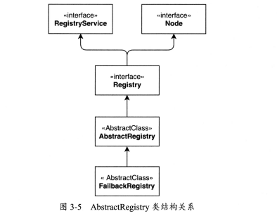

​		消费者或服务治理中心获取注册信息后会做本地缓存。内存中会有一份，保存在`Properties`对象里，磁盘上也会持久化一份文件，通过`file`对象引用：

```java
private final Properties properties = new Properties();
private File file; // 磁盘文件服务缓存对象
private final ConcurrentMap<URL, Map<String, List<URL>>> notified = new ConcurrentHashMap<>(); // 内存中的服务缓存对象
```

​		内存中的缓存`notified`是`ConcurrentHashMap`里面又嵌套了一个`Map`，外层`Map`的`key`是消费者的`URL`，内层`Map`的`key`是分类，包含`providers、`

`consumers、routes、configurators`四种。`value`则是对应的服务列表，对于没有服务提供者提供服务的`URL`，它会以特殊的`empty://`前缀开头。


​		在服务初始化的时候，`AbstractRegistry`构造函数里会从本地磁盘文件中把持久化的注册数据读到`Properties`对象里，并加载到内存缓存中：

```java
	private void loadProperties() {
        if (file != null && file.exists()) {
            InputStream in = null;
            try {
                in = new FileInputStream(file); // 读取本地缓存文件
                properties.load(in);
                if (logger.isInfoEnabled()) {
                    logger.info("Loaded registry cache file " + file);
                }
            } catch (Throwable e) {
                logger.warn("Failed to load registry cache file " + file, e);
            } finally {
                if (in != null) {
                    try {
                        in.close();
                    } catch (IOException e) {
                        logger.warn(e.getMessage(), e);
                    }
                }
            }
        }
    }
```

​		`Properties`保存了所有服务提供者的`URL`，使用`URL#serviceKey()`作为`key`，提供者列表、路由规则列表、配置规则列表等作为`value`。由于`value`是列

表，当存在多个的时候使用空格隔开。还有一个特殊的`key.registies`，保存所有的注册中心的地址。如果应用在启动过程中注册中心无法连接或宕机，则`Dubbo`

框架会自动通过本地缓存加载`Invokers`。


​		缓存的保存有同步和异步两种方式。异步会使用线程池异步保存，如果线程在执行过程中出现异常，则会再次调用线程池不断重试：

```java
	private void saveProperties(URL url) {
        ...
            if (syncSaveFile) {
                doSaveProperties(version); // 同步保存
            } else {
                registryCacheExecutor.execute(new SaveProperties(version)); // 异步保存
            }
        ...
    }
```

​		`AbstractRegistry#notify`方法中封装了更新内存缓存和更新文件缓存的逻辑。当客户端第一次订阅获取全量数据，或者后续由于订阅得到新数据时，都会调

用该方法进行保存。


## 重试

​		`FailbackRegistry`继承了`AbstractRegistry`，并在此基础上增加了失败重试机制作为抽象能力。`ZookeeperRegistry`和`RedisRegistry`继承该抽象方法后，

直接使用即可。

​		`FailbackRegistry`抽象类中定义了一个`ScheduledExecutorService`，每经过固定间隔`(`默认为`5`秒`)`调用`FailbackRegistry#retry()`方法。另外，该抽象类

中还有五个比较重要的集合：

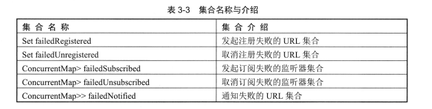

​		在定时器中调用`retry`方法的时候，会把这五个集合分别遍历和重试，重试成功则从集合中移除。`FailbackRegistry`实现了`subscribe、unsubscribe`等通用

方法，里面调用了未实现的模板方法，会由子类实现。通用方法会调用这些模板方法，如果捕获到异常，则会把`URL`添加到对应的重试集合中，以供定时器去重

试。


# 扩展点加载机制

## SPI

​		`SPI`的全称是`Service Provider Interface`，起初是提供给厂商做插件开发的。`Java SPI`使用了策略模式，一个接口多种实现。我们只声明接口，具体的实

现并不在程序中直接确定，而是由程序之外的配置掌控，用于具体实现的装配：

​				1、定义一个接口及对应的方法。

​				2、编写该接口的一个实现类。

​				3、在`META-INF/services/`目录下，创建一个以接口全路径命名的文件。`Spring Boot`则在`resource`目录下创建`META-INF/services/`。

​				4、文件内容为具体实现类的全路径名，如果有多个，则用分行符分隔。

​				5、在代码中通过`java.util.ServiceLoader`来加载具体的实现类。

```java
public interface HelloSerivice {
    public void hello(String name);
}
public class HelloSeriviceImpl implements HelloSerivice {
    @Override
    public void hello(String name) {
        System.out.println("hello " + name);
    }
}
```

```java
    public static void main(String[] args) {
        ServiceLoader<HelloSerivice> load = ServiceLoader.load(HelloSerivice.class);
        for(HelloSerivice temp : load)
        {
            temp.hello("xiaoshanshan");
        }
    }
```

​		`com.shanji.over.spi.HelloSerivice`：

```tex
com.shanji.over.impl.HelloSeriviceImpl
```


​		`JDK`标准的`SPI`会一次性实例化扩展点所有实现，如果有扩展实现则初始化很耗时，如果没用上也加载，则浪费资源。


​		`Dubbo`对`SPI`做了一定的优化和修改：

​				增加了对扩展`IoC`和`AOP`的支持，一个扩展可以直接`setter`注入其他扩展。`Dubbo SPI`只是加载配置文件中的类， 并分成不同的种类缓存在内存中，

​		而不会立即全部初始化，在性能上有更好的表现。

```java
@SPI("impl")
public interface HelloSerivice {
    public void hello(String name);
}

public class HelloSeriviceImpl implements HelloSerivice {
    @Override
    public void hello(String name) {
        System.out.println("hello " + name);
    }
}
```

​				与`Java SPI`一样也要建立全路径接口名的文件，不过此时是在`dubbo/internal`目录下创建：

```java
impl=com.shanji.over.impl.HelloSeriviceImpl
```

```java
	public static void main(String[] args) {
        HelloSerivice serivice = ExtensionLoader.getExtensionLoader(HelloSerivice.class).getDefaultExtension();
        serivice.hello("xiaoshanshan");
    }
```

​		`Java SPI`加载失败，可能会因为各种原因导致异常信息被吞掉，导致开发人员问题追踪比较困难。`Dubbo SPI`在扩展加载失败的时候会先抛出真实异常并打

印日志。扩展点在被动加载的时候，即使有部分扩展加载失败也不会影响其他扩展点和整个框架的使用。


## 配置规范

​		`Dubbo SPI`和`Java SPI`类似，需要在`META-INF/dubbo/`下放置对应的`SPI`配置文件，文件名称需要命名为接口的全路径名。配置文件的内容为`key=`扩展点实

现类全路径名，如果有多个实现类则使用换行符分隔。其中，`key`会作为`Dubbo SPI`注解中的传入参数。另外，`Dubbo SPI`还兼容了`Java SPI`的配置路径和内容

配置方式。在`Dubbo`启动的时候，会默认扫三个目录下的配置文件：`META-INF/services/、META-INF/dubbo/、META-INF/dubbo/internal/`：

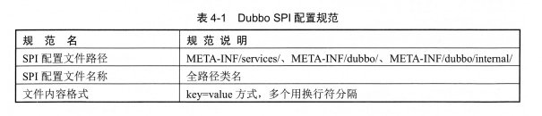


## 分类与缓存

​		`Dubbo SPI`可以分为`Class`缓存、实例缓存。这两种缓存又能根据扩展类的种类分为普通扩展类、包装扩展类、自适应扩展类：

​				`Class`缓存：`Dubbo SPI`获取扩展类时，会先从缓存中读取。如果缓存中不存在，则加载配置文件，根据配置把`Class`缓存到内存中，并不会直接全部

​		初始化。

​				实例缓存：基于性能考虑，`Dubbo`框架中不仅缓存`Class`，也会缓存`Class`实例化后的对象。每次获取的时候，会先从缓存中读取，如果缓存中读不

​		到，则重新加载并缓存起来。

​				普通扩展类：最基础的，配置在`SPI`配置文件中的扩展类实现。

​				包装扩展类：这种`Wrapper`类没有具体的实现，只是做了通用逻辑的抽象，并且需要在构造方法中传入一个具体的扩展接口的实现。属于`Dubbo`的自动

​		包装特性。

​				自适应扩展类：一个扩展接口会有多种实现类，具体使用哪个实现类可以不写死在配置或代码中，在运行时，通过传入`URL`中的某些参数动态来确定。

​		这属于扩展点的自适应特性。

​		其他缓存：如扩展类加载器缓存、扩展名缓存等

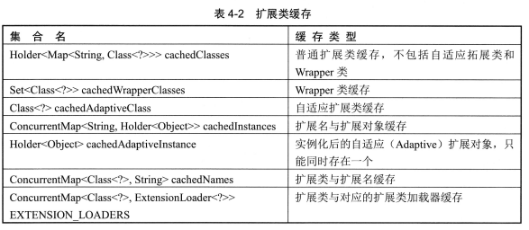


## 扩展点的特性

### 自动包装

​		自动包装一种被缓存的扩展类，`ExtensionLoader`在加载扩展时，如果发现这个扩展类包含其他扩展点`(Protocol`类型`)`作为构造函数的参数，则这个扩展类

就会被认为是`Wrapper`类。这是一种装饰器模式，把通用的抽象逻辑进行封装或对子类进行增强，让子类可以更加专注具体的实现。


### 自动加载

​		除了在构造函数中传入其他扩展实例，还经常使用`setter`方法设置属性值。如果某个扩展类是另外一个扩展点类的成员属性，并且拥有`setter`方法，那么框

架也会自动注入对应的扩展点实例。`ExtensionLoader`在执行扩展点初始化的时候，会自动通过`setter`方法注入对应的实现类。


### 自适应

​		在`Dubbo SPI`中，使用`@Adaptive`注解，可以动态地通过`URL`中的参数来确定要使用哪个具体的实现类。从而解决自动加载中的实例注入问题。


### 自动激活

​		使用`@Activate`注解，可以标记对应的扩展点默认被激活启用。该注解还可以通过传入不同的参数，设置扩展点在不同的条件下被自动激活。主要的使用场景

是某个扩展点的多个实现类需要同时启用。


## 注解

### @SPI

​		`@SPI`注解可以使用在类、接口和枚举类上，`Dubbo`框架中都是使用在接口上。它的主要作用就是标记这个接口是一个`Dubbo SPI`接口，即是一个扩展点，可

以有多个不同的内置或用户定义的实现。运行时需要通过配置找到具体的实现类。

​		`Dubbo`中很多地方通过`getExtension(Class type. String name)`来获取扩展点接口的具体实现，此时会对传入的`Class`做校验，判断是否是接口，以及是否

有`@SPI`注解，两者缺一不可。


### ©Adaptive

​		`@Adaptive`注解可以标记在类、接口、枚举类和方法上，如果标注在接口的方法上，即方法级别注解，则可以通过参数动态获得实现类，方法级别注解在第一

次`getExtension`时，会自动生成和编译一个动态的`Adaptive`类，从而达到动态实现类的效果。

​		当该注解放在实现类上，则整个实现类会直接作为默认实现，不再自动生成代码。在扩展点接口的多个实现里，只能有一个实现上可以加`@Adaptive`注解。如

果多个实现类都有该注解，则会抛出异常。

​		`ExtensionLoader`中会缓存两个与`©Adaptive`有关的对象，一个缓存在`cachedAdaptiveClass`中， 即`Adaptive`具体实现类的`Class`类型；另外一个缓存在

`cachedAdaptivelnstance`中，即`Class`的具体实例化对象。在扩展点初始化时，如果发现实现类有`@Adaptive`注解，则直接赋值给`cachedAdaptiveClass`，后续实

例化类的时候，就不会再动态生成代码，直接实例化`cachedAdaptiveClas`，并把实例缓存到`cachedAdaptivelnstance`中。如果注解在接口方法上， 则会根据参

数，动态获得扩展点的实现，会生成`Adaptive`类，再缓存到`cachedAdaptivelnstance`中。


### ©Activate

​		`@Activate`可以标记在类、接口、枚举类和方法上。主要使用在有多个扩展点实现、需要根据不同条件被激活的场景中。

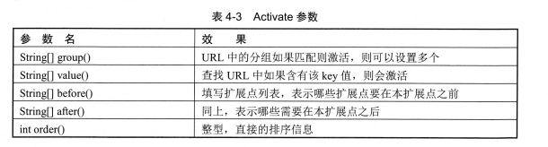


## ExtensionLoader的工作原理

​		`ExtensionLoader`的逻辑入口可以分为`getExtension、getAdaptiveExtension、getActivateExtension`三个，分别是获取普通扩展类、获取自适应扩展类、获

取自动激活的扩展类。总体逻辑都是从调用这三个方法开始的，每个方法可能会有不同的重载的方法，根据不同的传入参数进行调整。

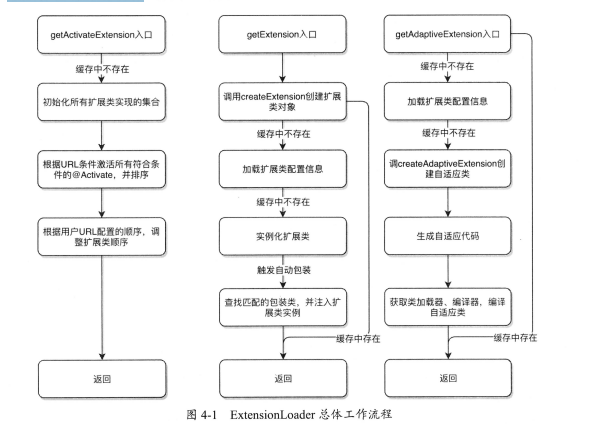

​		`getExtension(String name)`是整个扩展加载器中最核心的方法，实现了一个完整的普通扩展类加载过程。加载过程中的每一步，都会先检查缓存中是否己经

存在所需的数据，如果存在则直接从缓存中读取，没有则重新加载。这个方法每次只会根据名称返回一个扩展点实现类：

​				1、框架读取`SPI`对应路径下的配置文件，并根据配置加载所有扩展类并缓存`(`不初始化`)`。

​				2、根据传入的名称初始化对应的扩展类。

​				3、尝试查找符合条件的包装类：包含扩展点的`setter`方法；包含与扩展点类型相同的构造函数，为其注入扩展类实例，并初始化这个包装类。

​				4、返回对应的扩展类实例。

​		当调用`getExtension(String name)`方法时，会先检查缓存中是否有现成的数据，没有则调用`createExtension`开始创建。这里有个特殊点，如果

`getExtension`传入的`name`是`true`，则加载并返回默认扩展类。在调用`createExtension`开始创建的过程中，也会先检查缓存中是否有配置信息，如果不存在扩

展类，则会从`META-INF/services/、META-INF/dubbo/、META-INF/dubbo/internal/`这几个路径中读取所有的配置文件，通过`I/O`读取字符流，然后通过解析字符

串，得到配置文件中对应的扩展点实现类的全称：

```java
	private Map<String, Class<?>> getExtensionClasses() {
        Map<String, Class<?>> classes = cachedClasses.get(); // 从缓存中获取
        if (classes == null) {
            synchronized (cachedClasses) {
                classes = cachedClasses.get();
                if (classes == null) {
                    classes = loadExtensionClasses(); // 加载 Class
                    cachedClasses.set(classes);
                }
            }
        }
        return classes;
    }
```

```java
	private Map<String, Class<?>> loadExtensionClasses() {
        cacheDefaultExtensionName(); // 检查时候后 @SPI 注解

        Map<String, Class<?>> extensionClasses = new HashMap<>();

        for (LoadingStrategy strategy : strategies) {
            loadDirectory(extensionClasses, strategy, type.getName());

            if (this.type == ExtensionInjector.class) {
                loadDirectory(extensionClasses, strategy, ExtensionFactory.class.getName()); // 加载配置文件
            }
        }

        return extensionClasses;
    }
	private void cacheDefaultExtensionName() {
        final SPI defaultAnnotation = type.getAnnotation(SPI.class);
        if (defaultAnnotation == null) {
            return;
        }

        String value = defaultAnnotation.value();
        if ((value = value.trim()).length() > 0) {
            String[] names = NAME_SEPARATOR.split(value);
            if (names.length > 1) {
                throw new IllegalStateException("More than 1 default extension name on extension " + type.getName()
                    + ": " + Arrays.toString(names));
            }
            if (names.length == 1) {
                cachedDefaultName = names[0]; // 设为默认实现名
            }
        }
    }

```

​		加载完扩展点配置后，再通过反射获得所有扩展实现类并缓存起来。注意，此处仅仅是把`Class`加载到`JVM`中，但并没有做`Class`初始化。在加载`Class`文

件时，会根据`Class`上的注解来判断扩展点类型，再根据类型分类做缓存。

```java
	private void loadClass(Map<String, Class<?>> extensionClasses, java.net.URL resourceURL, Class<?> clazz, String name,
                           boolean overridden) throws NoSuchMethodException {
        if (!type.isAssignableFrom(clazz)) {
            throw new IllegalStateException("Error occurred when loading extension class (interface: " +
                type + ", class line: " + clazz.getName() + "), class "
                + clazz.getName() + " is not subtype of interface.");
        }
        if (clazz.isAnnotationPresent(Adaptive.class)) { // 是否为自适应类
            cacheAdaptiveClass(clazz, overridden); // 缓存，缓存的自适应类只能有一个
        } else if (isWrapperClass(clazz)) { // 是否为包装类
            cacheWrapperClass(clazz); // 加入包装扩展类的 Set 集合
        } else {
            if (StringUtils.isEmpty(name)) {
                name = findAnnotationName(clazz);
                if (name.length() == 0) {
                    throw new IllegalStateException("No such extension name for the class " + clazz.getName() + " in the config " + resourceURL);
                }
            }

            String[] names = NAME_SEPARATOR.split(name);
            if (ArrayUtils.isNotEmpty(names)) {
                cacheActivateClass(clazz, names[0]); // 缓存自动激活扩展类
                for (String n : names) { // 普通扩展类
                    cacheName(clazz, n);
                    saveInExtensionClass(extensionClasses, clazz, n, overridden);
                }
            }
        }
    }
```

​		最后，根据传入的`name`找到对应的类并通过`Class.forName`方法进行初始化，并为其注入依赖的其他扩展类`(`自动加载特性`)`。当扩展类初始化后，会检查

一次包装扩展类集合，查找包含与扩展点类型相同的构造函数，为其注入刚初始化的扩展类。

```java
			   // createExtension 的代码片段
		   T instance = (T) extensionInstances.get(clazz);
            if (instance == null) {
                extensionInstances.putIfAbsent(clazz, createExtensionInstance(clazz));
                instance = (T) extensionInstances.get(clazz);
                instance = postProcessBeforeInitialization(instance, name);
                injectExtension(instance); // 为扩展类注入其他依赖属性
                instance = postProcessAfterInitialization(instance, name);
            }

            if (wrap) {
                List<Class<?>> wrapperClassesList = new ArrayList<>();
                if (cachedWrapperClasses != null) {
                    wrapperClassesList.addAll(cachedWrapperClasses);
                    wrapperClassesList.sort(WrapperComparator.COMPARATOR);
                    Collections.reverse(wrapperClassesList);
                }

                if (CollectionUtils.isNotEmpty(wrapperClassesList)) {
                    for (Class<?> wrapperClass : wrapperClassesList) { // 遍历扩展包装类，用于初始化包装类实例
                        Wrapper wrapper = wrapperClass.getAnnotation(Wrapper.class);
                        if (wrapper == null
                            || (ArrayUtils.contains(wrapper.matches(), name) && !ArrayUtils.contains(wrapper.mismatches(), name))) {
                            instance = injectExtension((T) wrapperClass.getConstructor(type).newInstance(instance)); // 注入扩展类实例
                            instance = postProcessAfterInitialization(instance, name);
                        }
                    }
                }
            }
```

​		在`injectExtension`方法中可以为类注入依赖属性，：首先通过反射获取类的所有方法，然后遍历以字符串`set`开头的方法，得到`set`方法的参数类型，再通 

过`ExtensionFactory`寻找参数类型相同的扩展类实例，如果找到，就设值进去。

```java
		   for (Method method : instance.getClass().getMethods()) {
                if (!isSetter(method)) { // 以 set 开头，并且只有一个参数，并且是 public 方法
                    continue;
                }
                if (method.getAnnotation(DisableInject.class) != null) {
                    continue;
                }
                Class<?> pt = method.getParameterTypes()[0]; // 得到参数的类型
                if (ReflectUtils.isPrimitives(pt)) {
                    continue;
                }

                try {
                    String property = getSetterProperty(method); // 得到类名
                    Object object = injector.getInstance(pt, property); // 获取实例
                    if (object != null) {
                        method.invoke(instance, object); // 注入依赖
                    }
                } catch (Exception e) {
                    logger.error("Failed to inject via method " + method.getName()
                        + " of interface " + type.getName() + ": " + e.getMessage(), e);
                }

            }
```


​		`getAdaptiveExtension`也相对独立，只有加载配置信息部分与`getExtension`共用了同一个 方法。和获取普通扩展类一样，框架会先检查缓存中是否有已经初

始化化好的`Adaptive`实例， 没有则调用`createAdaptiveExtension`重新初始化：

​				1、和`getExtension`一样先加载配置文件。

​				2、生成自适应类的代码字符串。

​				3、获取类加载器和编译器，并用编译器编译刚才生成的代码字符串。`Dubbo`一共有三种类型的编译器实现。

​				4、返回对应的自适应类实例。

​		为接口中每个有`@Adaptive`注解的方法生成默认实现`(`没有注解的方法则生成空实现`)`，每个默认实现都会从`URL`中提取`Adaptive`参数值，并以此为依据动

态加载扩展点。然后，框架会使用不同的编译器，把实现类字符串编译为自适应类并返回。

​		生成代码的逻辑主要具体步骤：

​				1、生成`package、import、`类名称等头部信息。此处只会引入一个类`ExtensionLoader`。 为了不写其他类的`import`方法，其他方法调用时全部使用全

​		路径。类名称会变为接口名称`+$Adaptive`的格式。

​				2、遍历接口所有方法，获取方法的返回类型、参数类型、异常类型等。

​				3、生成参数为空校验代码，如参数是否为空的校验。如果有远程调用，还会添加`Invocation`参数为空的校验。

​				4、生成默认实现类名称。如果`@Adaptive`注解中没有设定默认值，则根据类名称生成，生成的规则是不断找大写字母，并把它们用连接起来。得到默认

​		实现类名称后，还需要知道这个实现是哪个扩展点的。

​				5、生成获取扩展点名称的代码。根据`@Adaptive`注解中配置的`key`值生成不同的获取代码。

​				6、生成获取具体扩展实现类代码。最终还是通过`getExtension(extName)`方法获取自适应扩展类的真正实现。如果根据`URL`中配置的`key`没有找到对应

​		的实现类，则会使用第`(4)`步中生成的默认实现类名称去找。

​				7、生成调用结果代码。 

​		`Dubbo`中的编译器也是一个自适应接口，但`@Adaptive`注解是加在实现类`AdaptiveCompiler`上的。这样一来`AdaptiveCompiler`就会作为该自适应类的默认实

现，不需要再做代码生成和编译就可以使用了。


​		`getActivateExtension(URL url,String key,String group)`方法可以获取所有自动激活扩展点。参数分别是`URL,URL`中指定的`key(`多个则用逗号隔开`)`和

`URL`中指定的组信息`(group)`：

​				1、检查缓存，如果缓存中没有，则初始化所有扩展类实现的集合。

​				2、遍历整个`©Activate`注解集合，根据传入`URL`匹配条件`(`匹配`group、name`等`)`，得到所有符合激活条件的扩展类实现。然后根据`@Activate`中配置

​		的`before、after、order`等参数进行排序。

​				3、遍历所有用户自定义扩展类名称，根据用户`URL`配置的顺序，调整扩展点激活顺序`(`遵循用户在`URL`中配置的顺序`)`。

​				4、返回所有自动激活类集合。 

​		如果`URL`的参数中传入了`-default`，则所有的默认`@Activate`都不会被激活，只有`URL`参数中指定的扩展点会被激活。如果传入了`-`符号开头的扩展点名， 

则该扩展点也不会被自动激活。


​		`RegistryFactory`工厂类通过`@Adaptive({"protocol"})`注解动态查找注册中心实现，根据`URL`中的`protocol`参数动态选择对应的注册中心工厂，并初始化

具体的注册中心客户端。而实现这个特性的`ExtensionLoader`类，本身又是通过工厂方法`ExtensionFactory`创建的并且这个工厂接口上也有`SPI`注解，还有多个实

现。

​		`AdaptiveExtensionFactory`这个实现类工厂上有`@Adaptive`注解。因此，`AdaptiveExtensionFactory`会作为一开始的默认实现：

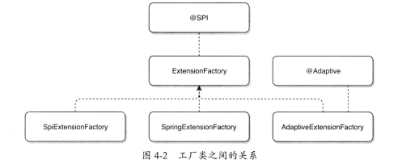

​		`SpringExtensionFactory`的实现，该工厂提供了保存`Spring`上下文的静态方法，可以把`Spring`上下文保存到`Set`集合中。 当调用`getExtension`获取扩展类

时，会遍历`Set`集合中所有的`Spring`上下文，先根据名字依次从每个`Spring`容器中进行匹配，如果根据名字没匹配到，则根据类型去匹配，如果还没匹配到则返

回`null`。

```java
public class SpringExtensionFactory implements ExtensionFactory, Lifecycle {
    private static final Logger logger = LoggerFactory.getLogger(SpringExtensionFactory.class);

    private static final Set<ApplicationContext> CONTEXTS = new ConcurrentHashSet<ApplicationContext>();

    public static void addApplicationContext(ApplicationContext context) { // 添加 Spring 上下文
        CONTEXTS.add(context);
        if (context instanceof ConfigurableApplicationContext) {
            ((ConfigurableApplicationContext) context).registerShutdownHook();
            DubboShutdownHook.getDubboShutdownHook().unregister();
        }
    }

    ....

    @Override
    @SuppressWarnings("unchecked")
    public <T> T getExtension(Class<T> type, String name) {

        //SPI should be get from SpiExtensionFactory
        if (type.isInterface() && type.isAnnotationPresent(SPI.class)) { 
            return null;
        }

        for (ApplicationContext context : CONTEXTS) {
            T bean = BeanFactoryUtils.getOptionalBean(context, name, type);
            if (bean != null) {
                return bean;
            }
        }

        return null;
    }
    ...
}
```

​		`Spring`的上下文在`ReferenceBean`和`ServiceBean`中会调用静态方法保存`Spring`上下文，即一个服务被发布或被引用的时候，对应的`Spring`上下文会被保

存下来。

​		`AdaptiveExtensionFactory`持有了所有的具体工厂实现，它的`getExtension`方法中只是遍历了它持有的所有工厂，最终还是调用`SPI`或`Spring`工厂实现的

`getExtension`方法。


​		`Dubbo`中有三种代码编译器，分别是`JDK`编译器、`Javassist`编译器和`AdaptiveCompiler`编译器。这几种编译器都实现了`Compiler`接口：

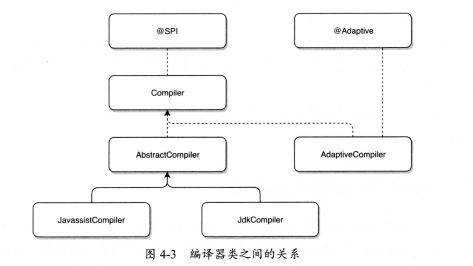

​		`Compiler`接口上含有一个`SPI`注解，注解的默认值是`@SPI("javassist")`, 很明显，`Javassist`编译器将作为默认编译器。如果用户想改变默认编译器，则可

以通过`<dubbo:application compiler="jdk" />`标签进行配置。

​		`AdaptiveCompiler`上面有`@Adaptive`注解，说明`AdaptiveCompiler`会固定为默认实现，这个`Compiler`的主要作用和`AdaptiveExtensionFactory`相似，就是

为了管理其他`Compile`。

​		`AbstpactCompiler`定义了一个抽象方法`docompile` ，留给子类来实现具体的编译逻辑，还将主要逻辑进行抽象：

​				1、通过正则匹配出包路径、类名，再根据包路径、类名拼接出全路径类名。

​				2、尝试通过`Class.forName`加载该类并返回，防止重复编译。如果类加载器中没有这个类，则进入第`3`步。

​				3、调用`doCompile`方法进行编译。这个抽象方法由子类实现。 

​		`JavassistCompiler`中，就是不断通过正则表达式匹配不同部位的代码，然后调用`Javassist`库中的`API`生成不同部位的代码，最后得到一个完整的`Class`对

象。

​				1、初始化`Javassist`，设置默认参数。

​				2、通过正则匹配出所有`import`的包，并使用`Javassist`添加`import`。

​				3、通过正则匹配出所有`extends`的包，创建`Class`对象，并使用`Javassist`添加`extends`。

​				4、通过正则匹配出所有`implements`包，并使用`Javassist`添加`implements`。

​				5、通过正则匹配出类里面所有内容，即得到`{}`中的内容，再通过正则匹配出所有方法，并使用`Javassist`添加类方法。

​				6、生成`Class`对象。


​		`JdkCompiler`是`Dubbo`编译器的另一种实现，使用了`JDK`自带的编译器，原生`JDK`编译器包位于`javax.tools`下。主要使用了三个东西：`JavaFileObject`接

口、`ForwardingJavaFileManager`接口、`DavaCompiler.CompilationTask`方法。整个动态编译过程可以简单地总结为：首先初始化一个`JavaFileObject`对象，并把

代码字符串作为参数传入构造方法，然后调用`JavaCompiler.CompilationTask`方法编译出具体的类。`JavaFileManager`负责管理类文件的输入/输出位置。


# 配置解析

​		`Dubbo`框架直接集成了`Spring`的能力，利用了`Spring`配置文件扩展出自定义的解析方式。`Dubbo`配置约束文件在`dubbo-config/dubbo-`

`configspring/src/main/resources/dubbo.xsd`中。

​		`dubbo.xsd`文件用来约束使用`XML`配置时的标签和对应的属性，`Spring`在解析到自定义的`namespace`标签时，会查找对应的`spring.schemas`和

`spring.handlers`文件，最终触发`Dubbo`的`DubboNamespaceHandler`类来进行初始化和解析。


## XML配置原理解析

​		主要解析逻辑入口是在`DubboNamespaceHandler`类中完成的：

```java
public class DubboNamespaceHandler extends NamespaceHandlerSupport implements ConfigurableSourceBeanMetadataElement {

   	...
        
    public void init() {
        registerBeanDefinitionParser("application", new DubboBeanDefinitionParser(ApplicationConfig.class));
        registerBeanDefinitionParser("module", new DubboBeanDefinitionParser(ModuleConfig.class));
        registerBeanDefinitionParser("registry", new DubboBeanDefinitionParser(RegistryConfig.class));
        registerBeanDefinitionParser("config-center", new DubboBeanDefinitionParser(ConfigCenterBean.class));
        registerBeanDefinitionParser("metadata-report", new DubboBeanDefinitionParser(MetadataReportConfig.class));
        registerBeanDefinitionParser("monitor", new DubboBeanDefinitionParser(MonitorConfig.class));
        registerBeanDefinitionParser("metrics", new DubboBeanDefinitionParser(MetricsConfig.class));
        registerBeanDefinitionParser("ssl", new DubboBeanDefinitionParser(SslConfig.class));
        registerBeanDefinitionParser("provider", new DubboBeanDefinitionParser(ProviderConfig.class));
        registerBeanDefinitionParser("consumer", new DubboBeanDefinitionParser(ConsumerConfig.class));
        registerBeanDefinitionParser("protocol", new DubboBeanDefinitionParser(ProtocolConfig.class));
        registerBeanDefinitionParser("service", new DubboBeanDefinitionParser(ServiceBean.class));
        registerBeanDefinitionParser("reference", new DubboBeanDefinitionParser(ReferenceBean.class));
        registerBeanDefinitionParser("annotation", new AnnotationBeanDefinitionParser());
    }
    ...
}
```

​		`DubboNamespaceHandler`主要把不同的标签关联到解析实现类中。`registerBeanDefinitionParser`方法约定了在`Dubbo`框架中遇到标签`application、`

`module`和`registry`等都会委托给`DubboBeanDefinitionParser`处理。

​		解析`id`和`name`：

```java
	    // DubboBeanDefinitionParser 类中的 parse 方法片段
		RootBeanDefinition beanDefinition = new RootBeanDefinition(); // 生成 Spring 的 Bean 定义
        beanDefinition.setBeanClass(beanClass);
        beanDefinition.setLazyInit(false);
        // config id
        String configId = resolveAttribute(element, "id", parserContext);
        if (StringUtils.isNotEmpty(configId)) {
            beanDefinition.getPropertyValues().addPropertyValue("id", configId);
        }
        // get id from name
        if (StringUtils.isEmpty(configId)) {
            configId = resolveAttribute(element, "name", parserContext);
        }

        String beanName = configId;
        if (StringUtils.isEmpty(beanName)) {
            // generate bean name
            String prefix = beanClass.getName();
            int counter = 0;
            beanName = prefix + "#" + counter;
            while (parserContext.getRegistry().containsBeanDefinition(beanName)) { // 确保 Spring 容器中没有重复的 id
                beanName = prefix + "#" + (counter++);
            }
        }
        beanDefinition.setAttribute(BEAN_NAME, beanName);
```

​		解析`<dubbo:service />、<dubbo:provider />、<dubbo:consumer />`标签：

```java
...
else if (ServiceBean.class.equals(beanClass)) {
	String className = resolveAttribute(element, "class", parserContext); // 如果配置了 class 属性
	if (StringUtils.isNotEmpty(className)) {
		RootBeanDefinition classDefinition = new RootBeanDefinition(); 
		classDefinition.setBeanClass(ReflectUtils.forName(className));
		classDefinition.setLazyInit(false);
		parseProperties(element.getChildNodes(), classDefinition, parserContext);  // 解析标签中的 name，ref 等属性，把key-value键值对提取出来放到 BeanDefinition 中， 运行时 Spring 会自动处理注入值，因此 ServiceBean 就会包含用户配置的属性值
		beanDefinition.getPropertyValues().addPropertyValue("ref", new BeanDefinitionHolder(classDefinition, beanName + "Impl")); // 将 class 配置的类的信息解析，并加入到 Spring 容器，然后注入
}
...
    
if (ProviderConfig.class.equals(beanClass)) {
	parseNested(element, parserContext, ServiceBean.class, true, "service", "provider", beanName, beanDefinition);
} else if (ConsumerConfig.class.equals(beanClass)) {
	parseNested(element, parserContext, ReferenceBean.class, true, "reference", "consumer", beanName, beanDefinition);
}
```

​		`parseNested`方法：主要逻辑是处理内部嵌套的标签，比如`<dubbo:provider />`内部可能嵌套了`<dubbo:service />`，如果使用了嵌套标签，则内部的标签对

象会自动持有外层标签的对象，即解析内部的标签并生成`Bean`的时候，会把外层标签实例对象注入`Bean`中，这种设计方式允许内部标签直接获取外部标签属性。

​		对于外部标签的属性：

​				1、查找配置对象的`get、set`和`is`前缀方法，如果标签属性名和方法名称相同，则通过反射调用存储标签对应值。

​				2、如果没有和`get、set`和`is`前缀方法匹配，则当作`parameters`参数存储，`parameters`是一个`Map`对象。

```java
        ....
        ManagedMap parameters = null;
        Set<String> processedProps = new HashSet<>();
        for (Map.Entry<String, Class> entry : beanPropTypeMap.entrySet()) {
            String beanProperty = entry.getKey();
            Class type = entry.getValue();
            String property = StringUtils.camelToSplitName(beanProperty, "-");
            processedProps.add(property);
            if ("parameters".equals(property)) { // 解析各种属性
                parameters = parseParameters(element.getChildNodes(), beanDefinition, parserContext);
            } else if ("methods".equals(property)) {
                parseMethods(beanName, element.getChildNodes(), beanDefinition, parserContext);
            } else if ("arguments".equals(property)) {
                parseArguments(beanName, element.getChildNodes(), beanDefinition, parserContext);
            } else {
                String value = resolveAttribute(element, property, parserContext); // 获取标签属性值
                if (value != null) {
                    value = value.trim();
                    if (value.length() > 0) {
                        if ("registry".equals(property) && RegistryConfig.NO_AVAILABLE.equalsIgnoreCase(value)) {
                            RegistryConfig registryConfig = new RegistryConfig();
                            registryConfig.setAddress(RegistryConfig.NO_AVAILABLE);
                            beanDefinition.getPropertyValues().addPropertyValue(beanProperty, registryConfig);
                        } else if ("provider".equals(property) || "registry".equals(property) || ("protocol".equals(property) && AbstractServiceConfig.class.isAssignableFrom(beanClass))) {
                            /**
                             * For 'provider' 'protocol' 'registry', keep literal value (should be id/name) and set the value to 'registryIds' 'providerIds' protocolIds'
                             * The following process should make sure each id refers to the corresponding instance, here's how to find the instance for different use cases:
                             * 1. Spring, check existing bean by id, see{@link ServiceBean#afterPropertiesSet()}; then try to use id to find configs defined in remote Config Center
                             * 2. API, directly use id to find configs defined in remote Config Center; if all config instances are defined locally, please use {@link ServiceConfig#setRegistries(List)}
                             */
                            beanDefinition.getPropertyValues().addPropertyValue(beanProperty + "Ids", value);
                        } else {
                            Object reference;
                            if (isPrimitive(type)) {
                                value = getCompatibleDefaultValue(property, value);
                                reference = value;
                            } else if (ONRETURN.equals(property) || ONTHROW.equals(property) || ONINVOKE.equals(property)) {
                                int index = value.lastIndexOf(".");
                                String ref = value.substring(0, index);
                                String method = value.substring(index + 1);
                                reference = new RuntimeBeanReference(ref);
                                beanDefinition.getPropertyValues().addPropertyValue(property + METHOD, method);
                            } else {
                                if ("ref".equals(property) && parserContext.getRegistry().containsBeanDefinition(value)) {
                                    BeanDefinition refBean = parserContext.getRegistry().getBeanDefinition(value);
                                    if (!refBean.isSingleton()) {
                                        throw new IllegalStateException("The exported service ref " + value + " must be singleton! Please set the " + value + " bean scope to singleton, eg: <bean id=\"" + value + "\" scope=\"singleton\" ...>");
                                    }
                                }
                                reference = new RuntimeBeanReference(value);
                            }
                            if (reference != null) {
                                beanDefinition.getPropertyValues().addPropertyValue(beanProperty, reference);
                            }
                        }
                    }
                }
            }
        }

        NamedNodeMap attributes = element.getAttributes(); // 剩余不匹配的 attribute 当做 parameters 注入 bean 中
        int len = attributes.getLength();
        for (int i = 0; i < len; i++) {
            Node node = attributes.item(i);
            String name = node.getLocalName();
            if (!processedProps.contains(name)) { // 排除已经解析的值
                if (parameters == null) {
                    parameters = new ManagedMap();
                }
                String value = node.getNodeValue();
                parameters.put(name, new TypedStringValue(value, String.class));
            }
        }
        if (parameters != null) {
            beanDefinition.getPropertyValues().addPropertyValue("parameters", parameters);
        }

        ...
        return beanDefinition;
```

​		本质上都是把属性注入`Spring`框架的`BeanDefinition`。如果属性是引用对象，则`Dubbo`默认会创建`RuntimeBeanReference`类型注入，运行时由`Spring`注入

引用对象。`Dubbo`只做了属性提取的事情，运行时属性注入和转换都是`Spring`处理的。


## 注解配置原理解析

​		注解处理逻辑主要包含`3`部分内容，第一部分是如果用户使用了配置文件，则框架按需生成对应`Bean`，第二部分是要将所有使用`Dubbo`的注解`@Service`的

`class`提升为`Bean`，第三部分要为使用`@Reference`注解的字段或方法注入代理对象。

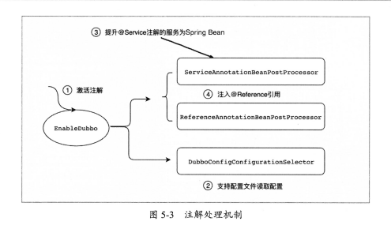

```java
...
@EnableDubboConfig
@DubboComponentScan
public @interface EnableDubbo {
	...
}

...
@Import(DubboConfigConfigurationRegistrar.class)
public @interface EnableDubboConfig {
	...
}

...
@Import(DubboComponentScanRegistrar.class)
public @interface DubboComponentScan {
	...
}
```


​		使用注解`@DubboComponentScan`时，会激活`DubboComponentScanRegistrar`，同时生成`ServiceAnnotationPostProcessor`和

`ReferenceAnnotationBeanPostProcessor`两种处理器，分别是处理服务注解和消费注解。`ServiceAnnotationPostProcessor`处理器实现了

`BeanDefinitionRegistryPostProcessor`接口，`Spring`容器中所有`Bean`注册之后回调`postProcessBeanDefinitionRegistry`方法开始扫描`@Service`注解并注入容

器：

```java
public class ServiceAnnotationPostProcessor implements BeanDefinitionRegistryPostProcessor, EnvironmentAware,
    ...
        
    private Set<String> resolvedPackagesToScan;    
    @Override
    public void afterPropertiesSet() throws Exception {
        this.resolvedPackagesToScan = resolvePackagesToScan(packagesToScan); // 获取用户注解的包扫描
    }

	...

    @Override
    public void postProcessBeanDefinitionRegistry(BeanDefinitionRegistry registry) throws BeansException {
        this.registry = registry;
        scanServiceBeans(resolvedPackagesToScan, registry);
    }

    
    private void scanServiceBeans(Set<String> packagesToScan, BeanDefinitionRegistry registry) {

        scaned = true;
        if (CollectionUtils.isEmpty(packagesToScan)) {
            if (logger.isWarnEnabled()) {
                logger.warn("packagesToScan is empty , ServiceBean registry will be ignored!");
            }
            return;
        }

        DubboClassPathBeanDefinitionScanner scanner =
                new DubboClassPathBeanDefinitionScanner(registry, environment, resourceLoader);

        BeanNameGenerator beanNameGenerator = resolveBeanNameGenerator(registry);
        scanner.setBeanNameGenerator(beanNameGenerator);
        for (Class<? extends Annotation> annotationType : serviceAnnotationTypes) {
            scanner.addIncludeFilter(new AnnotationTypeFilter(annotationType)); // 扫描 dubbo 下的 @Service ，而不会扫描 Spring 的 @Serivce
        }

        ScanExcludeFilter scanExcludeFilter = new ScanExcludeFilter();
        scanner.addExcludeFilter(scanExcludeFilter);

        for (String packageToScan : packagesToScan) {

            // avoid duplicated scans
            if (servicePackagesHolder.isPackageScanned(packageToScan)) {
                if (logger.isInfoEnabled()) {
                    logger.info("Ignore package who has already bean scanned: " + packageToScan);
                }
                continue;
            }

            // Registers @Service Bean first
            scanner.scan(packageToScan); // 将 @Service 标注的类实例装入容器

            // Finds all BeanDefinitionHolders of @Service whether @ComponentScan scans or not.
            Set<BeanDefinitionHolder> beanDefinitionHolders =
                    findServiceBeanDefinitionHolders(scanner, packageToScan, registry, beanNameGenerator); // 对扫描的服务创建BeanDefinitionHolder,用于生成 ServiceBean 定义

            if (!CollectionUtils.isEmpty(beanDefinitionHolders)) {
                if (logger.isInfoEnabled()) {
                    List<String> serviceClasses = new ArrayList<>(beanDefinitionHolders.size());
                    for (BeanDefinitionHolder beanDefinitionHolder : beanDefinitionHolders) {
                        serviceClasses.add(beanDefinitionHolder.getBeanDefinition().getBeanClassName());
                    }
                    logger.info("Found " + beanDefinitionHolders.size() + " classes annotated by Dubbo @Service under package [" + packageToScan + "]: " + serviceClasses);
                }

                for (BeanDefinitionHolder beanDefinitionHolder : beanDefinitionHolders) {
                    processScannedBeanDefinition(beanDefinitionHolder, registry, scanner); // 注册 ServiceBean 并做数据绑定和解析
                    servicePackagesHolder.addScannedClass(beanDefinitionHolder.getBeanDefinition().getBeanClassName());
                }
            } else {
                if (logger.isWarnEnabled()) {
                    logger.warn("No class annotated by Dubbo @Service was found under package ["
                            + packageToScan + "], ignore re-scanned classes: " + scanExcludeFilter.getExcludedCount());
                }
            }

            servicePackagesHolder.addScannedPackage(packageToScan);
        }
    }

    ...
}
```

​		1、`Dubbo`框架首先会提取用户配置的扫描包名称，因为包名可能使用`${...}`占位符，因此框架会调用`Spring`的占位符解析做进一步解码。

​		2、开始真正的注解扫描，委托`Spring`对所有符合包名的`.class`文件做字节码分析，最终通过。

​		3、配置扫描`@Service`注解作为过滤条件。

​		4、将`@Service`标注的服务提升为不同的`Bean`，这里并没有设置`beanClass`。

​		5、主要根据注册的普通`Bean`生成`ServiceBean`的占位符，用于后面的属性注入逻辑。

​		6、提取普通`Bean`上标注的`@Service`注解生成新的`RootBeanDefinition`，用于`Spring`启动后的服务暴露。


​		在实际使用过程中，会在`@Service`注解的服务中注入`@Reference`注解，这样就可以很方便地发起远程服务调用，`Dubbo`中做属性注入是通过

`ReferenceAnnotationBeanPostProcessor`处理的：

​				1、获取类中标注的`@Reference`注解的字段和方法。

​				2、反射设置字段或方法对应的引用。

```java
public class ReferenceAnnotationBeanPostProcessor extends AbstractAnnotationBeanPostProcessor
        implements ApplicationContextAware, BeanFactoryPostProcessor {
	
    ...
    
    @Override
    public PropertyValues postProcessPropertyValues(
            PropertyValues pvs, PropertyDescriptor[] pds, Object bean, String beanName) throws BeansException {

        try {
            AnnotatedInjectionMetadata metadata = findInjectionMetadata(beanName, bean.getClass(), pvs); // 查找 Bean 所有标注了@Reference的字段和方法
            prepareInjection(metadata);
            metadata.inject(bean, beanName, pvs); // 对字段、方法进行反射绑定
        } catch (BeansException ex) {
            throw ex;
        } catch (Throwable ex) {
            throw new BeanCreationException(beanName, "Injection of @" + getAnnotationType().getSimpleName()
                    + " dependencies is failed", ex);
        }
        return pvs;
    }
    private List<AbstractAnnotationBeanPostProcessor.AnnotatedFieldElement> findFieldAnnotationMetadata(final Class<?> beanClass) {

        final List<AbstractAnnotationBeanPostProcessor.AnnotatedFieldElement> elements = new LinkedList<AbstractAnnotationBeanPostProcessor.AnnotatedFieldElement>();

        ReflectionUtils.doWithFields(beanClass, new ReflectionUtils.FieldCallback() {
            @Override
            public void doWith(Field field) throws IllegalArgumentException, IllegalAccessException {

                for (Class<? extends Annotation> annotationType : getAnnotationTypes()) { // 遍历服务类所有的字段，查找@Reference注解标注

                    AnnotationAttributes attributes = getAnnotationAttributes(field, annotationType, getEnvironment(), true, true);

                    if (attributes != null) {

                        if (Modifier.isStatic(field.getModifiers())) {
                            if (logger.isWarnEnabled()) {
                                logger.warn("@" + annotationType.getName() + " is not supported on static fields: " + field);
                            }
                            return;
                        }

                        elements.add(new AnnotatedFieldElement(field, attributes));
                    }
                }
            }
        });

        return elements;

    }
    ...
}
```


