# 总体分层

​		总体分为业务层`(Biz)、RPC`层`、Remote`三层。


## 总体调用过程

​		首先，服务器端`(`服务提供者`)`在框架启动时，会初始化服务实例，通过`Proxy`组件调用具体协议`(Protocol)`，把服务端要暴露的接口封装成`Invoker(`真

实类型是`AbstractProxylnvoker`，然后转换成`Exporter`，这个时候框架会打开服务端口等并记录服务实例到内存中，最后通过`Registry`把服务元数据注册到注册

中心。


# 注册中心

​		`Dubbo`通过注册中心实现了分布式 环境中各服务之间的注册与发现，是各个分布式节点之间的纽带。作用：

​				1、动态加入：一个服务提供者通过注册中心可以动态地把自己暴露给其他消费者，无须消费者逐个去更新配置文件。

​				2、动态发现：一个消费者可以动态地感知新的配置、路由规则和新的服务提供者，无须重启服务使之生效。

​				3、动态调整：注册中心支持参数的动态调整，新参数自动更新到所有相关服务节点。

​				4、统一配置：避免了本地配置导致每个服务的配置不一致问题。

​		`ZooKeeper`是官方推荐的注册中心，在生产环境中有过实际使用，具体的实现在`Dubbo`源码的`dubbo-registry-zookeeper`模块中。阿里内部并没有使用

`Redis`作为注册中心，`Redis`注册中心并没有经过长时间运行的可靠性验证，其稳定性依赖于`Redis`本身。`Multicast`模式则不需要启动任何注册中心，只要通过

广播地址，就可以互相发现。服务提供者启动时，会广播自己的地址。消费者启动时，会广播订阅请求，服务提供者收到订阅请求，会根据配置广播或单播给订阅

者。不建议在生产环境使用。

​		`Dubbo`拥有良好的扩展性，如果以上注册中心都不能满足需求，那么可以基于`RegistryFactory`和`Registry`自行扩展。


## 工作流程

​		1、服务提供者启动时，会向注册中心写入自己的元数据信息，同时会订阅配置元数据信息。

​		2、消费者启动时，也会向注册中心写入自己的元数据信息，并订阅服务提供者、路由和配置元数据信息。

​		3、服务治理中心启动时，会同时订阅所有消费者、服务提供者、路由和配置元数据信息。

​		4、当有服务提供者离开或有新的服务提供者加入时，注册中心服务提供者目录会发生变化，变化信息会动态通知给消费者、服务治理中心。

​		5、当消费方发起服务调用时，会异步将调用、统计信息等上报给监控中心。


## 原理概述

​		`ZooKeeper`是树形结构的注册中心，每个节点的类型分为持久节点、持久顺序节点、临时节点和临时顺序节点。

​				持久节点：服务注册后保证节点不会丢失，注册中心重启也会存在。

​				持久顺序节点：在持久节点特性的基础上增加了节点先后顺序的能力。

​				临时节点：服务注册后连接丢失或`session`超时，注册的节点会自动被移除。

​				临时顺序节点：在临时节点特性的基础上增加了节点先后顺序的能力。

​		`Dubbo`使用`ZooKeeper`作为注册中心时，只会创建持久节点和临时节点两种，对创建的顺序并没有要求。

​		`ZooKeeper`的树形结构，分为四层：`root(`根节点`)`、`service(`接口名称`)`、四种服务目录`(providers、consumers、routers、configurations)`、服务目录

下具体的`Dubbo`服务`URL`。


​				1、树的根节点是注册中心分组，下面有多个服务接口，分组值来自用户配置`<dubbo:registry>`中的`group`属性，默认是`/dubbo`。

​				2、服务接口下包含`4`类子目录，分别是`providers、consumers、routers、configurators`，这个路径是持久节点。

​				3、服务提供者目录`(/dubbo/service/providers)`下面包含的接口有多个服务者`URL`元数据信息。

​				4、服务消费者目录`(/dubbo/service/consumers)`下面包含的接口有多个消费者`URL`元数据信息。

​				5、路由配置目录`(/dubbo/service/routers)`下面包含多个用于消费者路由策略`URL`元数据信息。

​				6、动态配置目录`(/dubbo/service/configurators)`下面包含多个用于服务者动态配置`URL`元数据信息。


​		在`Dubbo`框架启动时，会根据用户配置的服务，在注册中心中创建`4`个目录，在`providers`和`consumers`目录中分别存储服务提供方、消费方元数据信息，

主要包括`IP`、端口、权重和应用名等数据。

​		在`Dubbo`框架进行服务调用时，用户可以通过服务治理平台下发路由配置。如果要在运行时改变服务参数，则用户可以通过服务治理平台下发动态配置。服

务器端会通过订阅机制收到属性变更，并重新更新已经暴露的服务。 


​		`Redis`注册中心也沿用了`Dubbo`抽象的`Root、Service、Type、URL`四层结构。但是由于`Redis`属于`NoSQL`数据库，数据都是以键值对的形式保存的，并不能

像`ZooKeeper`一样直接实现树形目录结构。因此，`Redis`使用了`key/Map`结构实现了这个需求，`Root、Service、Type`组合成`Redis`的`key`，`Redis`的`value`是一

个`Map`结构，`URL`作为`Map`的`key`，超时时间作为`Map`的`value`。


```java
public void doRegister(URL url) {
        String key = toCategoryPath(url); // 生成 redis 的 key
        String value = url.toFullString(); // 生成 URL
        String expire = String.valueOf(System.currentTimeMillis() + expirePeriod); // 超时时间
        try {
            redisClient.hset(key, value, expire); // 注册到 redis 注册中心
            redisClient.publish(key, REGISTER);
        } catch (Throwable t) {
            throw new RpcException("Failed to register service to redis registry. registry: " + url.getAddress() + ", service: " + url + ", cause: " + t.getMessage(), t);
        }
    }
```


## 订阅/发布

​		当一个已有服务提供者节点下线，或者一个新的服务提供者节点加入微服务环境时，订阅对应接口的消费者和服务治理中心都能及时收到注册中心的通知，并

更新本地的配置信息。如此一来，后续的服务调用就能避免调用已经下线的节点，或者能调用到新的节点。整个过程都是自动完成的，不需要人工参与。

​		服务提供者和消费者都需要把自己注册到注册中心。服务提供者的注册是为了让消费者感知服务的存在，从而发起远程调用；也让服务治理中心感知有新的服

务提供者上线。消费者的发布是为了让服务治理中心可以发现自己。

```java
zkClient.create(toUrlPath(url), url.getParameter(DYNAMIC_KEY, true)); // 发布，即调用 zookeeper 客户端在注册中心上创建一个目录
zkClient.delete(toUrlPath(url)); // 取消发布，即调用 zookeeper 客户端在注册中心上删除对应的目录
```


​		订阅通常有`pull`和`push`两种方式，一种是客户端定时轮询注册中心拉取配置，另一种是注册中心主动推送数据给客户端。这两种方式各有利弊，目前

`Dubbo`采用的是第一次启动拉取方式，后续接收事件重新拉取数据。 在服务暴露时，服务端会订阅`configurators`用于监听动态配置，在消费端启动时，消费端会

订阅`providers、routers`和`configuratops`这三个目录，分别对应服务提供者、路由和动态配置变更通知。

​		可以在`<dubbo:registry>`的`client`属性中设置`curator、zkclient`来使用不同的客户端实现库，如果不设置则默认使用`Curator`作为实现。

​		`ZooKeeper`注册中心采用的是事件通知`+`客户端拉取的方式，客户端在第一次连接上注册中心时，会获取对应目录下全量的数据。并在订阅的节点上注册一

个`watcher`，客户端与注册中心之间保持`TCP`长连接，后续每个节点有任何数据变化的时候，注册中心会根据`watcher`的回调主动通知客户端，客户端接到通知

后，会把对应节点下的全量数据都拉取过来。全量拉取有一个局限，当微服务节点较多时会对网络造成很大的压力。

​		`ZooKeeper`的每个节点都有一个版本号，当某个节点的数据发生变化`(`即事务操作`)`时， 该节点对应的版本号就会发生变化，并触发`watcher`事件，推送数

据给订阅方。版本号强调的是变更次数，即使该节点的值没有变化，只要有更新操作，依然会使版本号变化。

​		事务操作：客户端任何新增、删除、修改、会话创建和失效操作，都会被认为是事务操作，会由`ZooKeeper`集群中的`leader`执行。即使客户端连接的是非

`leader`节点，请求也会被转发给`leader`执行，以此来保证所有事物操作的全局时序性。由于每个节点都有一个版本号，因此可以通过`CAS`操作比较版本号来保证

该节点数据操作的原子性。

​		客户端第一次连上注册中心，订阅时会获取全量的数据，后续则通过监听器事件进行更新。 服务治理中心会处理所有`service`层的订阅，`service`被设置成

特殊值`*`。此外，服务治理中心除了订阅当前节点，还会订阅这个节点下的所有子节点：

```java
if (ANY_VALUE.equals(url.getServiceInterface())) {
		String root = toRootPath();
         boolean check = url.getParameter(CHECK_KEY, false);
         ConcurrentMap<NotifyListener,ChildListener> listeners = zkListeners.computeIfAbsent(url,k -> new ConcurrentHashMap<>()); //订阅所有数据
         ChildListener zkListener = listeners.computeIfAbsent(listener, k -> (parentPath, currentChilds) -> {
         		for (String child : currentChilds) { // 子节点有变化
                 	child = URL.decode(child);
                 	if (!anyServices.contains(child)) { // 当前子节点未被订阅，即是新节点，立即订阅
                    	anyServices.add(child);
                        subscribe(url.setPath(child).addParameters(INTERFACE_KEY, child,Constants.CHECK_KEY, String.valueOf(check)), k);
                    }
         		}
         });
		zkClient.create(root, false); // 创建持久节点
		List<String> services = zkClient.addChildListener(root, zkListener);
		if (CollectionUtils.isNotEmpty(services)) {
				for (String service : services) { // 遍历所有子节点进行订阅
					service = URL.decode(service);
					anyServices.add(service);
					subscribe(url.setPath(service).addParameters(INTERFACE_KEY, service,Constants.CHECK_KEY, String.valueOf(check)), listener);
				}
		}
}
```

​		普通消费者首先根据`URL`的类别得到一组需要订阅的路径。如果类别是`*`，则会订阅四种类型的路径`(providers、routers、consumers、configurators)`, 否

则只订阅`providers`路径：

```java
List<URL> urls = new ArrayList<>();
for (String path : toCategoriesPath(url)) { // 根据 URL 类别获取一组需要订阅的路径
	ConcurrentMap<NotifyListener, ChildListener> listeners = zkListeners.computeIfAbsent(url, k -> new ConcurrentHashMap<>());
	ChildListener zkListener = listeners.computeIfAbsent(listener, k -> new RegistryChildListenerImpl(url, path, k, latch));
	if (zkListener instanceof RegistryChildListenerImpl) {
		((RegistryChildListenerImpl) zkListener).setLatch(latch);
	}
	zkClient.create(path, false);
	List<String> children = zkClient.addChildListener(path, zkListener); // 订阅，返回该节点下的子路径并缓存
	if (children != null) {
		urls.addAll(toUrlsWithEmpty(url, path, children));
	}
}
notify(url, listener, urls); // I回调 NotifyListener,更新本地缓存信息
```

​		此处会根据`URL`中的`category`属性值获取具体的类别：`providers、routers、 consumers、configurators`，然后拉取直接子节点的数据进行通知`(notify)`。

如果是`providers`类别的数据，则订阅方会更新本地`Directory`管理的`Invoker`服务列表；如果是`routers`分类，则订阅方会更新本地路由规则列表；如果是

`configuators`类别，则订阅方会更新或覆盖本地动态参数列表。


​		`Redis`订阅发布使用的是过期机制和`publish/subscribe`通道。服务提供者发布服务，首先会在`Redis`中创建一个`key`，然后在通道中发布一条`register`事

件消息。 但服务的`key`写入`Redis`后，发布者需要周期性地刷新`key`过期时间，在`RedisRegistry`构造方法中会启动一个`expireExecutor`定时调度线程池，不断

调用`deferExpired()`方法去延续`key`的超时时间。如果服务提供者服务宕机，没有续期，则`key`会因为超时而被`Redis`删除，服务也就会被认定为下线。

​		订阅方首次连接上注册中心，会获取全量数据并缓存在本地内存中。后续的服务列表变化则通过`publish/subscribe`通道广播，当有服务提供者主动下线的时

候，会在通道中广播一条`unregister`事件消息，订阅方收到后则从注册中心拉取数据，更新本地缓存的服务列表。新服务提供者上线也是通过通道事件触发更新

的。

​		如果使用`Redis`作为服务注册中心，会依赖于服务治理中心。如果服务治理中心定时调度， 则还会触发清理逻辑：获取`Redis`上所有的`key`并进行遍历，如

果发现`key`已经超时，则删除`Redis`上对应的`key`。清除完后，还会在通道中发起对应`key`的`unregister`事件，其他消费者监听到取消注册事件后会删除本地对

应服务的数据，从而保证数据的最终一致。

```java
private void deferExpired() {
	for (URL url : new HashSet<>(getRegistered())) { // 获取所有已注册的 key ，进行遍历
		if (url.getParameter(DYNAMIC_KEY, true)) {
			String key = toCategoryPath(url);
			if (redisClient.hset(key, url.toFullString(), String.valueOf(System.currentTimeMillis() + expirePeriod)) == 1) {
				redisClient.publish(key, REGISTER); // 如果返回 1 ，说明 key 已经被删除，重新发布，在通道中广播
			}
		}
	}

	if (doExpire) {
		for (Map.Entry<URL, Long> expireEntry : expireCache.entrySet()) {
			if (expireEntry.getValue() < System.currentTimeMillis()) {
				doNotify(toCategoryPath(expireEntry.getKey()));
			}
		}
	}

	if (admin) { // 如果是服务治理中心，则还要清理过期的 key
		clean();
	}
}
```


​		`Redis`客户端初始化的时候，需要先初始化`Redis`的连接池`jedisPools`，此时如果配置注册中心的集群模式为`<dubbo:registry cluster="replicate" />`，

则服务提供者在发布服务的时候，需要同时向`Redis`集群中所有的节点都写入，是多写的方式。但读取还是从一个节点中读取。 在这种模式下，`Redis`集群可以

不配置数据同步，一致性由客户端的多写来保证。 

​		如果设置为`failover`或不设置，则只会读取和写入任意一个`Redis`节点，失败的话再尝试下一个`Redis`节点。这种模式需要`Redis`自行配置数据同步。 

​		另外，在初始化阶段，还会初始化一个定时调度线程池`expireExecutor`，它主要的任务是延长`key`的过期时间和删除过期的`key`线程池调度的时间间隔是超

时时间的一半。

​		发布：服务提供者和消费者都会使用注册功能。


​		在订阅时，如果是首次订阅，则会先创建一个`Notifier`内部类，这是一个线程类，在启动时会异步进行通道的订阅。在启动`Notifier`线程的同时，主线程会

继续往下执行，全量拉一次注册中心上所有的服务信息。后续注册中心上的信息变更则通过`Notifier`线程订阅的通道推送事件来实现。

```java
if (service.endsWith(ANY_VALUE)) { // 以 * 结尾，订阅所有服务
	if (first) { // 不是第一次，则获取所有服务的 key ，并更新本地缓存
		first = false;
		Set<String> keys = redisClient.scan(service);
		if (CollectionUtils.isNotEmpty(keys)) {
			for (String s : keys) {
				doNotify(s);
			}
		}
		resetSkip(); // 重置计数器
	}
	redisClient.psubscribe(new NotifySub(), service);
}
else {
	if (first) { // 不以 * 结尾，且不是第一次，则代表已订阅过
		first = false;
		doNotify(service); // 出发通知，更新本地缓存，重置失败计数器
		resetSkip();
	}
	redisClient.psubscribe(new NotifySub(), service + PATH_SEPARATOR + ANY_VALUE); // 订阅一个或多个符合给定模式的频道
}
```


## 缓存

​		缓存的存在就是用空间换取时间，如果每次远程调用都要先从注册中心获取一次可调用的服务列表，则会让注册中心承受巨大的流量压力。另外，每次额外的

网络请求也会让整个系统的性能下降。因此`Dubbo`的注册中心实现了通用的缓存机制。


​		消费者或服务治理中心获取注册信息后会做本地缓存。内存中会有一份，保存在`Properties`对象里，磁盘上也会持久化一份文件，通过`file`对象引用：

```java
private final Properties properties = new Properties();
private File file; // 磁盘文件服务缓存对象
private final ConcurrentMap<URL, Map<String, List<URL>>> notified = new ConcurrentHashMap<>(); // 内存中的服务缓存对象
```

​		内存中的缓存`notified`是`ConcurrentHashMap`里面又嵌套了一个`Map`，外层`Map`的`key`是消费者的`URL`，内层`Map`的`key`是分类，包含`providers、`

`consumers、routes、configurators`四种。`value`则是对应的服务列表，对于没有服务提供者提供服务的`URL`，它会以特殊的`empty://`前缀开头。


​		在服务初始化的时候，`AbstractRegistry`构造函数里会从本地磁盘文件中把持久化的注册数据读到`Properties`对象里，并加载到内存缓存中：

```java
	private void loadProperties() {
        if (file != null && file.exists()) {
            InputStream in = null;
            try {
                in = new FileInputStream(file); // 读取本地缓存文件
                properties.load(in);
                if (logger.isInfoEnabled()) {
                    logger.info("Loaded registry cache file " + file);
                }
            } catch (Throwable e) {
                logger.warn("Failed to load registry cache file " + file, e);
            } finally {
                if (in != null) {
                    try {
                        in.close();
                    } catch (IOException e) {
                        logger.warn(e.getMessage(), e);
                    }
                }
            }
        }
    }
```

​		`Properties`保存了所有服务提供者的`URL`，使用`URL#serviceKey()`作为`key`，提供者列表、路由规则列表、配置规则列表等作为`value`。由于`value`是列

表，当存在多个的时候使用空格隔开。还有一个特殊的`key.registies`，保存所有的注册中心的地址。如果应用在启动过程中注册中心无法连接或宕机，则`Dubbo`

框架会自动通过本地缓存加载`Invokers`。


​		缓存的保存有同步和异步两种方式。异步会使用线程池异步保存，如果线程在执行过程中出现异常，则会再次调用线程池不断重试：

```java
	private void saveProperties(URL url) {
        ...
            if (syncSaveFile) {
                doSaveProperties(version); // 同步保存
            } else {
                registryCacheExecutor.execute(new SaveProperties(version)); // 异步保存
            }
        ...
    }
```

​		`AbstractRegistry#notify`方法中封装了更新内存缓存和更新文件缓存的逻辑。当客户端第一次订阅获取全量数据，或者后续由于订阅得到新数据时，都会调

用该方法进行保存。


## 重试

​		`FailbackRegistry`继承了`AbstractRegistry`，并在此基础上增加了失败重试机制作为抽象能力。`ZookeeperRegistry`和`RedisRegistry`继承该抽象方法后，

直接使用即可。

​		`FailbackRegistry`抽象类中定义了一个`ScheduledExecutorService`，每经过固定间隔`(`默认为`5`秒`)`调用`FailbackRegistry#retry()`方法。另外，该抽象类

中还有五个比较重要的集合：


​		在定时器中调用`retry`方法的时候，会把这五个集合分别遍历和重试，重试成功则从集合中移除。`FailbackRegistry`实现了`subscribe、unsubscribe`等通用

方法，里面调用了未实现的模板方法，会由子类实现。通用方法会调用这些模板方法，如果捕获到异常，则会把`URL`添加到对应的重试集合中，以供定时器去重

试。


# 扩展点加载机制

## SPI

​		`SPI`的全称是`Service Provider Interface`，起初是提供给厂商做插件开发的。`Java SPI`使用了策略模式，一个接口多种实现。我们只声明接口，具体的实

现并不在程序中直接确定，而是由程序之外的配置掌控，用于具体实现的装配：

​				1、定义一个接口及对应的方法。

​				2、编写该接口的一个实现类。

​				3、在`META-INF/services/`目录下，创建一个以接口全路径命名的文件。`Spring Boot`则在`resource`目录下创建`META-INF/services/`。

​				4、文件内容为具体实现类的全路径名，如果有多个，则用分行符分隔。

​				5、在代码中通过`java.util.ServiceLoader`来加载具体的实现类。

```java
public interface HelloSerivice {
    public void hello(String name);
}
public class HelloSeriviceImpl implements HelloSerivice {
    @Override
    public void hello(String name) {
        System.out.println("hello " + name);
    }
}
```

```java
    public static void main(String[] args) {
        ServiceLoader<HelloSerivice> load = ServiceLoader.load(HelloSerivice.class);
        for(HelloSerivice temp : load)
        {
            temp.hello("xiaoshanshan");
        }
    }
```

​		`com.shanji.over.spi.HelloSerivice`：

```tex
com.shanji.over.impl.HelloSeriviceImpl
```


​		`JDK`标准的`SPI`会一次性实例化扩展点所有实现，如果有扩展实现则初始化很耗时，如果没用上也加载，则浪费资源。


​		`Dubbo`对`SPI`做了一定的优化和修改：

​				增加了对扩展`IoC`和`AOP`的支持，一个扩展可以直接`setter`注入其他扩展。`Dubbo SPI`只是加载配置文件中的类， 并分成不同的种类缓存在内存中，

​		而不会立即全部初始化，在性能上有更好的表现。

```java
@SPI("impl")
public interface HelloSerivice {
    public void hello(String name);
}

public class HelloSeriviceImpl implements HelloSerivice {
    @Override
    public void hello(String name) {
        System.out.println("hello " + name);
    }
}
```

​				与`Java SPI`一样也要建立全路径接口名的文件，不过此时是在`dubbo/internal`目录下创建：

```java
impl=com.shanji.over.impl.HelloSeriviceImpl
```

```java
	public static void main(String[] args) {
        HelloSerivice serivice = ExtensionLoader.getExtensionLoader(HelloSerivice.class).getDefaultExtension();
        serivice.hello("xiaoshanshan");
    }
```

​		`Java SPI`加载失败，可能会因为各种原因导致异常信息被吞掉，导致开发人员问题追踪比较困难。`Dubbo SPI`在扩展加载失败的时候会先抛出真实异常并打

印日志。扩展点在被动加载的时候，即使有部分扩展加载失败也不会影响其他扩展点和整个框架的使用。


## 配置规范

​		`Dubbo SPI`和`Java SPI`类似，需要在`META-INF/dubbo/`下放置对应的`SPI`配置文件，文件名称需要命名为接口的全路径名。配置文件的内容为`key=`扩展点实

现类全路径名，如果有多个实现类则使用换行符分隔。其中，`key`会作为`Dubbo SPI`注解中的传入参数。另外，`Dubbo SPI`还兼容了`Java SPI`的配置路径和内容

配置方式。在`Dubbo`启动的时候，会默认扫三个目录下的配置文件：`META-INF/services/、META-INF/dubbo/、META-INF/dubbo/internal/`：


## 分类与缓存

​		`Dubbo SPI`可以分为`Class`缓存、实例缓存。这两种缓存又能根据扩展类的种类分为普通扩展类、包装扩展类、自适应扩展类：

​				`Class`缓存：`Dubbo SPI`获取扩展类时，会先从缓存中读取。如果缓存中不存在，则加载配置文件，根据配置把`Class`缓存到内存中，并不会直接全部

​		初始化。

​				实例缓存：基于性能考虑，`Dubbo`框架中不仅缓存`Class`，也会缓存`Class`实例化后的对象。每次获取的时候，会先从缓存中读取，如果缓存中读不

​		到，则重新加载并缓存起来。

​				普通扩展类：最基础的，配置在`SPI`配置文件中的扩展类实现。

​				包装扩展类：这种`Wrapper`类没有具体的实现，只是做了通用逻辑的抽象，并且需要在构造方法中传入一个具体的扩展接口的实现。属于`Dubbo`的自动

​		包装特性。

​				自适应扩展类：一个扩展接口会有多种实现类，具体使用哪个实现类可以不写死在配置或代码中，在运行时，通过传入`URL`中的某些参数动态来确定。

​		这属于扩展点的自适应特性。

​		其他缓存：如扩展类加载器缓存、扩展名缓存等


## 扩展点的特性

### 自动包装

​		自动包装一种被缓存的扩展类，`ExtensionLoader`在加载扩展时，如果发现这个扩展类包含其他扩展点`(Protocol`类型`)`作为构造函数的参数，则这个扩展类

就会被认为是`Wrapper`类。这是一种装饰器模式，把通用的抽象逻辑进行封装或对子类进行增强，让子类可以更加专注具体的实现。


### 自动加载

​		除了在构造函数中传入其他扩展实例，还经常使用`setter`方法设置属性值。如果某个扩展类是另外一个扩展点类的成员属性，并且拥有`setter`方法，那么框

架也会自动注入对应的扩展点实例。`ExtensionLoader`在执行扩展点初始化的时候，会自动通过`setter`方法注入对应的实现类。


### 自适应

​		在`Dubbo SPI`中，使用`@Adaptive`注解，可以动态地通过`URL`中的参数来确定要使用哪个具体的实现类。从而解决自动加载中的实例注入问题。


### 自动激活

​		使用`@Activate`注解，可以标记对应的扩展点默认被激活启用。该注解还可以通过传入不同的参数，设置扩展点在不同的条件下被自动激活。主要的使用场景

是某个扩展点的多个实现类需要同时启用。


## 注解

### @SPI

​		`@SPI`注解可以使用在类、接口和枚举类上，`Dubbo`框架中都是使用在接口上。它的主要作用就是标记这个接口是一个`Dubbo SPI`接口，即是一个扩展点，可

以有多个不同的内置或用户定义的实现。运行时需要通过配置找到具体的实现类。

​		`Dubbo`中很多地方通过`getExtension(Class type. String name)`来获取扩展点接口的具体实现，此时会对传入的`Class`做校验，判断是否是接口，以及是否

有`@SPI`注解，两者缺一不可。


### ©Adaptive

​		`@Adaptive`注解可以标记在类、接口、枚举类和方法上，如果标注在接口的方法上，即方法级别注解，则可以通过参数动态获得实现类，方法级别注解在第一

次`getExtension`时，会自动生成和编译一个动态的`Adaptive`类，从而达到动态实现类的效果。

​		当该注解放在实现类上，则整个实现类会直接作为默认实现，不再自动生成代码。在扩展点接口的多个实现里，只能有一个实现上可以加`@Adaptive`注解。如

果多个实现类都有该注解，则会抛出异常。

​		`ExtensionLoader`中会缓存两个与`©Adaptive`有关的对象，一个缓存在`cachedAdaptiveClass`中， 即`Adaptive`具体实现类的`Class`类型；另外一个缓存在

`cachedAdaptivelnstance`中，即`Class`的具体实例化对象。在扩展点初始化时，如果发现实现类有`@Adaptive`注解，则直接赋值给`cachedAdaptiveClass`，后续实

例化类的时候，就不会再动态生成代码，直接实例化`cachedAdaptiveClas`，并把实例缓存到`cachedAdaptivelnstance`中。如果注解在接口方法上， 则会根据参

数，动态获得扩展点的实现，会生成`Adaptive`类，再缓存到`cachedAdaptivelnstance`中。


### ©Activate

​		`@Activate`可以标记在类、接口、枚举类和方法上。主要使用在有多个扩展点实现、需要根据不同条件被激活的场景中。


## ExtensionLoader的工作原理

​		`ExtensionLoader`的逻辑入口可以分为`getExtension、getAdaptiveExtension、getActivateExtension`三个，分别是获取普通扩展类、获取自适应扩展类、获

取自动激活的扩展类。总体逻辑都是从调用这三个方法开始的，每个方法可能会有不同的重载的方法，根据不同的传入参数进行调整。


​		`getExtension(String name)`是整个扩展加载器中最核心的方法，实现了一个完整的普通扩展类加载过程。加载过程中的每一步，都会先检查缓存中是否己经

存在所需的数据，如果存在则直接从缓存中读取，没有则重新加载。这个方法每次只会根据名称返回一个扩展点实现类：

​				1、框架读取`SPI`对应路径下的配置文件，并根据配置加载所有扩展类并缓存`(`不初始化`)`。

​				2、根据传入的名称初始化对应的扩展类。

​				3、尝试查找符合条件的包装类：包含扩展点的`setter`方法；包含与扩展点类型相同的构造函数，为其注入扩展类实例，并初始化这个包装类。

​				4、返回对应的扩展类实例。

​		当调用`getExtension(String name)`方法时，会先检查缓存中是否有现成的数据，没有则调用`createExtension`开始创建。这里有个特殊点，如果

`getExtension`传入的`name`是`true`，则加载并返回默认扩展类。在调用`createExtension`开始创建的过程中，也会先检查缓存中是否有配置信息，如果不存在扩

展类，则会从`META-INF/services/、META-INF/dubbo/、META-INF/dubbo/internal/`这几个路径中读取所有的配置文件，通过`I/O`读取字符流，然后通过解析字符

串，得到配置文件中对应的扩展点实现类的全称：

```java
	private Map<String, Class<?>> getExtensionClasses() {
        Map<String, Class<?>> classes = cachedClasses.get(); // 从缓存中获取
        if (classes == null) {
            synchronized (cachedClasses) {
                classes = cachedClasses.get();
                if (classes == null) {
                    classes = loadExtensionClasses(); // 加载 Class
                    cachedClasses.set(classes);
                }
            }
        }
        return classes;
    }
```

```java
	private Map<String, Class<?>> loadExtensionClasses() {
        cacheDefaultExtensionName(); // 检查时候后 @SPI 注解

        Map<String, Class<?>> extensionClasses = new HashMap<>();

        for (LoadingStrategy strategy : strategies) {
            loadDirectory(extensionClasses, strategy, type.getName());

            if (this.type == ExtensionInjector.class) {
                loadDirectory(extensionClasses, strategy, ExtensionFactory.class.getName()); // 加载配置文件
            }
        }

        return extensionClasses;
    }
	private void cacheDefaultExtensionName() {
        final SPI defaultAnnotation = type.getAnnotation(SPI.class);
        if (defaultAnnotation == null) {
            return;
        }

        String value = defaultAnnotation.value();
        if ((value = value.trim()).length() > 0) {
            String[] names = NAME_SEPARATOR.split(value);
            if (names.length > 1) {
                throw new IllegalStateException("More than 1 default extension name on extension " + type.getName()
                    + ": " + Arrays.toString(names));
            }
            if (names.length == 1) {
                cachedDefaultName = names[0]; // 设为默认实现名
            }
        }
    }

```

​		加载完扩展点配置后，再通过反射获得所有扩展实现类并缓存起来。注意，此处仅仅是把`Class`加载到`JVM`中，但并没有做`Class`初始化。在加载`Class`文

件时，会根据`Class`上的注解来判断扩展点类型，再根据类型分类做缓存。

```java
	private void loadClass(Map<String, Class<?>> extensionClasses, java.net.URL resourceURL, Class<?> clazz, String name,
                           boolean overridden) throws NoSuchMethodException {
        if (!type.isAssignableFrom(clazz)) {
            throw new IllegalStateException("Error occurred when loading extension class (interface: " +
                type + ", class line: " + clazz.getName() + "), class "
                + clazz.getName() + " is not subtype of interface.");
        }
        if (clazz.isAnnotationPresent(Adaptive.class)) { // 是否为自适应类
            cacheAdaptiveClass(clazz, overridden); // 缓存，缓存的自适应类只能有一个
        } else if (isWrapperClass(clazz)) { // 是否为包装类
            cacheWrapperClass(clazz); // 加入包装扩展类的 Set 集合
        } else {
            if (StringUtils.isEmpty(name)) {
                name = findAnnotationName(clazz);
                if (name.length() == 0) {
                    throw new IllegalStateException("No such extension name for the class " + clazz.getName() + " in the config " + resourceURL);
                }
            }

            String[] names = NAME_SEPARATOR.split(name);
            if (ArrayUtils.isNotEmpty(names)) {
                cacheActivateClass(clazz, names[0]); // 缓存自动激活扩展类
                for (String n : names) { // 普通扩展类
                    cacheName(clazz, n);
                    saveInExtensionClass(extensionClasses, clazz, n, overridden);
                }
            }
        }
    }
```

​		最后，根据传入的`name`找到对应的类并通过`Class.forName`方法进行初始化，并为其注入依赖的其他扩展类`(`自动加载特性`)`。当扩展类初始化后，会检查

一次包装扩展类集合，查找包含与扩展点类型相同的构造函数，为其注入刚初始化的扩展类。

```java
			   // createExtension 的代码片段
		   T instance = (T) extensionInstances.get(clazz);
            if (instance == null) {
                extensionInstances.putIfAbsent(clazz, createExtensionInstance(clazz));
                instance = (T) extensionInstances.get(clazz);
                instance = postProcessBeforeInitialization(instance, name);
                injectExtension(instance); // 为扩展类注入其他依赖属性
                instance = postProcessAfterInitialization(instance, name);
            }

            if (wrap) {
                List<Class<?>> wrapperClassesList = new ArrayList<>();
                if (cachedWrapperClasses != null) {
                    wrapperClassesList.addAll(cachedWrapperClasses);
                    wrapperClassesList.sort(WrapperComparator.COMPARATOR);
                    Collections.reverse(wrapperClassesList);
                }

                if (CollectionUtils.isNotEmpty(wrapperClassesList)) {
                    for (Class<?> wrapperClass : wrapperClassesList) { // 遍历扩展包装类，用于初始化包装类实例
                        Wrapper wrapper = wrapperClass.getAnnotation(Wrapper.class);
                        if (wrapper == null
                            || (ArrayUtils.contains(wrapper.matches(), name) && !ArrayUtils.contains(wrapper.mismatches(), name))) {
                            instance = injectExtension((T) wrapperClass.getConstructor(type).newInstance(instance)); // 注入扩展类实例
                            instance = postProcessAfterInitialization(instance, name);
                        }
                    }
                }
            }
```

​		在`injectExtension`方法中可以为类注入依赖属性，：首先通过反射获取类的所有方法，然后遍历以字符串`set`开头的方法，得到`set`方法的参数类型，再通 

过`ExtensionFactory`寻找参数类型相同的扩展类实例，如果找到，就设值进去。

```java
		   for (Method method : instance.getClass().getMethods()) {
                if (!isSetter(method)) { // 以 set 开头，并且只有一个参数，并且是 public 方法
                    continue;
                }
                if (method.getAnnotation(DisableInject.class) != null) {
                    continue;
                }
                Class<?> pt = method.getParameterTypes()[0]; // 得到参数的类型
                if (ReflectUtils.isPrimitives(pt)) {
                    continue;
                }

                try {
                    String property = getSetterProperty(method); // 得到类名
                    Object object = injector.getInstance(pt, property); // 获取实例
                    if (object != null) {
                        method.invoke(instance, object); // 注入依赖
                    }
                } catch (Exception e) {
                    logger.error("Failed to inject via method " + method.getName()
                        + " of interface " + type.getName() + ": " + e.getMessage(), e);
                }

            }
```


​		`getAdaptiveExtension`也相对独立，只有加载配置信息部分与`getExtension`共用了同一个 方法。和获取普通扩展类一样，框架会先检查缓存中是否有已经初

始化化好的`Adaptive`实例， 没有则调用`createAdaptiveExtension`重新初始化：

​				1、和`getExtension`一样先加载配置文件。

​				2、生成自适应类的代码字符串。

​				3、获取类加载器和编译器，并用编译器编译刚才生成的代码字符串。`Dubbo`一共有三种类型的编译器实现。

​				4、返回对应的自适应类实例。

​		为接口中每个有`@Adaptive`注解的方法生成默认实现`(`没有注解的方法则生成空实现`)`，每个默认实现都会从`URL`中提取`Adaptive`参数值，并以此为依据动

态加载扩展点。然后，框架会使用不同的编译器，把实现类字符串编译为自适应类并返回。

​		生成代码的逻辑主要具体步骤：

​				1、生成`package、import、`类名称等头部信息。此处只会引入一个类`ExtensionLoader`。 为了不写其他类的`import`方法，其他方法调用时全部使用全

​		路径。类名称会变为接口名称`+$Adaptive`的格式。

​				2、遍历接口所有方法，获取方法的返回类型、参数类型、异常类型等。

​				3、生成参数为空校验代码，如参数是否为空的校验。如果有远程调用，还会添加`Invocation`参数为空的校验。

​				4、生成默认实现类名称。如果`@Adaptive`注解中没有设定默认值，则根据类名称生成，生成的规则是不断找大写字母，并把它们用连接起来。得到默认

​		实现类名称后，还需要知道这个实现是哪个扩展点的。

​				5、生成获取扩展点名称的代码。根据`@Adaptive`注解中配置的`key`值生成不同的获取代码。

​				6、生成获取具体扩展实现类代码。最终还是通过`getExtension(extName)`方法获取自适应扩展类的真正实现。如果根据`URL`中配置的`key`没有找到对应

​		的实现类，则会使用第`(4)`步中生成的默认实现类名称去找。

​				7、生成调用结果代码。 

​		`Dubbo`中的编译器也是一个自适应接口，但`@Adaptive`注解是加在实现类`AdaptiveCompiler`上的。这样一来`AdaptiveCompiler`就会作为该自适应类的默认实

现，不需要再做代码生成和编译就可以使用了。


​		`getActivateExtension(URL url,String key,String group)`方法可以获取所有自动激活扩展点。参数分别是`URL,URL`中指定的`key(`多个则用逗号隔开`)`和

`URL`中指定的组信息`(group)`：

​				1、检查缓存，如果缓存中没有，则初始化所有扩展类实现的集合。

​				2、遍历整个`©Activate`注解集合，根据传入`URL`匹配条件`(`匹配`group、name`等`)`，得到所有符合激活条件的扩展类实现。然后根据`@Activate`中配置

​		的`before、after、order`等参数进行排序。

​				3、遍历所有用户自定义扩展类名称，根据用户`URL`配置的顺序，调整扩展点激活顺序`(`遵循用户在`URL`中配置的顺序`)`。

​				4、返回所有自动激活类集合。 

​		如果`URL`的参数中传入了`-default`，则所有的默认`@Activate`都不会被激活，只有`URL`参数中指定的扩展点会被激活。如果传入了`-`符号开头的扩展点名， 

则该扩展点也不会被自动激活。


​		`RegistryFactory`工厂类通过`@Adaptive({"protocol"})`注解动态查找注册中心实现，根据`URL`中的`protocol`参数动态选择对应的注册中心工厂，并初始化

具体的注册中心客户端。而实现这个特性的`ExtensionLoader`类，本身又是通过工厂方法`ExtensionFactory`创建的并且这个工厂接口上也有`SPI`注解，还有多个实

现。

​		`AdaptiveExtensionFactory`这个实现类工厂上有`@Adaptive`注解。因此，`AdaptiveExtensionFactory`会作为一开始的默认实现：


​		`SpringExtensionFactory`的实现，该工厂提供了保存`Spring`上下文的静态方法，可以把`Spring`上下文保存到`Set`集合中。 当调用`getExtension`获取扩展类

时，会遍历`Set`集合中所有的`Spring`上下文，先根据名字依次从每个`Spring`容器中进行匹配，如果根据名字没匹配到，则根据类型去匹配，如果还没匹配到则返

回`null`。

```java
public class SpringExtensionFactory implements ExtensionFactory, Lifecycle {
    private static final Logger logger = LoggerFactory.getLogger(SpringExtensionFactory.class);

    private static final Set<ApplicationContext> CONTEXTS = new ConcurrentHashSet<ApplicationContext>();

    public static void addApplicationContext(ApplicationContext context) { // 添加 Spring 上下文
        CONTEXTS.add(context);
        if (context instanceof ConfigurableApplicationContext) {
            ((ConfigurableApplicationContext) context).registerShutdownHook();
            DubboShutdownHook.getDubboShutdownHook().unregister();
        }
    }

    ....

    @Override
    @SuppressWarnings("unchecked")
    public <T> T getExtension(Class<T> type, String name) {

        //SPI should be get from SpiExtensionFactory
        if (type.isInterface() && type.isAnnotationPresent(SPI.class)) { 
            return null;
        }

        for (ApplicationContext context : CONTEXTS) {
            T bean = BeanFactoryUtils.getOptionalBean(context, name, type);
            if (bean != null) {
                return bean;
            }
        }

        return null;
    }
    ...
}
```

​		`Spring`的上下文在`ReferenceBean`和`ServiceBean`中会调用静态方法保存`Spring`上下文，即一个服务被发布或被引用的时候，对应的`Spring`上下文会被保

存下来。

​		`AdaptiveExtensionFactory`持有了所有的具体工厂实现，它的`getExtension`方法中只是遍历了它持有的所有工厂，最终还是调用`SPI`或`Spring`工厂实现的

`getExtension`方法。


​		`Dubbo`中有三种代码编译器，分别是`JDK`编译器、`Javassist`编译器和`AdaptiveCompiler`编译器。这几种编译器都实现了`Compiler`接口：


​		`Compiler`接口上含有一个`SPI`注解，注解的默认值是`@SPI("javassist")`, 很明显，`Javassist`编译器将作为默认编译器。如果用户想改变默认编译器，则可

以通过`<dubbo:application compiler="jdk" />`标签进行配置。

​		`AdaptiveCompiler`上面有`@Adaptive`注解，说明`AdaptiveCompiler`会固定为默认实现，这个`Compiler`的主要作用和`AdaptiveExtensionFactory`相似，就是

为了管理其他`Compile`。

​		`AbstpactCompiler`定义了一个抽象方法`docompile` ，留给子类来实现具体的编译逻辑，还将主要逻辑进行抽象：

​				1、通过正则匹配出包路径、类名，再根据包路径、类名拼接出全路径类名。

​				2、尝试通过`Class.forName`加载该类并返回，防止重复编译。如果类加载器中没有这个类，则进入第`3`步。

​				3、调用`doCompile`方法进行编译。这个抽象方法由子类实现。 

​		`JavassistCompiler`中，就是不断通过正则表达式匹配不同部位的代码，然后调用`Javassist`库中的`API`生成不同部位的代码，最后得到一个完整的`Class`对

象。

​				1、初始化`Javassist`，设置默认参数。

​				2、通过正则匹配出所有`import`的包，并使用`Javassist`添加`import`。

​				3、通过正则匹配出所有`extends`的包，创建`Class`对象，并使用`Javassist`添加`extends`。

​				4、通过正则匹配出所有`implements`包，并使用`Javassist`添加`implements`。

​				5、通过正则匹配出类里面所有内容，即得到`{}`中的内容，再通过正则匹配出所有方法，并使用`Javassist`添加类方法。

​				6、生成`Class`对象。


​		`JdkCompiler`是`Dubbo`编译器的另一种实现，使用了`JDK`自带的编译器，原生`JDK`编译器包位于`javax.tools`下。主要使用了三个东西：`JavaFileObject`接

口、`ForwardingJavaFileManager`接口、`DavaCompiler.CompilationTask`方法。整个动态编译过程可以简单地总结为：首先初始化一个`JavaFileObject`对象，并把

代码字符串作为参数传入构造方法，然后调用`JavaCompiler.CompilationTask`方法编译出具体的类。`JavaFileManager`负责管理类文件的输入/输出位置。


# 配置解析

​		`Dubbo`框架直接集成了`Spring`的能力，利用了`Spring`配置文件扩展出自定义的解析方式。`Dubbo`配置约束文件在`dubbo-config/dubbo-`

`configspring/src/main/resources/dubbo.xsd`中。

​		`dubbo.xsd`文件用来约束使用`XML`配置时的标签和对应的属性，`Spring`在解析到自定义的`namespace`标签时，会查找对应的`spring.schemas`和

`spring.handlers`文件，最终触发`Dubbo`的`DubboNamespaceHandler`类来进行初始化和解析。


## XML配置原理解析

​		主要解析逻辑入口是在`DubboNamespaceHandler`类中完成的：

```java
public class DubboNamespaceHandler extends NamespaceHandlerSupport implements ConfigurableSourceBeanMetadataElement {

   	...
        
    public void init() {
        registerBeanDefinitionParser("application", new DubboBeanDefinitionParser(ApplicationConfig.class));
        registerBeanDefinitionParser("module", new DubboBeanDefinitionParser(ModuleConfig.class));
        registerBeanDefinitionParser("registry", new DubboBeanDefinitionParser(RegistryConfig.class));
        registerBeanDefinitionParser("config-center", new DubboBeanDefinitionParser(ConfigCenterBean.class));
        registerBeanDefinitionParser("metadata-report", new DubboBeanDefinitionParser(MetadataReportConfig.class));
        registerBeanDefinitionParser("monitor", new DubboBeanDefinitionParser(MonitorConfig.class));
        registerBeanDefinitionParser("metrics", new DubboBeanDefinitionParser(MetricsConfig.class));
        registerBeanDefinitionParser("ssl", new DubboBeanDefinitionParser(SslConfig.class));
        registerBeanDefinitionParser("provider", new DubboBeanDefinitionParser(ProviderConfig.class));
        registerBeanDefinitionParser("consumer", new DubboBeanDefinitionParser(ConsumerConfig.class));
        registerBeanDefinitionParser("protocol", new DubboBeanDefinitionParser(ProtocolConfig.class));
        registerBeanDefinitionParser("service", new DubboBeanDefinitionParser(ServiceBean.class));
        registerBeanDefinitionParser("reference", new DubboBeanDefinitionParser(ReferenceBean.class));
        registerBeanDefinitionParser("annotation", new AnnotationBeanDefinitionParser());
    }
    ...
}
```

​		`DubboNamespaceHandler`主要把不同的标签关联到解析实现类中。`registerBeanDefinitionParser`方法约定了在`Dubbo`框架中遇到标签`application、`

`module`和`registry`等都会委托给`DubboBeanDefinitionParser`处理。

​		解析`id`和`name`：

```java
	    // DubboBeanDefinitionParser 类中的 parse 方法片段
		RootBeanDefinition beanDefinition = new RootBeanDefinition(); // 生成 Spring 的 Bean 定义
        beanDefinition.setBeanClass(beanClass);
        beanDefinition.setLazyInit(false);
        // config id
        String configId = resolveAttribute(element, "id", parserContext);
        if (StringUtils.isNotEmpty(configId)) {
            beanDefinition.getPropertyValues().addPropertyValue("id", configId);
        }
        // get id from name
        if (StringUtils.isEmpty(configId)) {
            configId = resolveAttribute(element, "name", parserContext);
        }

        String beanName = configId;
        if (StringUtils.isEmpty(beanName)) {
            // generate bean name
            String prefix = beanClass.getName();
            int counter = 0;
            beanName = prefix + "#" + counter;
            while (parserContext.getRegistry().containsBeanDefinition(beanName)) { // 确保 Spring 容器中没有重复的 id
                beanName = prefix + "#" + (counter++);
            }
        }
        beanDefinition.setAttribute(BEAN_NAME, beanName);
```

​		解析`<dubbo:service />、<dubbo:provider />、<dubbo:consumer />`标签：

```java
...
else if (ServiceBean.class.equals(beanClass)) {
	String className = resolveAttribute(element, "class", parserContext); // 如果配置了 class 属性
	if (StringUtils.isNotEmpty(className)) {
		RootBeanDefinition classDefinition = new RootBeanDefinition(); 
		classDefinition.setBeanClass(ReflectUtils.forName(className));
		classDefinition.setLazyInit(false);
		parseProperties(element.getChildNodes(), classDefinition, parserContext);  // 解析标签中的 name，ref 等属性，把key-value键值对提取出来放到 BeanDefinition 中， 运行时 Spring 会自动处理注入值，因此 ServiceBean 就会包含用户配置的属性值
		beanDefinition.getPropertyValues().addPropertyValue("ref", new BeanDefinitionHolder(classDefinition, beanName + "Impl")); // 将 class 配置的类的信息解析，并加入到 Spring 容器，然后注入
}
...
    
if (ProviderConfig.class.equals(beanClass)) {
	parseNested(element, parserContext, ServiceBean.class, true, "service", "provider", beanName, beanDefinition);
} else if (ConsumerConfig.class.equals(beanClass)) {
	parseNested(element, parserContext, ReferenceBean.class, true, "reference", "consumer", beanName, beanDefinition);
}
```

​		`parseNested`方法：主要逻辑是处理内部嵌套的标签，比如`<dubbo:provider />`内部可能嵌套了`<dubbo:service />`，如果使用了嵌套标签，则内部的标签对

象会自动持有外层标签的对象，即解析内部的标签并生成`Bean`的时候，会把外层标签实例对象注入`Bean`中，这种设计方式允许内部标签直接获取外部标签属性。

​		对于外部标签的属性：

​				1、查找配置对象的`get、set`和`is`前缀方法，如果标签属性名和方法名称相同，则通过反射调用存储标签对应值。

​				2、如果没有和`get、set`和`is`前缀方法匹配，则当作`parameters`参数存储，`parameters`是一个`Map`对象。

```java
        ....
        ManagedMap parameters = null;
        Set<String> processedProps = new HashSet<>();
        for (Map.Entry<String, Class> entry : beanPropTypeMap.entrySet()) {
            String beanProperty = entry.getKey();
            Class type = entry.getValue();
            String property = StringUtils.camelToSplitName(beanProperty, "-");
            processedProps.add(property);
            if ("parameters".equals(property)) { // 解析各种属性
                parameters = parseParameters(element.getChildNodes(), beanDefinition, parserContext);
            } else if ("methods".equals(property)) {
                parseMethods(beanName, element.getChildNodes(), beanDefinition, parserContext);
            } else if ("arguments".equals(property)) {
                parseArguments(beanName, element.getChildNodes(), beanDefinition, parserContext);
            } else {
                String value = resolveAttribute(element, property, parserContext); // 获取标签属性值
                if (value != null) {
                    value = value.trim();
                    if (value.length() > 0) {
                        if ("registry".equals(property) && RegistryConfig.NO_AVAILABLE.equalsIgnoreCase(value)) {
                            RegistryConfig registryConfig = new RegistryConfig();
                            registryConfig.setAddress(RegistryConfig.NO_AVAILABLE);
                            beanDefinition.getPropertyValues().addPropertyValue(beanProperty, registryConfig);
                        } else if ("provider".equals(property) || "registry".equals(property) || ("protocol".equals(property) && AbstractServiceConfig.class.isAssignableFrom(beanClass))) {
                            /**
                             * For 'provider' 'protocol' 'registry', keep literal value (should be id/name) and set the value to 'registryIds' 'providerIds' protocolIds'
                             * The following process should make sure each id refers to the corresponding instance, here's how to find the instance for different use cases:
                             * 1. Spring, check existing bean by id, see{@link ServiceBean#afterPropertiesSet()}; then try to use id to find configs defined in remote Config Center
                             * 2. API, directly use id to find configs defined in remote Config Center; if all config instances are defined locally, please use {@link ServiceConfig#setRegistries(List)}
                             */
                            beanDefinition.getPropertyValues().addPropertyValue(beanProperty + "Ids", value);
                        } else {
                            Object reference;
                            if (isPrimitive(type)) {
                                value = getCompatibleDefaultValue(property, value);
                                reference = value;
                            } else if (ONRETURN.equals(property) || ONTHROW.equals(property) || ONINVOKE.equals(property)) {
                                int index = value.lastIndexOf(".");
                                String ref = value.substring(0, index);
                                String method = value.substring(index + 1);
                                reference = new RuntimeBeanReference(ref);
                                beanDefinition.getPropertyValues().addPropertyValue(property + METHOD, method);
                            } else {
                                if ("ref".equals(property) && parserContext.getRegistry().containsBeanDefinition(value)) {
                                    BeanDefinition refBean = parserContext.getRegistry().getBeanDefinition(value);
                                    if (!refBean.isSingleton()) {
                                        throw new IllegalStateException("The exported service ref " + value + " must be singleton! Please set the " + value + " bean scope to singleton, eg: <bean id=\"" + value + "\" scope=\"singleton\" ...>");
                                    }
                                }
                                reference = new RuntimeBeanReference(value);
                            }
                            if (reference != null) {
                                beanDefinition.getPropertyValues().addPropertyValue(beanProperty, reference);
                            }
                        }
                    }
                }
            }
        }

        NamedNodeMap attributes = element.getAttributes(); // 剩余不匹配的 attribute 当做 parameters 注入 bean 中
        int len = attributes.getLength();
        for (int i = 0; i < len; i++) {
            Node node = attributes.item(i);
            String name = node.getLocalName();
            if (!processedProps.contains(name)) { // 排除已经解析的值
                if (parameters == null) {
                    parameters = new ManagedMap();
                }
                String value = node.getNodeValue();
                parameters.put(name, new TypedStringValue(value, String.class));
            }
        }
        if (parameters != null) {
            beanDefinition.getPropertyValues().addPropertyValue("parameters", parameters);
        }

        ...
        return beanDefinition;
```

​		本质上都是把属性注入`Spring`框架的`BeanDefinition`。如果属性是引用对象，则`Dubbo`默认会创建`RuntimeBeanReference`类型注入，运行时由`Spring`注入

引用对象。`Dubbo`只做了属性提取的事情，运行时属性注入和转换都是`Spring`处理的。


## 注解配置原理解析

​		注解处理逻辑主要包含`3`部分内容，第一部分是如果用户使用了配置文件，则框架按需生成对应`Bean`，第二部分是要将所有使用`Dubbo`的注解`@Service`的

`class`提升为`Bean`，第三部分要为使用`@Reference`注解的字段或方法注入代理对象。


```java
...
@EnableDubboConfig
@DubboComponentScan
public @interface EnableDubbo {
	...
}

...
@Import(DubboConfigConfigurationRegistrar.class)
public @interface EnableDubboConfig {
	...
}

...
@Import(DubboComponentScanRegistrar.class)
public @interface DubboComponentScan {
	...
}
```


​		使用注解`@DubboComponentScan`时，会激活`DubboComponentScanRegistrar`，同时生成`ServiceAnnotationPostProcessor`和

`ReferenceAnnotationBeanPostProcessor`两种处理器，分别是处理服务注解和消费注解。`ServiceAnnotationPostProcessor`处理器实现了

`BeanDefinitionRegistryPostProcessor`接口，`Spring`容器中所有`Bean`注册之后回调`postProcessBeanDefinitionRegistry`方法开始扫描`@Service`注解并注入容

器：

```java
public class ServiceAnnotationPostProcessor implements BeanDefinitionRegistryPostProcessor, EnvironmentAware,
    ...
        
    private Set<String> resolvedPackagesToScan;    
    @Override
    public void afterPropertiesSet() throws Exception {
        this.resolvedPackagesToScan = resolvePackagesToScan(packagesToScan); // 获取用户注解的包扫描
    }

	...

    @Override
    public void postProcessBeanDefinitionRegistry(BeanDefinitionRegistry registry) throws BeansException {
        this.registry = registry;
        scanServiceBeans(resolvedPackagesToScan, registry);
    }

    
    private void scanServiceBeans(Set<String> packagesToScan, BeanDefinitionRegistry registry) {

        scaned = true;
        if (CollectionUtils.isEmpty(packagesToScan)) {
            if (logger.isWarnEnabled()) {
                logger.warn("packagesToScan is empty , ServiceBean registry will be ignored!");
            }
            return;
        }

        DubboClassPathBeanDefinitionScanner scanner =
                new DubboClassPathBeanDefinitionScanner(registry, environment, resourceLoader);

        BeanNameGenerator beanNameGenerator = resolveBeanNameGenerator(registry);
        scanner.setBeanNameGenerator(beanNameGenerator);
        for (Class<? extends Annotation> annotationType : serviceAnnotationTypes) {
            scanner.addIncludeFilter(new AnnotationTypeFilter(annotationType)); // 扫描 dubbo 下的 @Service ，而不会扫描 Spring 的 @Serivce
        }

        ScanExcludeFilter scanExcludeFilter = new ScanExcludeFilter();
        scanner.addExcludeFilter(scanExcludeFilter);

        for (String packageToScan : packagesToScan) {

            // avoid duplicated scans
            if (servicePackagesHolder.isPackageScanned(packageToScan)) {
                if (logger.isInfoEnabled()) {
                    logger.info("Ignore package who has already bean scanned: " + packageToScan);
                }
                continue;
            }

            // Registers @Service Bean first
            scanner.scan(packageToScan); // 将 @Service 标注的类实例装入容器

            // Finds all BeanDefinitionHolders of @Service whether @ComponentScan scans or not.
            Set<BeanDefinitionHolder> beanDefinitionHolders =
                    findServiceBeanDefinitionHolders(scanner, packageToScan, registry, beanNameGenerator); // 对扫描的服务创建BeanDefinitionHolder,用于生成 ServiceBean 定义

            if (!CollectionUtils.isEmpty(beanDefinitionHolders)) {
                if (logger.isInfoEnabled()) {
                    List<String> serviceClasses = new ArrayList<>(beanDefinitionHolders.size());
                    for (BeanDefinitionHolder beanDefinitionHolder : beanDefinitionHolders) {
                        serviceClasses.add(beanDefinitionHolder.getBeanDefinition().getBeanClassName());
                    }
                    logger.info("Found " + beanDefinitionHolders.size() + " classes annotated by Dubbo @Service under package [" + packageToScan + "]: " + serviceClasses);
                }

                for (BeanDefinitionHolder beanDefinitionHolder : beanDefinitionHolders) {
                    processScannedBeanDefinition(beanDefinitionHolder, registry, scanner); // 注册 ServiceBean 并做数据绑定和解析
                    servicePackagesHolder.addScannedClass(beanDefinitionHolder.getBeanDefinition().getBeanClassName());
                }
            } else {
                if (logger.isWarnEnabled()) {
                    logger.warn("No class annotated by Dubbo @Service was found under package ["
                            + packageToScan + "], ignore re-scanned classes: " + scanExcludeFilter.getExcludedCount());
                }
            }

            servicePackagesHolder.addScannedPackage(packageToScan);
        }
    }

    ...
}
```

​		1、`Dubbo`框架首先会提取用户配置的扫描包名称，因为包名可能使用`${...}`占位符，因此框架会调用`Spring`的占位符解析做进一步解码。

​		2、开始真正的注解扫描，委托`Spring`对所有符合包名的`.class`文件做字节码分析，最终通过。

​		3、配置扫描`@Service`注解作为过滤条件。

​		4、将`@Service`标注的服务提升为不同的`Bean`，这里并没有设置`beanClass`。

​		5、主要根据注册的普通`Bean`生成`ServiceBean`的占位符，用于后面的属性注入逻辑。

​		6、提取普通`Bean`上标注的`@Service`注解生成新的`RootBeanDefinition`，用于`Spring`启动后的服务暴露。


​		在实际使用过程中，会在`@Service`注解的服务中注入`@Reference`注解，这样就可以很方便地发起远程服务调用，`Dubbo`中做属性注入是通过

`ReferenceAnnotationBeanPostProcessor`处理的：

​				1、获取类中标注的`@Reference`注解的字段和方法。

​				2、反射设置字段或方法对应的引用。

```java
public class ReferenceAnnotationBeanPostProcessor extends AbstractAnnotationBeanPostProcessor
        implements ApplicationContextAware, BeanFactoryPostProcessor {
	
    ...
    
    @Override
    public PropertyValues postProcessPropertyValues(
            PropertyValues pvs, PropertyDescriptor[] pds, Object bean, String beanName) throws BeansException {

        try {
            AnnotatedInjectionMetadata metadata = findInjectionMetadata(beanName, bean.getClass(), pvs); // 查找 Bean 所有标注了@Reference的字段和方法
            prepareInjection(metadata);
            metadata.inject(bean, beanName, pvs); // 对字段、方法进行反射绑定
        } catch (BeansException ex) {
            throw ex;
        } catch (Throwable ex) {
            throw new BeanCreationException(beanName, "Injection of @" + getAnnotationType().getSimpleName()
                    + " dependencies is failed", ex);
        }
        return pvs;
    }
    private List<AbstractAnnotationBeanPostProcessor.AnnotatedFieldElement> findFieldAnnotationMetadata(final Class<?> beanClass) {

        final List<AbstractAnnotationBeanPostProcessor.AnnotatedFieldElement> elements = new LinkedList<AbstractAnnotationBeanPostProcessor.AnnotatedFieldElement>();

        ReflectionUtils.doWithFields(beanClass, new ReflectionUtils.FieldCallback() {
            @Override
            public void doWith(Field field) throws IllegalArgumentException, IllegalAccessException {

                for (Class<? extends Annotation> annotationType : getAnnotationTypes()) { // 遍历服务类所有的字段，查找@Reference注解标注

                    AnnotationAttributes attributes = getAnnotationAttributes(field, annotationType, getEnvironment(), true, true);

                    if (attributes != null) {

                        if (Modifier.isStatic(field.getModifiers())) {
                            if (logger.isWarnEnabled()) {
                                logger.warn("@" + annotationType.getName() + " is not supported on static fields: " + field);
                            }
                            return;
                        }

                        elements.add(new AnnotatedFieldElement(field, attributes));
                    }
                }
            }
        });

        return elements;

    }
    ...
}
```


# 服务暴露

​		配置优先级：

​				1、通过`-D`传递给`JVM`参数优先级最高。

​				2、代码或`XML`配置优先级次高。

​				3、配置文件优先级最低。一般将配置文件的值作为默认值，共享公共配置。

​		配置也会受到服务方的影响：

​				1、如果只有服务方指定配置，则会自动透传到消费方。

​				2、如果消费方也配置了相应属性，则服务方配置会被覆盖。

## 远程服务暴露

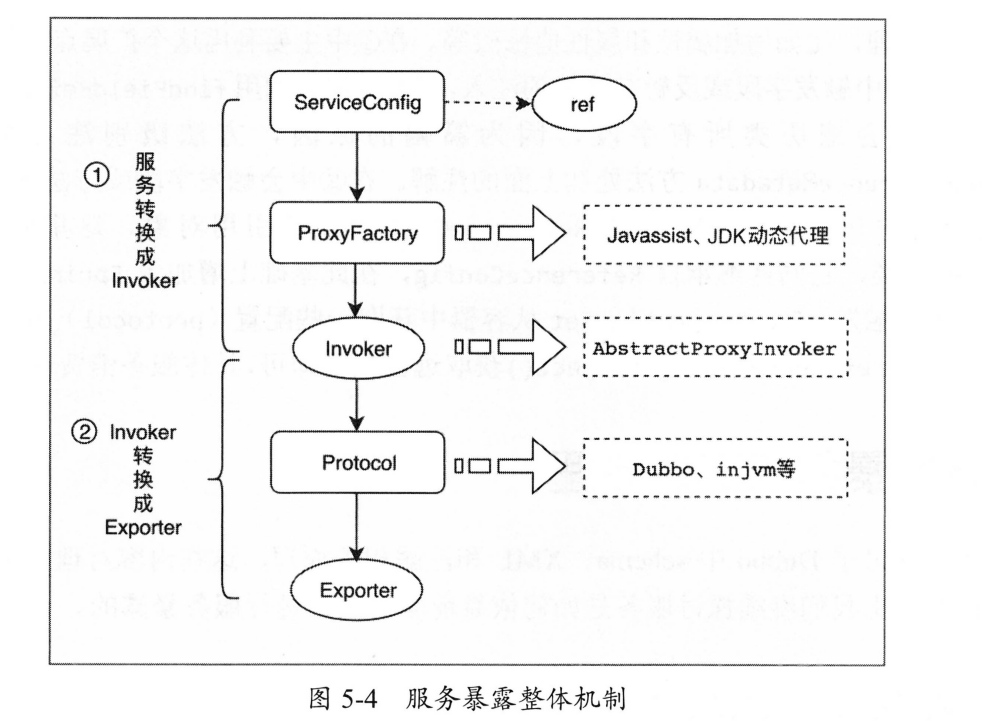

​		`Dubbo`框架做服务暴露分为两大部分，第一步将持有的服务实例通过代理转换成`Invoker`，第二步会把`Invoker`通过具体的协议转换成`Exporter`。框架做了

这层抽象也大大方便了功能扩展。这里的`Invoker`可以简单理解成一个真实的服务对象实例，是`Dubbo`框架实体域，所有模型都会向它靠拢，可向它发起`invoke`

调用。它可能是一个本地的实现，也可能是一个远程的实现，还可能是一个集群实现。

​		多注册中心同时写：配置了服务同时注册多个注册中心，则会依次暴露

```java
	private void doExportUrls() {
        ModuleServiceRepository repository = getScopeModel().getServiceRepository();
        ServiceDescriptor serviceDescriptor = repository.registerService(getInterfaceClass());
        providerModel = new ProviderModel(getUniqueServiceName(),
            ref,
            serviceDescriptor,
            this,
            getScopeModel(),
            serviceMetadata);

        repository.registerProvider(providerModel);

        List<URL> registryURLs = ConfigValidationUtils.loadRegistries(this, true); // 获取当前服务的配置中心

        for (ProtocolConfig protocolConfig : protocols) {
            String pathKey = URL.buildKey(getContextPath(protocolConfig)
                    .map(p -> p + "/" + path)
                    .orElse(path), group, version);
            // In case user specified path, register service one more time to map it to path.
            repository.registerService(pathKey, interfaceClass);
            doExportUrlsFor1Protocol(protocolConfig, registryURLs); // 根据协议暴露服务，如果存在多个协议，则会依次暴露，协议暴露后将注册元数据写入到对应的注册中心
        }
    }
```

```java
	private void doExportUrlsFor1Protocol(ProtocolConfig protocolConfig, List<URL> registryURLs) {
        Map<String, String> map = buildAttributes(protocolConfig);

        //init serviceMetadata attachments
        serviceMetadata.getAttachments().putAll(map);

        URL url = buildUrl(protocolConfig, registryURLs, map);

        exportUrl(url, registryURLs);
    }


	private Map<String, String> buildAttributes(ProtocolConfig protocolConfig) {

        Map<String, String> map = new HashMap<String, String>();
        map.put(SIDE_KEY, PROVIDER_SIDE);

        // append params with basic configs,
        ServiceConfig.appendRuntimeParameters(map);
        AbstractConfig.appendParameters(map, getApplication()); // 读取其他配置，用于后续构造URL
        AbstractConfig.appendParameters(map, getModule());
        // remove 'default.' prefix for configs from ProviderConfig
        // appendParameters(map, provider, Constants.DEFAULT_KEY);
        AbstractConfig.appendParameters(map, provider);
        AbstractConfig.appendParameters(map, protocolConfig);
        AbstractConfig.appendParameters(map, this);
        appendMetricsCompatible(map);

        ...

        return map;
    }


	private void exportUrl(URL url, List<URL> registryURLs) {
        String scope = url.getParameter(SCOPE_KEY);
        // don't export when none is configured
        if (!SCOPE_NONE.equalsIgnoreCase(scope)) {

            // export to local if the config is not remote (export to remote only when config is remote)
            if (!SCOPE_REMOTE.equalsIgnoreCase(scope)) { // 暴露本地服务
                exportLocal(url);
            }

            // export to remote if the config is not local (export to local only when config is local)
            if (!SCOPE_LOCAL.equalsIgnoreCase(scope)) {
                url = exportRemote(url, registryURLs); // 暴露远程服务
                MetadataUtils.publishServiceDefinition(url);
            }

        }
        this.urls.add(url);
    }

	private URL exportRemote(URL url, List<URL> registryURLs) {
        if (CollectionUtils.isNotEmpty(registryURLs)) { // 有注册中心的情况
            for (URL registryURL : registryURLs) {
                if (SERVICE_REGISTRY_PROTOCOL.equals(registryURL.getProtocol())) {
                    url = url.addParameterIfAbsent(SERVICE_NAME_MAPPING_KEY, "true");
                }

                //if protocol is only injvm ,not register
                if (LOCAL_PROTOCOL.equalsIgnoreCase(url.getProtocol())) {
                    continue;
                }

                url = url.addParameterIfAbsent(DYNAMIC_KEY, registryURL.getParameter(DYNAMIC_KEY));
                URL monitorUrl = ConfigValidationUtils.loadMonitor(this, registryURL);
                if (monitorUrl != null) {
                    url = url.putAttribute(MONITOR_KEY, monitorUrl); // 如果配置了监控地址，则服务调用信息会上报
                }

                // For providers, this is used to enable custom proxy to generate invoker
                String proxy = url.getParameter(PROXY_KEY);
                if (StringUtils.isNotEmpty(proxy)) {
                    registryURL = registryURL.addParameter(PROXY_KEY, proxy);
                }

                if (logger.isInfoEnabled()) {
                    if (url.getParameter(REGISTER_KEY, true)) {
                        logger.info("Register dubbo service " + interfaceClass.getName() + " url " + url.getServiceKey() + " to registry " + registryURL.getAddress());
                    } else {
                        logger.info("Export dubbo service " + interfaceClass.getName() + " to url " + url.getServiceKey());
                    }
                }

                doExportUrl(registryURL.putAttribute(EXPORT_KEY, url), true);
            }

        } else { // 无注册中心

            if (MetadataService.class.getName().equals(url.getServiceInterface())) {
                localMetadataService.setMetadataServiceURL(url);
            }

            if (logger.isInfoEnabled()) {
                logger.info("Export dubbo service " + interfaceClass.getName() + " to url " + url);
            }

            doExportUrl(url, true);
        }
        return url;
    }
```

```java
	private void doExportUrl(URL url, boolean withMetaData) {
        Invoker<?> invoker = proxyFactory.getInvoker(ref, (Class) interfaceClass, url); // 通过动态代理转换成Invoker, registryURL存储的是注册中心地址，使用export作为key追加服务元数据信息
        if (withMetaData) {
            invoker = new DelegateProviderMetaDataInvoker(invoker, this);
        }
        Exporter<?> exporter = protocolSPI.export(invoker); // 暴露后，向注册中心注册服务信息
        exporters.add(exporter);
    }
```

​		整个逻辑：

​				1、通过反射获取配置对象并放到`map`中用于后续构造`URL`参数(比如 应用名等)。

​				2、区分全局配置，默认在属性前面增加`default.`前缀，当框架获取`URL`中的参数时，如果不存在则会自动尝试获取`default.`前缀对应的值。

​				3、处理本地内存`JVM`协议暴露。

​				4、追加监控上报地址，框架会在拦截器中执行数据上报，这部分是可选的。

​				5、通过动态代理的方式创建`Invoker`对象，在服务端生成的是`AbstractProxylnvoker`实例，所有真实的方法调用都会委托给代理，然后代理转发给服务 

​		`ref`调用。目前框架实现两种代理：`JavassistProxyFactory`和`JdkProxyFactory`。`JavassistProxyFactory`模式原理：创建`Wrapper`子类，在子类中实现

​		`invokeMethod`方法，方法体内会为每个`ref`方法都做方法名和方法参数匹配校验，如果匹配则直接调用即可，相比`JdkProxyFactory`省去了反射调用的开

​		销。`JdkProxyFactory`模式是我们常见的用法，通过反射获取真实对象的方法，然后调用即可。

​				6、先触发服务暴露`(`端口打开等`)`，然后进行服务元数据注册。

​				7、处理没有使用注册中心的场景，直接进行服务暴露，不需要元数据注册，因为这里暴露的`URL`信息是以具体`RPC`协议开头的，并不是以注册中心协议

​		开头的。

​		在将服务实例`ref`转换成`Invoker`之后，如果有注册中心时，则会通过`RegistryProtocol#export`进行更细粒度的控制：

​				1、委托具体协议`(Dubbo)`进行服务暴露，创建`NettyServer`监听端口和保存服务实例。

​				2、创建注册中心对象，与注册中心创建`TCP`连接。

​				3、注册服务元数据到注册中心。

​				4、订阅`configurators`节点，监听服务动态属性变更事件。

​				5、服务销毁收尾工作，比如关闭端口、反注册服务信息等。

```java
	public <T> Exporter<T> export(final Invoker<T> originInvoker) throws RpcException {
        ...
            
        //export invoker
        final ExporterChangeableWrapper<T> exporter = doLocalExport(originInvoker, providerUrl); // 打开端口，把服务实例存储到 map

        // url to registry
        final Registry registry = getRegistry(registryUrl); // 创建注册中心实例
        final URL registeredProviderUrl = getUrlToRegistry(providerUrl, registryUrl);

        // decide if we need to delay publish
        boolean register = providerUrl.getParameter(REGISTER_KEY, true);
        if (register) {
            register(registry, registeredProviderUrl); // 服务暴露之后，注册服务元数据
        }

        // register stated url on provider model
        registerStatedUrl(registryUrl, registeredProviderUrl, register);


        exporter.setRegisterUrl(registeredProviderUrl);
        exporter.setSubscribeUrl(overrideSubscribeUrl);

        // Deprecated! Subscribe to override rules in 2.6.x or before.
        registry.subscribe(overrideSubscribeUrl, overrideSubscribeListener); // 监听服务接口下 configurators 节点，用于处理动态配置

        notifyExport(exporter);
        //Ensure that a new exporter instance is returned every time export
        return new DestroyableExporter<>(exporter); // exporter 是 ExporterChangeableWrapper 的实例
    }
```

```java
	private static class DestroyableExporter<T> implements Exporter<T> {

        private Exporter<T> exporter;

        public DestroyableExporter(Exporter<T> exporter) {
            this.exporter = exporter;
        }

        @Override
        public Invoker<T> getInvoker() {
            return exporter.getInvoker();
        }

        @Override
        public void unexport() { // Invoker 销毁时注销端口和 map 中服务实例等资源
            exporter.unexport();
        }
    }
```


​		在进行服务暴露前，框架会做拦截器初始化，`Dubbo`在加载`protocol`扩展点时会自动注入`ProtocolListenerwrapper`和`ProtocolFilterWrapper`：

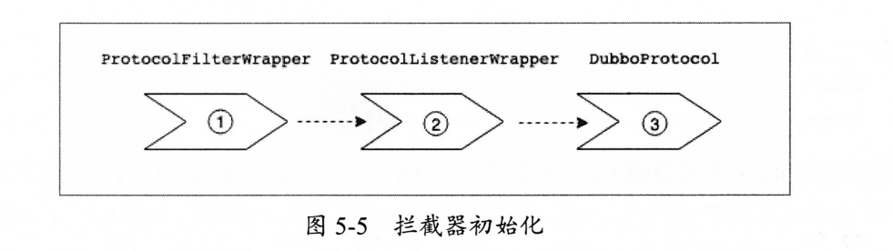

​		在`ProtocolListenerWrapper`实现中，在对服务提供者进行暴露时回调对应的监听器方法。 `ProtocolFilterWrapper`会调用下一级

`ListenerExporterWrapper#export`方法，在该方法内部会触发`buildlnvokerChain`进行拦截器构造：

```java
	// ProtocolFilterWrapper
    public <T> Exporter<T> export(Invoker<T> invoker) throws RpcException {
        if (UrlUtils.isRegistry(invoker.getUrl())) {
            return protocol.export(invoker);
        }
        FilterChainBuilder builder = getFilterChainBuilder(invoker.getUrl()); // 构造拦截器链
        return protocol.export(builder.buildInvokerChain(invoker, SERVICE_FILTER_KEY, CommonConstants.PROVIDER)); // 出发 Dubbo 协议暴露
    }
```

```java
	public <T> Invoker<T> buildInvokerChain(final Invoker<T> originalInvoker, String key, String group) {
        Invoker<T> last = originalInvoker;
        URL url = originalInvoker.getUrl();
        List<Filter> filters = ScopeModelUtil.getExtensionLoader(Filter.class, url.getScopeModel()).getActivateExtension(url, key, group);

        if (!filters.isEmpty()) {
            for (int i = filters.size() - 1; i >= 0; i--) {
                final Filter filter = filters.get(i);
                final Invoker<T> next = last; // 会把真实的 Invoker 服务对象 ref 放到拦截器的末尾
                last = new FilterChainNode<>(originalInvoker, next, filter); 
            }
        }
        return last;
    }
```

```java
	// FilterChainNode
	public Result invoke(Invocation invocation) throws RpcException {
            Result asyncResult;
            try {
                asyncResult = filter.invoke(nextNode, invocation); // 每次调用都会传递给下一个拦截器
            } catch (Exception e) {
                ...
            } finally {

            }
            ...
        }
```

​		整体逻辑：

​				1、在触发`Dubbo`协议暴露前先对服务`Invoker`做了一层拦截器构建，在加载所有拦截器时会过滤只对`provider`生效的数据。

​				2、首先获取真实服务`ref`对应的`Invoker`并挂载到整个拦截器链尾部，然后逐层包裹其他拦截器，这样保证了真实服务调用是最后触发的。

​				3、逐层转发拦截器服务调用，是否调用下一个拦截器由具体拦截器实现。

​		在构造调用拦截器之后会调用`Dubbo`协议进行服务暴露：

```java
	// DubboProtocol
	public <T> Exporter<T> export(Invoker<T> invoker) throws RpcException {
        checkDestroyed();
        URL url = invoker.getUrl();

        // export service.
        String key = serviceKey(url); // 根据服务分组、版本、接口和端口构造 key
        DubboExporter<T> exporter = new DubboExporter<T>(invoker, key, exporterMap);
        exporterMap.put(key, exporter); //  把exporter存储到单例 DubboProtocol 中

        ...

        openServer(url); // 初次暴露会创建监听服务器
        optimizeSerialization(url);

        return exporter;
    }

	private ProtocolServer createServer(URL url) {
        
        ...

        ExchangeServer server;
        try {
            server = Exchangers.bind(url, requestHandler); // 创建 NettyServer 并且初始化 Handler
        } catch (RemotingException e) {
            throw new RpcException("Fail to start server(url: " + url + ") " + e.getMessage(), e);
        }

        ...

        DubboProtocolServer protocolServer = new DubboProtocolServer(server);
        loadServerProperties(protocolServer);
        return protocolServer;
    }
```

​		整体逻辑：

​				1、根据服务分组、版本、服务接口和暴露端口作为`key`用于关联具体服务`Invoker`。

​				2、对服务暴露做校验判断，因为同一个协议暴露有很多接口，只有初次暴露的接口才需要打开端口监听

​				3、触发`HeaderExchanger`中的绑定方法，最后会调用底层`NettyServer`进行处理。

​		在初始化`Server`过程中会初始化很多`Handler`用于支持一些特性。


## 本地服务暴露

​		使用`Dubbo`框架的应用可能存在同一个`JVM`暴露了远程服务，同时同一个`JVM`内部又引用了自身服务的情况，`Dubbo`默认会把远程服务用`injvm`协议再暴露

一份，这样消费方直接消费同一个`JVM`内部的服务，避免了跨网络进行远程通信：

```java
	// ServiceConfig
	private void exportLocal(URL url) {
        URL local = URLBuilder.from(url)
                .setProtocol(LOCAL_PROTOCOL) // 显示指定 injvm 协议进行暴露
                .setHost(LOCALHOST_VALUE)
                .setPort(0)
                .build();
        local = local.setScopeModel(getScopeModel())
            .setServiceModel(providerModel);
        doExportUrl(local, false);
        logger.info("Export dubbo service " + interfaceClass.getName() + " to local registry url : " + local);
    }

	private void doExportUrl(URL url, boolean withMetaData) {
        Invoker<?> invoker = proxyFactory.getInvoker(ref, (Class) interfaceClass, url); // 调用 InjvmProtocol#export
        if (withMetaData) {
            invoker = new DelegateProviderMetaDataInvoker(invoker, this);
        }
        Exporter<?> exporter = protocolSPI.export(invoker);
        exporters.add(exporter);
    }
```

​		整体逻辑：

​				1、`Dubbo`指定用`injvm`协议暴露服务，这个协议比较特殊，不会做端口打开操作，仅仅把服务保存在内存中而已。

​				2、提取`URL`中的协议，在`InjvmProtocol`类中存储服务实例信息，它的实现也是非常直截了当的，直接返回`InjvmExporter`实例对象，构造函数内部会

​		把当前`Invoker`加入`exporterMap`。

```java
	// InjvmProtocol
	public <T> Exporter<T> export(Invoker<T> invoker) throws RpcException {
        return new InjvmExporter<T>(invoker, invoker.getUrl().getServiceKey(), exporterMap);
    }
```

```java
public class InjvmExporter<T> extends AbstractExporter<T> {

    ...

    InjvmExporter(Invoker<T> invoker, String key, Map<String, Exporter<?>> exporterMap) {
        super(invoker);
        this.key = key;
        this.exporterMap = exporterMap;
        exporterMap.put(key, this);
    }

    ...

}
```


# 服务消费

​		整体`RPC`的消费原理：

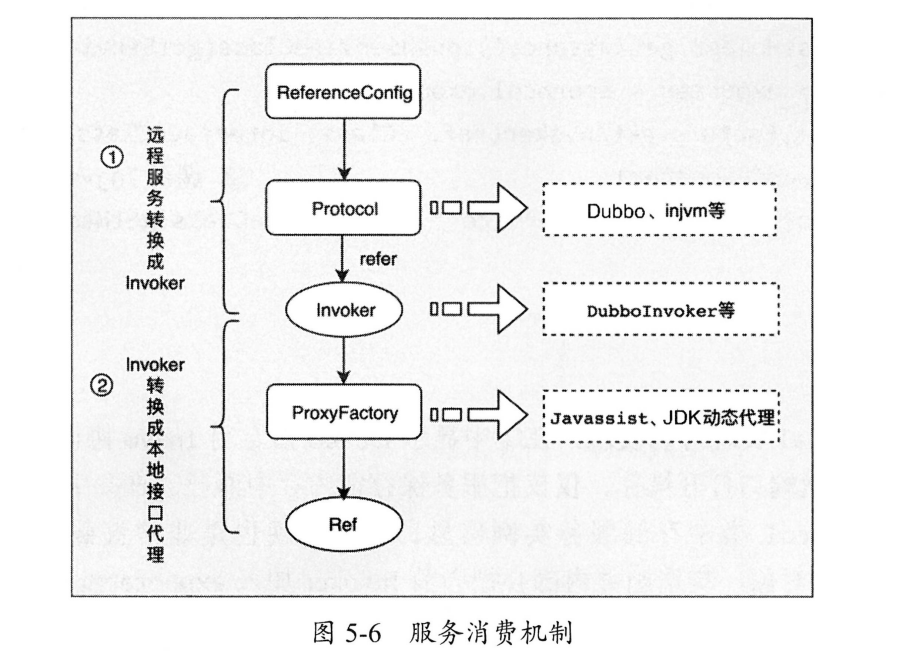

​		`Dubbo`框架做服务消费也分为两大部分：

​				第一步通过持有远程服务实例生成`Invoker`，这个`Invoker`在客户端是核心的远程代理对象。

​				第二步会把`Invoker`通过动态代理转换成实现用户接口的动态代理引用。这里的`Invoker`承载了网络连接、服务调用和重试等功能，在客户端，它可能

​		是一个远程的实现，也可能是一个集群实现。

​		`Dubbo`支持多注册中心同时消费，如果配置了服务同时注册多个注册中心，则会在`ReferenceConfig#createProxy`中合并成一个`Invoke`：

```java
	private T createProxy(Map<String, String> referenceParameters) {
        if (shouldJvmRefer(referenceParameters)) {  // 处理在同一个 JVM 内部引用的情况
            createInvokerForLocal(referenceParameters);
        } else {
            urls.clear();
            if (url != null && url.length() > 0) {
                // user specified URL, could be peer-to-peer address, or register center's address.
                parseUrl(referenceParameters);
            } else {
                // if protocols not in jvm checkRegistry
                if (!LOCAL_PROTOCOL.equalsIgnoreCase(getProtocol())) {
                    aggregateUrlFromRegistry(referenceParameters);
                }
            }
            createInvokerForRemote();
        }

        if (logger.isInfoEnabled()) {
            logger.info("Referred dubbo service " + interfaceClass.getName());
        }

        URL consumerUrl = new ServiceConfigURL(CONSUMER_PROTOCOL, referenceParameters.get(REGISTER_IP_KEY), 0,
            referenceParameters.get(INTERFACE_KEY), referenceParameters);
        consumerUrl = consumerUrl.setScopeModel(getScopeModel());
        consumerUrl = consumerUrl.setServiceModel(consumerModel);
        MetadataUtils.publishServiceDefinition(consumerUrl);

        // create service proxy
        return (T) proxyFactory.getProxy(invoker, ProtocolUtils.isGeneric(generic));
    }
```

```java
	private void createInvokerForRemote() {
        if (urls.size() == 1) {  // 单注册中心消费
            URL curUrl = urls.get(0);
            invoker = protocolSPI.refer(interfaceClass,curUrl);
            if (!UrlUtils.isRegistry(curUrl)){
                List<Invoker<?>> invokers = new ArrayList<>();
                invokers.add(invoker);
                invoker = Cluster.getCluster(scopeModel, Cluster.DEFAULT).join(new StaticDirectory(curUrl, invokers), true);
            }
        } else {
            List<Invoker<?>> invokers = new ArrayList<>();
            URL registryUrl = null;
            for (URL url : urls) { // 逐个获取注册中心的服务，添加到 invokers 列表

                invokers.add(protocolSPI.refer(interfaceClass, url));

                if (UrlUtils.isRegistry(url)) {
                    // use last registry url
                    registryUrl = url;
                }
            }

            if (registryUrl != null) {
                
                String cluster = registryUrl.getParameter(CLUSTER_KEY, ZoneAwareCluster.NAME);

                invoker = Cluster.getCluster(registryUrl.getScopeModel(), cluster, false).join(new StaticDirectory(registryUrl, invokers), false); // 通过 Cluster 将多个 Invoker 转换成一个 Invoker
            } else {
                // not a registry url, must be direct invoke.
                if (CollectionUtils.isEmpty(invokers)) {
                    throw new IllegalArgumentException("invokers == null");
                }
                URL curUrl = invokers.get(0).getUrl();
                String cluster = curUrl.getParameter(CLUSTER_KEY, Cluster.DEFAULT);
                invoker = Cluster.getCluster(scopeModel, cluster).join(new StaticDirectory(curUrl, invokers), true);
            }
        }
    }
```

​		整体逻辑：

​				1、优先判断是否在同一个`JVM`中包含要消费的服务。

​				2、找出内存中`injvm`协议的服务， 其实`injvm`协议是比较好理解的，前面提到服务实例都放到内存`map`中，消费也是直接获取实例调用而已。

​				3、在注册中心中追加消费者元数据信息，应用启动时订阅注册中心、服务提供者参数等合并时会用到这部分信息。

​				4、处理只有一个注册中心的场景，这种场景在客户端中是最常见的，客户端启动拉取服务元数据，订阅`provider`、路由和配置变更。

​				5、分别处理多注册中心的场景。

​		当经过注册中心消费时，主要通过`RegistryProtocol#refer`触发数据拉取、订阅和服务`Invoker`转换等操作：

```java
	public <T> Invoker<T> refer(Class<T> type, URL url) throws RpcException {
        url = getRegistryUrl(url);  // 设置具体注册中心协议
        Registry registry = getRegistry(url); // 创建注册中心实例
        if (RegistryService.class.equals(type)) {
            return proxyFactory.getInvoker((T) registry, type, url);
        }

        // group="a,b" or group="*"
        Map<String, String> qs = (Map<String, String>) url.getAttribute(REFER_KEY); // 根据配置处理多分组结果聚合
        String group = qs.get(GROUP_KEY);
        if (group != null && group.length() > 0) {
            if ((COMMA_SPLIT_PATTERN.split(group)).length > 1 || "*".equals(group)) {
                return doRefer(Cluster.getCluster(url.getScopeModel(), MergeableCluster.NAME), registry, type, url, qs);
            }
        }

        Cluster cluster = Cluster.getCluster(url.getScopeModel(), qs.get(CLUSTER_KEY));
        return doRefer(cluster, registry, type, url, qs); // 处理订阅数据并通过 Cluster 合并多个 Invoker
    }


	protected <T> Invoker<T> doRefer(Cluster cluster, Registry registry, Class<T> type, URL url, Map<String, String> parameters) {
        Map<String, Object> consumerAttribute = new HashMap<>(url.getAttributes());
        consumerAttribute.remove(REFER_KEY);
        URL consumerUrl = new ServiceConfigURL(parameters.get(PROTOCOL_KEY) == null ? DUBBO : parameters.get(PROTOCOL_KEY),
            null,
            null,
            parameters.get(REGISTER_IP_KEY),
            0, getPath(parameters, type),
            parameters,
            consumerAttribute);
        url = url.putAttribute(CONSUMER_URL_KEY, consumerUrl);
        ClusterInvoker<T> migrationInvoker = getMigrationInvoker(this, cluster, registry, type, url, consumerUrl);
        return interceptInvoker(migrationInvoker, url, consumerUrl, url);
    }
```

​		第一次发起订阅时会进行一次数据拉取操作，同时触发`RegistryDirectory#notify`方法，这里的通知数据是某一个类别的全量数据，当通知`providers`数据

时，在`RegistryDirectory#toInvokers`方法内完成`Invoker`转换：

```java
	private Map<URL, Invoker<T>> toInvokers(Map<URL, Invoker<T>> oldUrlInvokerMap, List<URL> urls) {
        Map<URL, Invoker<T>> newUrlInvokerMap = new ConcurrentHashMap<>();
        if (urls == null || urls.isEmpty()) {
            return newUrlInvokerMap;
        }
        String queryProtocols = this.queryMap.get(PROTOCOL_KEY);
        for (URL providerUrl : urls) {

            if (queryProtocols != null && queryProtocols.length() > 0) {
                boolean accept = false;
                String[] acceptProtocols = queryProtocols.split(",");
                for (String acceptProtocol : acceptProtocols) { // 根据消费方protocol配置过滤不匹配协议
                    if (providerUrl.getProtocol().equals(acceptProtocol)) {
                        accept = true;
                        break;
                    }
                }
                if (!accept) {
                    continue;
                }
            }
            
            ...
                
            URL url = mergeUrl(providerUrl); // 合并provider端配置数据


            Invoker<T> invoker = oldUrlInvokerMap == null ? null : oldUrlInvokerMap.remove(url);
            if (invoker == null) { // Not in the cache, refer again
                try {
                    boolean enabled = true;
                    
                    ...
                    
                    if (enabled) {
                        invoker = protocol.refer(serviceType, url); // 使用具体协议创建远程连接
                    }
                } catch (Throwable t) {
                    logger.error("Failed to refer invoker for interface:" + serviceType + ",url:(" + url + ")" + t.getMessage(), t);
                }
                if (invoker != null) { // Put new invoker in cache
                    newUrlInvokerMap.put(url, invoker);
                }
            } else {
                newUrlInvokerMap.put(url, invoker);
            }
        }
        return newUrlInvokerMap;
    }
```

​		1、进行协议处理，支持消费多个协议，允许消费多个协议时，在配置`Protocol`值时用逗号分隔即可。

​		2、消费信息是客户端处理的，需要合并服务端相关信息，通过注册中心获取这些信息，解耦了消费方强绑定配置。

​		3、消除重复推送的服务列表，防止重复引用。

​		4、使用具体的协议发起远程连接等操作。

​		具体`Invoker`创建是在`DubboProtocol#refer`中实现的，`Dubbo`协议在返回`Dubbolnvoker`对象之前会先初始化客户端连接对象。`Dubbo`支持客户端是否立即

和远程服务建立`TCP`连接是由参数是否配置了`lazy`属性决定的，默认会全部连接。`DubboProtocol#refer`内部会调用`DubboProtocol#initClient`负责建立客户端

连接和初始化`Handle`：

```java
	private ExchangeClient initClient(URL url) {

       ...

        ExchangeClient client;
        try {
            // connection should be lazy
            if (url.getParameter(LAZY_CONNECT_KEY, false)) {
                client = new LazyConnectExchangeClient(url, requestHandler); // 如果配置了 lazy属性，则真实调用才会创建TCP连接

            } else {
                client = Exchangers.connect(url, requestHandler); // 立即与远程连接
            }

        } catch (RemotingException e) {
            throw new RpcException("Fail to create remoting client for service(" + url + "): " + e.getMessage(), e);
        }

        return client;
    }
```

​		1、支持`lazy`延迟连接，在真实发生`RPC`调用时创建。

​		2、立即发起远程`TCP`连接，具体使用底层传输也是根据配置`transporter`决定的，默认是`Netty`传输。

​		3、会触发`HeaderExchanger#connect`调用，用于支持心跳和在业务线程中编解码`Handler`，最终会调用`Transporters#connect`生成`Netty`客户端处理。


​		多注册中心消费原理比较简单，每个单独注册中心抽象成一个单独的`Invoker`，多个注册中心实例最终通过`StaticDirectory`保存所有的`Invoker`，最终通过

`Cluster`合并成一个`Invoker`。

​		在多注册中心场景下，默认使用的集群策略是`available`：

```java
public class AvailableCluster implements Cluster {

    public static final String NAME = "available";

    @Override
    public <T> Invoker<T> join(Directory<T> directory, boolean buildFilterChain) throws RpcException {
        return new AvailableClusterInvoker<>(directory);
    }

}

public class AvailableClusterInvoker<T> extends AbstractClusterInvoker<T> {

    public AvailableClusterInvoker(Directory<T> directory) {
        super(directory);
    }

    @Override
    public Result doInvoke(Invocation invocation, List<Invoker<T>> invokers, LoadBalance loadbalance) throws RpcException {
        for (Invoker<T> invoker : invokers) { // invokers 注册中心实例
            if (invoker.isAvailable()) { // 判断特定注册中心是否包含 provider 服务
                return invokeWithContext(invoker, invocation);
            }
        }
        throw new RpcException("No provider available in " + invokers);
    }

}
```

​		1、`dolnvoke`实际持有的`invokers`列表是注册中心实例。

​		2、判断具体注册中心中是否有服务可用，这里发起的`invoke`实际上会通过注册中心`RegistryDirectory`获取真实`provider`机器列表进行路由和负载均衡调

用。


​		`Dubbo`可以绕过注册中心直接向指定服务发起`RPC`调用。`Dubbo`框架也支持同时指定直连多台机器进行服务调用：


​		`Dubbo`中实现的优雅停机机制主要包含`6`个步骤：

​				1、收到`kill -9`进程退出信号，`Spring`容器会触发容器销毁事件。

​				2、`provider`端会取消注册服务元数据信息。

​				3、`consumer`端会收到最新地址列表。

​				4、`Dubbo`协议会发送`readonly`事件报文通知`consumer`服务不可用。

​				5、服务端等待已经执行的任务结束并拒绝新任务执行。 


# 远程调用

​		`Dubbo`在一次完整的`RPC`调用流程中经过的步骤：

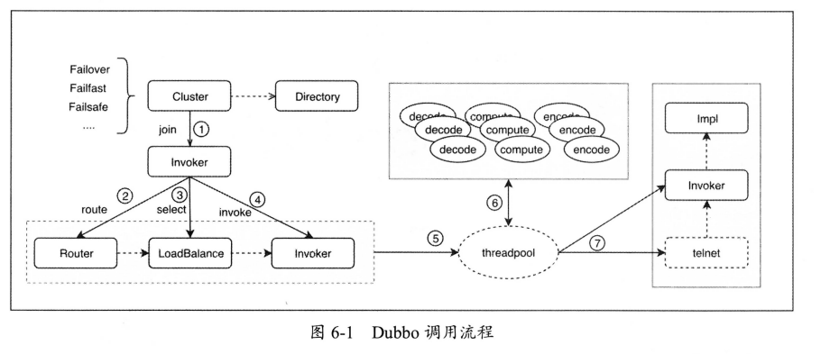

​		首先在客户端启动时会从注册中心拉取和订阅对应的服务列表，`Cluster`会把拉取的服务列表聚合成一个`Invoker`，每次`RPC`调用前会通过`Directory#list`

获取`providers`地址`(`已经生成好的`Invoker`列表`)`，获取这些服务列表给后续路由和负载均衡使用。在框架内部另外一个实现`Directory`接口是

`RegistryDirectory`类，它和接口名是一对一的关系`(`每一个接口都有一个`RegistryDirectory`实例`)`，主要负责拉取和订阅服务提供者、动态配置和路由项。 

​		在`Dubbo`发起服务调用时，所有路由和负载均衡都是在客户端实现的。客户端服务调用首先会触发路由操作，然后将路由结果得到的服务列表作为负载均衡

参数，经过负载均衡后会选出一台机器进行`RPC`调用。客户端经过路由和负载均衡后，会将请求交给底层`I/O`线程池，`I/O`线程池主要处理读写、序列化和反序列 

化等逻辑，因此这里一定不能阻塞操作，`Dubbo`也提供参数控制`decode.in.io`参数，在处理反序列化对象时会在业务线程池中处理。`Dubbo`包含两种类似的线程

池，一种是`I/O`线程池`(Netty)`，另一种是`Dubbo`业务线程池`(`承载业务方法调用`)`。

​		`Dubbo`将服务调用和`Telnet`调用做了端口复用，在编解码层面也做了适配。在`Telnet`调用时，会新建立一个`TCP`连接，传递接口、方法和`JSON`格式的参数

进行服务调用，在编解码层面简单读取流中的字符串，最终交给`Telnet`对应的`Handler`去解析方法调用。如果是非`Telnet`调用，则服务提供方会根据传递过来的

接口、分组和版本信息查找`Invoker`对应的实例进行反射调用。`Telnet`和正常`RPC`调用不一样的地方是序列化和反序列化使用的不是`Hessian`方式，而是直接使

用`fastjson`进行处理。


## Dubbo协议

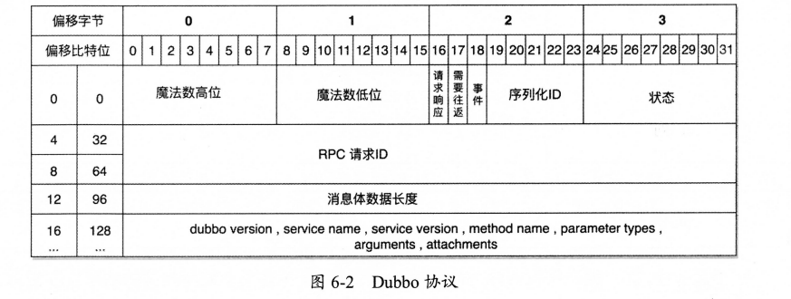

| 偏移比特位 |   字段描述   |                             作用                             |
| :--------: | :----------: | :----------------------------------------------------------: |
|    0〜7    |   魔数高位   |                 存储的是魔法数高位`(OxdaOO)`                 |
|   8〜15    |   魔数低位   |                  存储的是魔法数低位`(Oxbb)`                  |
|     16     |  数据包类型  | 是否为双向的`RPC`调用`(`比如方法调用有返回值`)`，`0`为`Response`，`1`为`Request` |
|     17     |   调用方式   | 仅在第`16`位被设为`1`的情况下有效，`0`为单向调用，`1`为双向调用 |
|     18     |   事件标识   | `0`为当前数据包是请求或响应包<br />`1`为当前数据包是心跳包，框架为了保活TCP连接，每次客户端和服务端互相发送心跳包时这个标志位被设定设置了心跳报文不会透传到业务方法调用，仅用于框架内部保活机制 |
|   19〜23   | 序列化器编号 | `2`为`Hessian2Serialization`<br /> `3`为`JavaSerialization`<br /> `4`为`CompactedJavaSerialization`<br /> `6`为`FastJsonSerialization`<br />`7`为`NativeJavaSerialization`<br />`8`为`KryoSerialization`<br />`9`为`FstSerialization` |
|   24〜31   |     状态     |                            状态码                            |
|   32〜95   |   请求编号   |  这`8`个字节存储`RPC`请求的唯一`id`，用来将请求和响应做关联  |
|  96〜127   |  消息体长度  | 占用的`4`个字节存储消息体长度。在一次`RPC`请求过程中，消息体中依次会存储`7`部分内容 |

​		在消息体中，客户端严格按照序列化顺序写入消息，服务端也会遵循相同的顺序读取消息，客户端发起请求的消息体依次保存下列内容：`Dubbo`版本号、服

务接口名、服务接口版本、方法名、参数类型、方法参数值和请求额外参数。

​		完整状态响应码和作用：

| 状态值 |             状态符号              |          作用          |
| :----: | :-------------------------------: | :--------------------: |
|   20   |                OK                 |        正确返回        |
|   30   |          CLIENT_TIMEOUT           |       客户端超时       |
|   31   |          SERVER_TIMEOUT           |       服务端超时       |
|   40   |            BAD_REQUEST            |    请求报文格式错误    |
|   50   |           BAD_RESPONSE            |    响应报文格式错误    |
|   60   |         SERVICE_NOT_FOUND         |    未找到匹配的服务    |
|   70   |           SERVICE_ERROR           |      服务调用错误      |
|   80   |           SERVER_ERROR            |     服务端内部错误     |
|   90   |           CLIENT_ERROR            |       客户端错误       |
|  100   | SERVER_THREADPOOL_EXHAUSTED_ERROR | 服务端线程池满拒绝执行 |

​		状态响主要根据以下标记判断返回值：

| 状态值 |                 状态符号                 |         作用         |
| :----: | :--------------------------------------: | :------------------: |
|   5    |   RESPONSE_NULL_VALUE_WITH_ATTACHMENTS   | 响应空值包含隐藏参数 |
|   4    |     RESPONSE_VALUE_WITH_ATTACHMENTS      | 响应结果包含隐藏参数 |
|   3    | RESPONSE_WITH_EXCEPTION_WITH_ATTACHMENTS | 异常返回包含隐藏参数 |
|   2    |           RESPONSE_NULL_VALUE            |       响应空值       |
|   1    |              RESPONSE_VALUE              |       响应结果       |
|   0    |         RESPONSE_WITH_EXCEPTION          |       异常返回       |

​		在返回消息体中，会先把返回值状态标记写入输出流，根据标记状态判断`RPC`是否正常，紧接着再写方法返回值。

​		客户端会使用多线程并发调用服务，`Dubbo`做到正确响应调用线程的关键点在于协议头全局请求`id`标识：

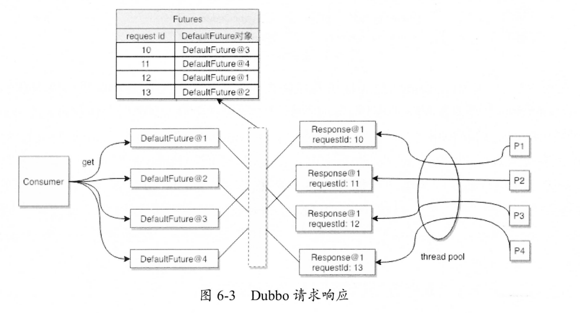

​		当客户端多个线程并发请求时，框架内部会调用`DefaultFuture`对象的`get`方法进行等待。 在请求发起时，框架内部会创建`Request`对象，这个时候会被分

配一个唯一`id`，`DefaultFuture`可以从`Request`对象中获取`id`，并将关联关系存储到静态`HashMap`中。当客户端收到响应时，会根据`Response`对象中的`id`，从

`Futures`集合中查找对应`DefaultFuture`对象，最终会唤醒对应的线程并通知结果。客户端也会启动一个定时扫描线程去探测超时没有返回的请求。


## 编解码器

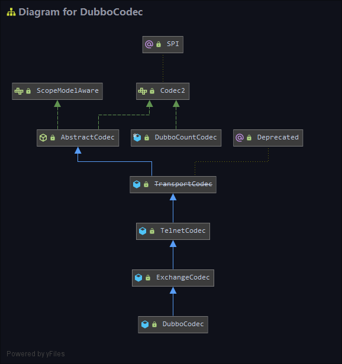

​		`AbstractCodec`主要提供基础能力，比如校验报文长度和查找具体编解码器等。`TransportCodec`主要抽象编解码实现，自动帮我们去调用序列化、反序列实

现和自动`cleanup`流。通过`Dubbo`编解码继承结构可以清晰看到，`DubboCodec`继承自`ExchangeCodec`，它又再次继承了`TelnetCodec`实现。`Telnet`实现复用了

`Dubbo`协议端口，其实就是在这层编解码做了通用处理。因为流中可能包含多个`RPC`请求，`Dubbo`框架尝试一次性读取更多完整报文编解码生成对象

`(DubboCountCodec)`，它的实现思想比较简单，依次调用`DubboCodec`去解码，如果能解码成完整报文，则加入消息列表，然后触发下一个`Handler`方法调用。


### 编码

​		`Dubbo`中的编码器主要将`Java`对象编码成字节流返回给客户端，主要做两部分事情，构造报文头部，然后对消息体进行序列化处理。所有编解码层实现都继

承自`Exchangecodec`。当`Dubbo`协议编码请求对象时，会调用`ExchangeCodec#encode`方法。

```java
	protected void encodeRequest(Channel channel, ChannelBuffer buffer, Request req) throws IOException {
        Serialization serialization = getSerialization(channel, req); // 获取指定或默认的序列化协议
        // header.
        byte[] header = new byte[HEADER_LENGTH]; // 构造 16 字节头
        // set magic number.
        Bytes.short2bytes(MAGIC, header); //占用 2 个字节存储魔法数

        // set request and serialization flag.
        header[2] = (byte) (FLAG_REQUEST | serialization.getContentTypeId()); // 在第 3 个字节(16位和19〜23位)分别存储请求标志和序列化协议序号

        if (req.isTwoWay()) {
            header[2] |= FLAG_TWOWAY; // 设置请求/响应标记
        }
        if (req.isEvent()) {
            header[2] |= FLAG_EVENT; 
        }

        // set request id.
        Bytes.long2bytes(req.getId(), header, 4); // 设置请求唯一标识

        // encode request data.
        int savedWriteIndex = buffer.writerIndex();
        buffer.writerIndex(savedWriteIndex + HEADER_LENGTH); // 跳过 buffer 头部 16 个字节，用于序列化消息体
        ChannelBufferOutputStream bos = new ChannelBufferOutputStream(buffer);

        if (req.isHeartbeat()) {
            // heartbeat request data is always null
            bos.write(CodecSupport.getNullBytesOf(serialization));
        } else {
            ObjectOutput out = serialization.serialize(channel.getUrl(), bos);
            if (req.isEvent()) {
                encodeEventData(channel, out, req.getData());
            } else {
                encodeRequestData(channel, out, req.getData(), req.getVersion()); // 序列化请求调用,data 一般是 Rpclnvocation
            }
            out.flushBuffer();
            if (out instanceof Cleanable) {
                ((Cleanable) out).cleanup();
            }
        }

        bos.flush();
        bos.close();
        int len = bos.writtenBytes();
        checkPayload(channel, len); // 检车是否超过默认 8MB 大小
        Bytes.int2bytes(len, header, 12); // 向消息长度写入头部第 12 个字节的偏移量(96〜127位)

        // write
        buffer.writerIndex(savedWriteIndex); // 定位指针到报文头部开始位
        buffer.writeBytes(header); // 写入完整报文头部到 buffer
        buffer.writerIndex(savedWriteIndex + HEADER_LENGTH + len); // 设置 writerindex 到消息体结束位置
    }
```

​		上面调用了`encodeRequestData`方法对`Rpclnvocation`调用进行编码，这部分主要就是对接口、方法、方法参数类型、方法参数等进行编码，在

`DubboCodec#encodeRequestData`中重写了这个方法实现：

```java
    protected void encodeRequestData(Channel channel, ObjectOutput out, Object data, String version) throws IOException {
        RpcInvocation inv = (RpcInvocation) data;

        out.writeUTF(version); // 写入框架版本，主要用于支持服务端版本隔离和服务端隐式参数透传给客户端的特性

        String serviceName = inv.getAttachment(INTERFACE_KEY);
        if (serviceName == null) {
            serviceName = inv.getAttachment(PATH_KEY); 
        }
        out.writeUTF(serviceName); // // 写入调用接口
        out.writeUTF(inv.getAttachment(VERSION_KEY)); // 写入接口指定的版本，默认为 0.0.0。Dubbo允许同一个接口有多个实现，可以指定版本或分组来区分

        out.writeUTF(inv.getMethodName()); // 写入方法名称
        out.writeUTF(inv.getParameterTypesDesc()); // 写入方法参数类型
        Object[] args = inv.getArguments();
        if (args != null) {
            for (int i = 0; i < args.length; i++) {
                out.writeObject(callbackServiceCodec.encodeInvocationArgument(channel, inv, i)); // 依次写入方法参数值
            }
        }
        out.writeAttachments(inv.getObjectAttachments()); // 写入隐式参数
    }
```


​		编码响应对象，实现在`ExchangeCodec#encodeResponse`中：

```java
	protected void encodeResponse(Channel channel, ChannelBuffer buffer, Response res) throws IOException {
        int savedWriteIndex = buffer.writerIndex();
        try {
            Serialization serialization = getSerialization(channel, res); // 获取指定或默认的序列化协议
            // header.
            byte[] header = new byte[HEADER_LENGTH]; // 构造 16 字节头
            // set magic number.
            Bytes.short2bytes(MAGIC, header); // 占用2个字节存储魔法数
            // set request and serialization flag.
            header[2] = serialization.getContentTypeId(); // 在第3个字节（19〜23位）存储响应标志
            if (res.isHeartbeat()) {
                header[2] |= FLAG_EVENT;
            }
            // set response status.
            byte status = res.getStatus(); // 在第4个字节存储响应状态
            header[3] = status;
            // set request id.
            Bytes.long2bytes(res.getId(), header, 4); // 设置请求唯一标识

            buffer.writerIndex(savedWriteIndex + HEADER_LENGTH); // 空出 16 字节头部用于存储响应体报文
            ChannelBufferOutputStream bos = new ChannelBufferOutputStream(buffer);

            // encode response data or error message.
            if (status == Response.OK) {
                if(res.isHeartbeat()){
                    // heartbeat response data is always null
                    bos.write(CodecSupport.getNullBytesOf(serialization));
                }else {
                    ObjectOutput out = serialization.serialize(channel.getUrl(), bos);
                    if (res.isEvent()) {
                        encodeEventData(channel, out, res.getResult());
                    } else {
                        encodeResponseData(channel, out, res.getResult(), res.getVersion()); // 序列化响应调用，data 一般是 Result 对象
                    }
                    out.flushBuffer();
                    if (out instanceof Cleanable) {
                        ((Cleanable) out).cleanup();
                    }
                }
            } else {
                ObjectOutput out = serialization.serialize(channel.getUrl(), bos);
                out.writeUTF(res.getErrorMessage());
                out.flushBuffer();
                if (out instanceof Cleanable) {
                    ((Cleanable) out).cleanup();
                }
            }

            bos.flush();
            bos.close();

            int len = bos.writtenBytes();
            checkPayload(channel, len); // 检查是否超过默认的 8MB 大小
            Bytes.int2bytes(len, header, 12); // 向消息长度写入头部第 12 个字节偏移量(96 ~ 127 位)
            // write
            buffer.writerIndex(savedWriteIndex); // 定位指针到报文头部开始位置
            buffer.writeBytes(header); // 写入完整报文头部到 buffer
            buffer.writerIndex(savedWriteIndex + HEADER_LENGTH + len); // 设置 writerindex 到消息体结束位置
        } catch (Throwable t) {
            // clear buffer
            buffer.writerIndex(savedWriteIndex); // 如果编码失败，则复位 buffer,否则导致缓冲区中数据错乱
            // send error message to Consumer, otherwise, Consumer will wait till timeout.
            if (!res.isEvent() && res.getStatus() != Response.BAD_RESPONSE) { // 将编码响应异常发送给 consumer,否则只能等待到超时
                Response r = new Response(res.getId(), res.getVersion());
                r.setStatus(Response.BAD_RESPONSE);

                if (t instanceof ExceedPayloadLimitException) {
                    logger.warn(t.getMessage(), t);
                    try {
                        r.setErrorMessage(t.getMessage());
                        channel.send(r); // 告知客户端数据包长度超过限制
                        return;
                    } catch (RemotingException e) {
                        logger.warn("Failed to send bad_response info back: " + t.getMessage() + ", cause: " + e.getMessage(), e);
                    }
                } else {
                    // FIXME log error message in Codec and handle in caught() of IoHanndler?
                    logger.warn("Fail to encode response: " + res + ", send bad_response info instead, cause: " + t.getMessage(), t);
                    try {
                        // 告知客户端编码失败的具体原因
                        r.setErrorMessage("Failed to send response: " + res + ", cause: " + StringUtils.toString(t)); 
                        channel.send(r);
                        return;
                    } catch (RemotingException e) {
                        logger.warn("Failed to send bad_response info back: " + res + ", cause: " + e.getMessage(), e);
                    }
                }
            }

            ...
        }
    }
```

​		编码响应消息体的部分实现在`DubboCodec#encodeResponseData`中：

```java
	protected void encodeResponseData(Channel channel, ObjectOutput out, Object data, String version) throws IOException {
        Result result = (Result) data;
        // currently, the version value in Response records the version of Request
        boolean attach = Version.isSupportResponseAttachment(version); // 判断客户端请求的版本是否支持服务端参数返回
        Throwable th = result.getException();
        if (th == null) {
            Object ret = result.getValue(); // 提取正常返回结果
            if (ret == null) {
                out.writeByte(attach ? RESPONSE_NULL_VALUE_WITH_ATTACHMENTS : RESPONSE_NULL_VALUE); // 在编码结果前，先写一个字节标志
            } else {
                out.writeByte(attach ? RESPONSE_VALUE_WITH_ATTACHMENTS : RESPONSE_VALUE);
                out.writeObject(ret); // 分别写一个字节标记和调用结果
            }
        } else {
            out.writeByte(attach ? RESPONSE_WITH_EXCEPTION_WITH_ATTACHMENTS : RESPONSE_WITH_EXCEPTION);
            out.writeThrowable(th); // 标记调用抛异常，并序列化异常
        }

        if (attach) {
            // returns current version of Response to consumer side.
            result.getObjectAttachments().put(DUBBO_VERSION_KEY, Version.getProtocolVersion()); 
            out.writeAttachments(result.getObjectAttachments()); // 记录服务端 Dubbo 版本，并返回服务端隐式参数
        }
    }
```


### 解码

​		解码工作分为`2`部分，第`1`部分解码报文的头部`(16`字节`)`，第`2`部分解码报文体内容，以及如何把报文体转换成`Rpclnvocation`。

​		当服务端读取流进行解码时，会触发`ExchangeCodec#decode`方法，`Dubbo`协议解码继承了这个类实现，但是在解析消息体时，`Dubbo`协议重写了`decodeBody`

方法：

```java
	public Object decode(Channel channel, ChannelBuffer buffer) throws IOException {
        int readable = buffer.readableBytes();
        byte[] header = new byte[Math.min(readable, HEADER_LENGTH)]; // 最多读取 16 个字节，并分配存储空间
        buffer.readBytes(header);
        return decode(channel, buffer, readable, header);
    }

	protected Object decode(Channel channel, ChannelBuffer buffer, int readable, byte[] header) throws IOException {
        // check magic number.
        if (readable > 0 && header[0] != MAGIC_HIGH
                || readable > 1 && header[1] != MAGIC_LOW) { // 处理流起始处不是 Dubbo 魔法数 Oxdabb 场景
            int length = header.length;
            if (header.length < readable) { // 流中还有数据可以读取
                header = Bytes.copyOf(header, readable); // 为 header 重新分配空间，用来存储流中所有可读字节
                buffer.readBytes(header, length, readable - length); // 将流中剩余字节读取到 header 中
            }
            for (int i = 1; i < header.length - 1; i++) {
                if (header[i] == MAGIC_HIGH && header[i + 1] == MAGIC_LOW) {
                    buffer.readerIndex(buffer.readerIndex() - header.length + i); // 将 buffer 读索引指向回 Dubbo 报文开头处 (Oxdabb)
                    header = Bytes.copyOf(header, i); // 将流起始处至下一个 Dubbo 报文之间的数据放到 header 中
                    break;
                }
            }
            return super.decode(channel, buffer, readable, header); // 主要用于解析 header 数据，比如用于 Telnet
        }
        // check length.
        if (readable < HEADER_LENGTH) { // 如果读取数据长度小于 16 个字节,则期待更多数据
            return DecodeResult.NEED_MORE_INPUT;
        }

        // get data length.
        int len = Bytes.bytes2int(header, 12); // 取头部存储的报文长度，并校验长度是否超过限制

        // When receiving response, how to exceed the length, then directly construct a response to the client.
        // see more detail from https://github.com/apache/dubbo/issues/7021.
        Object obj = finishRespWhenOverPayload(channel, len, header);
        if (null != obj) {
            return obj;
        }

        checkPayload(channel, len);

        int tt = len + HEADER_LENGTH;
        if (readable < tt) { // 校验是否可以读取完整 Dubbo 报文，否则期待更多数据
            return DecodeResult.NEED_MORE_INPUT;
        }

        // limit input stream.
        ChannelBufferInputStream is = new ChannelBufferInputStream(buffer, len);

        try {
            return decodeBody(channel, is, header); // 解码消息体，is 流是完整的 RPC 调用报文
        } finally {
            if (is.available() > 0) { // 如果解码过程有问题，则跳过这次 RPC 调用报文
                try {
                    if (logger.isWarnEnabled()) {
                        logger.warn("Skip input stream " + is.available());
                    }
                    StreamUtils.skipUnusedStream(is);
                } catch (IOException e) {
                    logger.warn(e.getMessage(), e);
                }
            }
        }
    }
```

​		处理消息体解码，这个是强协议相关的，因此`Dubbo`协议重写了这部分实现：

```java
	protected Object decodeBody(Channel channel, InputStream is, byte[] header) throws IOException {
        byte flag = header[2], proto = (byte) (flag & SERIALIZATION_MASK);
        // get request id.
        long id = Bytes.bytes2long(header, 4);
        if ((flag & FLAG_REQUEST) == 0) {
            
            ...
                
        } else {
            // decode request.
            Request req = new Request(id); // 请求标志位被设置，创建Request对象
            req.setVersion(Version.getProtocolVersion());
            req.setTwoWay((flag & FLAG_TWOWAY) != 0);
            if ((flag & FLAG_EVENT) != 0) {
                req.setEvent(true);
            }
            try {
                Object data;
                if (req.isEvent()) {
                    byte[] eventPayload = CodecSupport.getPayload(is);
                    if (CodecSupport.isHeartBeat(eventPayload, proto)) {
                        // heart beat response data is always null;
                        data = null;
                    } else {
                        data = decodeEventData(channel, CodecSupport.deserialize(channel.getUrl(), new ByteArrayInputStream(eventPayload), proto), eventPayload);
                    }
                } else {
                    data = decodeRequestData(channel, CodecSupport.deserialize(channel.getUrl(), is, proto)); // 解码
                }
                req.setData(data); // 将 Rpclnvocation 作为 Request 的数据域
            } catch (Throwable t) {
                // bad request
                req.setBroken(true); // 码失败，先做标记并存储异常
                req.setData(t);
            }
            return req;
        }
    }
```

​		心跳和事件的解码，这两种解码非常简单，心跳报文是没有消息体的， 事件有消息体，在使用`Hessian2`协议的情况下默认会传递字符`R`，当优雅停机时会通

过发送`readonly`事件来通知客户端服务端不可用。

​		把消息体转换成`Rpclnvocation`对象，具体解码会触发`DecodeableRpcInvocation#decode`方法：

```java
	public Object decode(Channel channel, InputStream input) throws IOException {
        ObjectInput in = CodecSupport.getSerialization(channel.getUrl(), serializationType)
            .deserialize(channel.getUrl(), input);
        this.put(SERIALIZATION_ID_KEY, serializationType);

        String dubboVersion = in.readUTF(); // 读取框架版本
        request.setVersion(dubboVersion);
        setAttachment(DUBBO_VERSION_KEY, dubboVersion);

        String path = in.readUTF();
        setAttachment(PATH_KEY, path); // 读取调用接口
        String version = in.readUTF();
        setAttachment(VERSION_KEY, version); // 读取接口指定的版本,默认为0.0.0

        setMethodName(in.readUTF()); // 读取方法名称

        String desc = in.readUTF(); // 读取方法参数类型
        setParameterTypesDesc(desc);

        ClassLoader originClassLoader = Thread.currentThread().getContextClassLoader();
        try {
            if (Boolean.parseBoolean(System.getProperty(SERIALIZATION_SECURITY_CHECK_KEY, "true"))) {
                CodecSupport.checkSerialization(frameworkModel.getServiceRepository(), path, version, serializationType);
            }
            Object[] args = DubboCodec.EMPTY_OBJECT_ARRAY;
            Class<?>[] pts = DubboCodec.EMPTY_CLASS_ARRAY;
            if (desc.length() > 0) {
//                if (RpcUtils.isGenericCall(path, getMethodName()) || RpcUtils.isEcho(path, getMethodName())) {
//                    pts = ReflectUtils.desc2classArray(desc);
//                } else {
                FrameworkServiceRepository repository = frameworkModel.getServiceRepository();
                List<ProviderModel> providerModels = repository.lookupExportedServicesWithoutGroup(keyWithoutGroup(path, version));
                ServiceDescriptor serviceDescriptor = null;
                if (CollectionUtils.isNotEmpty(providerModels)) {
                    for (ProviderModel providerModel : providerModels) {
                        serviceDescriptor = providerModel.getServiceModel();
                        if (serviceDescriptor != null) {
                            break;
                        }
                    }
                }
                if (serviceDescriptor == null) {
                    // Unable to find ProviderModel from Exported Services
                    for (ApplicationModel applicationModel : frameworkModel.getApplicationModels()) {
                        for (ModuleModel moduleModel : applicationModel.getModuleModels()) {
                            serviceDescriptor = moduleModel.getServiceRepository().lookupService(path);
                            if (serviceDescriptor != null) {
                                break;
                            }
                        }
                    }
                }

                if (serviceDescriptor != null) {
                    MethodDescriptor methodDescriptor = serviceDescriptor.getMethod(getMethodName(), desc);
                    if (methodDescriptor != null) {
                        pts = methodDescriptor.getParameterClasses();
                        this.setReturnTypes(methodDescriptor.getReturnTypes());

                        // switch TCCL
                        if (CollectionUtils.isNotEmpty(providerModels)) {
                            if (providerModels.size() == 1) {
                                Thread.currentThread().setContextClassLoader(providerModels.get(0).getClassLoader());
                            } else {
                                // try all providerModels' classLoader can load pts, use the first one
                                for (ProviderModel providerModel : providerModels) {
                                    ClassLoader classLoader = providerModel.getClassLoader();
                                    boolean match = true;
                                    for (Class<?> pt : pts) {
                                        try {
                                            if (!pt.equals(classLoader.loadClass(pt.getName()))) {
                                                match = false;
                                            }
                                        } catch (ClassNotFoundException e) {
                                            match = false;
                                        }
                                    }
                                    if (match) {
                                        Thread.currentThread().setContextClassLoader(classLoader);
                                        break;
                                    }
                                }
                            }
                        }
                    }
                }

                if (pts == DubboCodec.EMPTY_CLASS_ARRAY) {
                    if (!RpcUtils.isGenericCall(desc, getMethodName()) && !RpcUtils.isEcho(desc, getMethodName())) {
                        throw new IllegalArgumentException("Service not found:" + path + ", " + getMethodName());
                    }
                    pts = ReflectUtils.desc2classArray(desc);
                }
//                }

                args = new Object[pts.length];
                for (int i = 0; i < args.length; i++) {
                    try {
                        args[i] = in.readObject(pts[i]); // 依次读取方法参数值
                    } catch (Exception e) {
                        if (log.isWarnEnabled()) {
                            log.warn("Decode argument failed: " + e.getMessage(), e);
                        }
                    }
                }
            }
            setParameterTypes(pts);

            Map<String, Object> map = in.readAttachments(); // 读取隐式参数
            if (map != null && map.size() > 0) {
                Map<String, Object> attachment = getObjectAttachments();
                if (attachment == null) {
                    attachment = new HashMap<>();
                }
                attachment.putAll(map);
                setObjectAttachments(attachment);
            }

            //decode argument ,may be callback
            for (int i = 0; i < args.length; i++) { 
                // 处理异步参数回调，如果有则在服务端创建 reference 代理实例,为了支持异步参数回调，因为参数是回调客户端方法，所以需要在服务端创建客户端连接代理
                args[i] = callbackServiceCodec.decodeInvocationArgument(channel, this, pts, i, args[i]);
            }

            setArguments(args);
            String targetServiceName = buildKey((String) getAttachment(PATH_KEY),
                getAttachment(GROUP_KEY),
                getAttachment(VERSION_KEY));
            setTargetServiceUniqueName(targetServiceName);
        } catch (ClassNotFoundException e) {
            throw new IOException(StringUtils.toString("Read invocation data failed.", e));
        } finally {
            Thread.currentThread().setContextClassLoader(originClassLoader);
            if (in instanceof Cleanable) {
                ((Cleanable) in).cleanup();
            }
        }
        return this;
    }
```

​		解码响应和解码请求类似，解码响应会调用`DubboCodec#decodeBody`方法。当方法调用返回时，会触发`DecodeableRpcResult#decode`方法调用：

```java
	public Object decode(Channel channel, InputStream input) throws IOException {
        
        ...
        
        ObjectInput in = CodecSupport.getSerialization(channel.getUrl(), serializationType)
                .deserialize(channel.getUrl(), input);

        byte flag = in.readByte();
        switch (flag) {
            case DubboCodec.RESPONSE_NULL_VALUE: // 返回结果标记为 Null 值
                break;
            case DubboCodec.RESPONSE_VALUE:
                handleValue(in);
                break;
            case DubboCodec.RESPONSE_WITH_EXCEPTION:
                handleException(in);
                break;
            case DubboCodec.RESPONSE_NULL_VALUE_WITH_ATTACHMENTS:
                handleAttachment(in);
                break;
            case DubboCodec.RESPONSE_VALUE_WITH_ATTACHMENTS:
                handleValue(in);
                handleAttachment(in);
                break;
            case DubboCodec.RESPONSE_WITH_EXCEPTION_WITH_ATTACHMENTS:
                handleException(in);
                handleAttachment(in);
                break;
            default: // 其他类似隐式参数的读取
                throw new IOException("Unknown result flag, expect '0' '1' '2' '3' '4' '5', but received: " + flag);
        }
        if (in instanceof Cleanable) {
            ((Cleanable) in).cleanup();
        }
        return this;
    }

	private void handleValue(ObjectInput in) throws IOException {
        try {
            Type[] returnTypes;
            if (invocation instanceof RpcInvocation) {
                returnTypes = ((RpcInvocation) invocation).getReturnTypes(); // 读取方法调用返回值类型
            } else {
                returnTypes = RpcUtils.getReturnTypes(invocation);
            }
            Object value = null;
            if (ArrayUtils.isEmpty(returnTypes)) {
                // This almost never happens?
                value = in.readObject();
            } else if (returnTypes.length == 1) {
                value = in.readObject((Class<?>) returnTypes[0]);
            } else {
                value = in.readObject((Class<?>) returnTypes[0], returnTypes[1]); // 如果返回值包含泛型 ，则调用反序列化解析接口
            }
            setValue(value);  
        } catch (ClassNotFoundException e) {
            rethrow(e);
        }
    }

	private void handleException(ObjectInput in) throws IOException {
        try {
            setException(in.readThrowable()); // 保存读取的返回值异常结果
        } catch (ClassNotFoundException e) {
            rethrow(e);
        }
    }

	private void handleAttachment(ObjectInput in) throws IOException {
        try {
            addObjectAttachments(in.readAttachments()); // 读取返回值为Null,并且有隐式参数
        } catch (ClassNotFoundException e) {
            rethrow(e);
        }
    }
```


​		编解码器处理有三种场景：请求、响应和`Telent`调用。理解`Telnet`调用并不难，编解码器主要把`Telnet`当作明文字符串处理，按照`Dubbo`的调用规范，解

析成调用命令格式，然后查找对应的`Invoker`，发起方法调用即可。

​		为了支持未来更多的`Telnet`命令和扩展性，`Telnet`指令解析被设置成了扩展点`TelnetHandler`，每个`Telnet`指令都会实现这个扩展点：

```java
@SPI(scope = ExtensionScope.FRAMEWORK)
public interface TelnetHandler {
    // message包含处理命令之外的所有字符串参数，具体如何使用这些参数及这些参数的定义全部交给命令实现者决定
    String telnet(Channel channel, String message) throws RemotingException;
}
```

​		完成`Telnet`指令转发的核心实现类是`TelnetHandlerAdapter`，它的实现非常简单，首先将用户输入的指令识别成`command(`比如`invoke、Is`和`status)`，然

后将剩余的内容解析成`message`，`message`会交给命令实现者去处理。实现代码类在`TelnetHandlerAdapter#telnet`中：

```java
	public String telnet(Channel channel, String message) throws RemotingException {
        String prompt = channel.getUrl().getParameterAndDecoded(Constants.PROMPT_KEY, Constants.DEFAULT_PROMPT);
        boolean noprompt = message.contains("--no-prompt");
        message = message.replace("--no-prompt", "");
        StringBuilder buf = new StringBuilder();
        message = message.trim();
        String command;
        if (message.length() > 0) {
            int i = message.indexOf(' ');
            if (i > 0) {
                command = message.substring(0, i).trim(); // 提取执行命令
                message = message.substring(i + 1).trim(); // 提取命令后的所有字符串
            } else {
                command = message;
                message = "";
            }
        } else {
            command = "";
        }
        if (command.length() > 0) {
            if (extensionLoader.hasExtension(command)) { // 检查系统是否有命对应的扩展点
                if (commandEnabled(channel.getUrl(), command)) {
                    try {
                        String result = extensionLoader.getExtension(command).telnet(channel, message); // 交给具体扩展点执行
                        if (result == null) {
                            return null;
                        }
                        buf.append(result);
                    } catch (Throwable t) {
                        buf.append(t.getMessage());
                    }
                } else {
                    buf.append("Command: ");
                    buf.append(command);
                    buf.append(" disabled");
                }
            } else {
                buf.append("Unsupported command: ");
                buf.append(command);
            }
        }
        if (buf.length() > 0) {
            buf.append("\r\n"); // 在Telnet消息结尾追加回车和换行
        }
        if (StringUtils.isNotEmpty(prompt) && !noprompt) {
            buf.append(prompt);
        }
        return buf.toString();
    }
```


​		常用命令`Invoke`：

​				`Telnet`本地方法调用，在`InvokeTelnetHandler`中本地实现`Telnet`类调用：

```java
	public String telnet(Channel channel, String message) {

        ...

        int i = message.indexOf("(");

        if (i < 0 || !message.endsWith(")")) {
            return "Invalid parameters, format: service.method(args)";
        }

        String method = message.substring(0, i).trim(); // 提取调用方法(由接口名.方法名组成)
        String args = message.substring(i + 1, message.length() - 1).trim(); // 提取调用方法参数值
        i = method.lastIndexOf(".");
        if (i >= 0) {
            service = method.substring(0, i).trim(); // 提取方法前面的接口
            method = method.substring(i + 1).trim(); // 提取方法名称
        }

        List<Object> list;
        try {
            list = JSON.parseArray("[" + args + "]", Object.class); // 将参数 JSON 串转换成 JSON 对象
        } catch (Throwable t) {
            return "Invalid json argument, cause: " + t.getMessage();
        }
        StringBuilder buf = new StringBuilder();
        Method invokeMethod = null;
        ProviderModel selectedProvider = null;
        if (isInvokedSelectCommand(channel)) {
            selectedProvider = (ProviderModel) channel.getAttribute(INVOKE_METHOD_PROVIDER_KEY);
            invokeMethod = (Method) channel.getAttribute(SelectTelnetHandler.SELECT_METHOD_KEY);
        } else {
            for (ProviderModel provider : ApplicationModel.allProviderModels()) {
                if (isServiceMatch(service, provider)) {
                    selectedProvider = provider;
                    List<Method> methodList = findSameSignatureMethod(provider.getAllMethods(), method, list);
                    if (CollectionUtils.isNotEmpty(methodList)) {
                        if (methodList.size() == 1) {
                            invokeMethod = methodList.get(0);
                        } else {
                            List<Method> matchMethods = findMatchMethods(methodList, list); // 接口名、方法、参数值和类型作为检索方法的条件
                            if (CollectionUtils.isNotEmpty(matchMethods)) {
                                if (matchMethods.size() == 1) {
                                    invokeMethod = matchMethods.get(0);
                                } else { //exist overridden method
                                    channel.setAttribute(INVOKE_METHOD_PROVIDER_KEY, provider);
                                    channel.setAttribute(INVOKE_METHOD_LIST_KEY, matchMethods);
                                    channel.setAttribute(INVOKE_MESSAGE_KEY, message);
                                    printSelectMessage(buf, matchMethods);
                                    return buf.toString();
                                }
                            }
                        }
                    }
                    break;
                }
            }
        }


        if (!StringUtils.isEmpty(service)) {
            buf.append("Use default service ").append(service).append(".");
        }
        if (selectedProvider != null) {
            if (invokeMethod != null) {
                try {
                    Object[] array = realize(list.toArray(), invokeMethod.getParameterTypes(),
                            invokeMethod.getGenericParameterTypes()); // 将 JSON 参数值转换成 Java 对象值
                    long start = System.currentTimeMillis();
                    AppResponse result = new AppResponse();
                    try {
                        Object o = invokeMethod.invoke(selectedProvider.getServiceInstance(), array); // 根据查找到的Invoker、构造Rpclnvocation进行方法调用
                        result.setValue(o);
                    } catch (Throwable t) {
                        result.setException(t);
                    }
                    long end = System.currentTimeMillis();
                    buf.append("\r\nresult: ");
                    buf.append(JSON.toJSONString(result.recreate()));
                    buf.append("\r\nelapsed: ");
                    buf.append(end - start);
                    buf.append(" ms.");
                } catch (Throwable t) {
                    return "Failed to invoke method " + invokeMethod.getName() + ", cause: " + StringUtils.toString(t);
                }
            } else {
                buf.append("\r\nNo such method ").append(method).append(" in service ").append(service);
            }
        } else {
            buf.append("\r\nNo such service ").append(service);
        }
        return buf.toString();
    }
```

​		当本地没有客户端，想测试服务端提供的方法时，可以使用`Telnet`登录到远程服务器`(Telnet IP port)`，根据`invoke`指令执行方法调用来获得结果。


​		`Telnet`提供了健康检查的命令，可以在`Telnet`连接成功后执行`status -l`查看线程池、内存和注册中心等状态信息。为了完成线程池监控、内存和注册中心

监控等诉求，`Telnet`提供了新的扩展点`Statuschecke`：

```java
@SPI(scope = ExtensionScope.APPLICATION)
public interface StatusChecker {
    Status check();
}
```

​		当执行`status`命令时会触发`StatusTelnetHandler#telnet`调用，这个方法的实现也比较简单，它会加载所有实现`Statuschecker`扩展点的类，然后调用所有

扩展点的`check`方法。

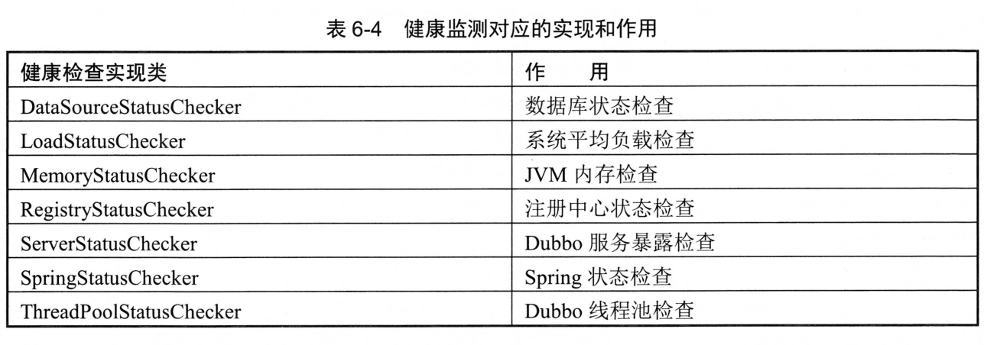


​		`Dubbo`中`Handler(ChannelHandler)`的`5`种状态：


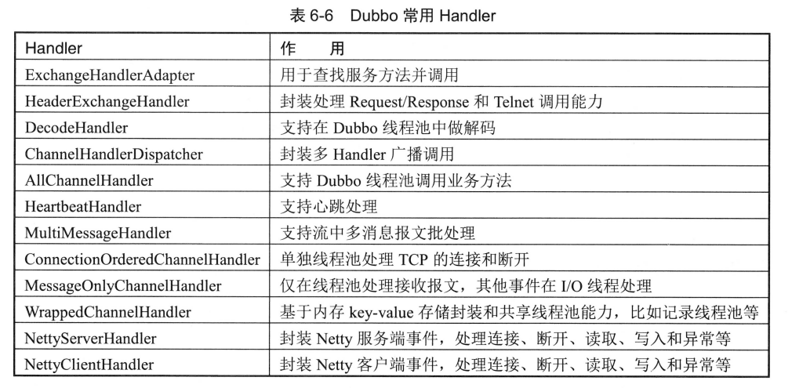

​		同时具有入站和出站`ChannelHandler`的布局，如果有一个入站事件被触发，比如连接或数据读取，那么它会从`ChannelPipeline`头部开始一直传播到

`Channelpipeline`的尾端。出站的`I/O`事件将从`ChannelPipeline`最右边开始，然后向左传播。当然，在`ChannelPipeline`传播事件时，它会测试入站是否实现了

`ChannellnboundHandler`接口，如果没有实现则会自动跳过，出站时会监测是否实现`ChannelOutboundHandler`，如果没有实现，那么也会自动跳过。在`Dubbo`框架

中实现的这两个接口类主要是`NettyServerHandler`和`NettyClientHandler`。`Dubbo`通过装饰者模式层包装`Handler`，从而不需要将每个`Handler`都追加到

`Pipeline`中。

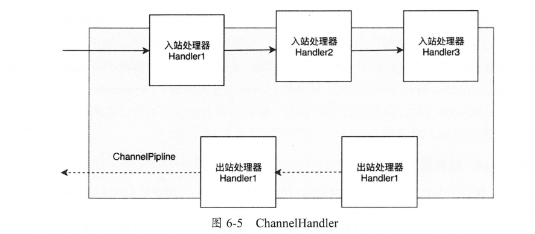

​		`RPC`调用服务方处理`Handler`的逻辑，在`DubboProtocol`中通过内部类继承自`ExchangeHandlerAdapter`，完成服务提供方`Invoker`实例的查找并进行服务的

真实调用：

```java
	private ExchangeHandler requestHandler = new ExchangeHandlerAdapter() {
        public CompletableFuture<Object> reply(ExchangeChannel channel, Object message) throws RemotingException {
            if (!(message instanceof Invocation)) {
                throw new RemotingException(channel, "Unsupported request: " + (message == null ? null : message.getClass().getName() + ": " + message) + ", channel: consumer: " + channel.getRemoteAddress() + " --> provider: " + channel.getLocalAddress());
            } else {
                Invocation inv = (Invocation)message;
                Invoker<?> invoker = DubboProtocol.this.getInvoker(channel, inv); // 找 invocation 关联的 Invoker
                
                ...

                RpcContext.getServiceContext().setRemoteAddress(channel.getRemoteAddress());
                Result result = invoker.invoke(inv); // 调用业务方具体方法
                return result.thenApply(Function.identity());
            }
        }

        ...
    };
```

​		在服务端唯一标识的服务是由`4`部分组成的：端口、接口名、 接口版本和接口分组：

```java
	Invoker<?> getInvoker(Channel channel, Invocation inv) throws RemotingException {
        boolean isCallBackServiceInvoke = false;
        boolean isStubServiceInvoke = false;
        int port = channel.getLocalAddress().getPort(); // 获取服务暴露协议的端口
        String path = (String)inv.getObjectAttachments().get("path"); // 获取调用传递的接口
        
        ...

        String serviceKey = serviceKey(port, path, (String)inv.getObjectAttachments().get("version"), (String)inv.getObjectAttachments().get("group")); // 根据端口、接口名、接口分组和接口版本构造唯一的
        DubboExporter<?> exporter = (DubboExporter)this.exporterMap.get(serviceKey); // 从 HashMap 中获取 Exporter
        if (exporter == null) {
            throw new RemotingException(channel, "Not found exported service: " + serviceKey + " in " + this.exporterMap.keySet() + ", may be version or group mismatch , channel: consumer: " + channel.getRemoteAddress() + " --> provider: " + channel.getLocalAddress() + ", message:" + this.getInvocationWithoutData(inv));
        } else {
            return exporter.getInvoker();
        }
    }
```


​		`Dubbo`实现线程派发：

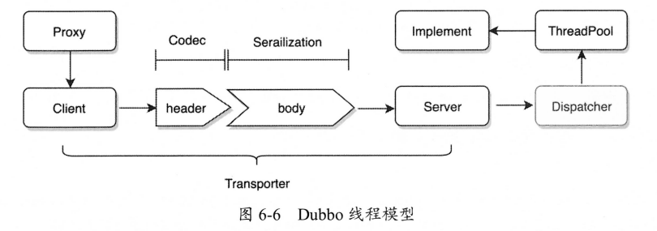

​		`Dispatcher`就是线程池派发器。这里需要注意的是，`Dispatcher`真实的职责是创建具有线程派发能力的`ChannelHandler`，其本身并不具备线程派发能力：

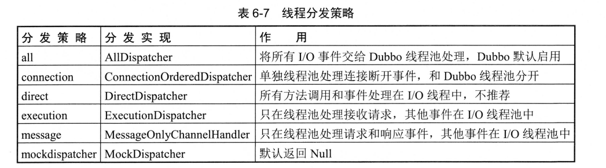


​		在`Dubbo`框架内部，所有方法调用会被抽象成`Request/Response`，每次调用`(`一次会话`)`都会创建一个请求`Request`，如果是方法调用则会返回一个

`Response`对象。`HeaderExchangeHandler`用来处理这种场景：

​				1、更新发送和读取请求时间戳。

​				2、判断请求格式或编解码是否有错，并响应客户端失则的具体原因。

​				3、处理`Request`请求和`Response`正常响应。

​				4、支持`Telnet`调用。 

```java
	public void received(Channel channel, Object message) throws RemotingException {
        final ExchangeChannel exchangeChannel = HeaderExchangeChannel.getOrAddChannel(channel);
        if (message instanceof Request) {
            // handle request.
            Request request = (Request) message;
            if (request.isEvent()) {
                handlerEvent(channel, request); // 处理 readonly 事件，在 channel 中打标
            } else {
                if (request.isTwoWay()) {
                    handleRequest(exchangeChannel, request); // 处理方法调用并返回给客户端
                } else {
                    handler.received(exchangeChannel, request.getData());
                }
            }
        } else if (message instanceof Response) {
            handleResponse(channel, (Response) message); // 接收响应
        } else if (message instanceof String) {
            if (isClientSide(channel)) { // 客户端不支持 Telnet 调用
                Exception e = new Exception("Dubbo client can not supported string message: " + message + " in channel: " + channel + ", url: " + channel.getUrl());
                logger.error(e.getMessage(), e);
            } else {
                String echo = handler.telnet(channel, (String) message);
                if (echo != null && echo.length() > 0) { // 触发 Telnet 调用，并返回
                    channel.send(echo);
                }
            }
        } else {
            handler.received(exchangeChannel, message);
        }
    }
```

​		处理请求和响应`(HeaderExchangeHandler#handleRequest,handleRespons)`：

```java
	void handleRequest(final ExchangeChannel channel, Request req) throws RemotingException {
        Response res = new Response(req.getId(), req.getVersion());
        if (req.isBroken()) {
            Object data = req.getData();

            String msg;
            if (data == null) {
                msg = null;
            } else if (data instanceof Throwable) {
                msg = StringUtils.toString((Throwable) data); // 处理请求格式不正确(编解码)，并把异常传换成字符串返回
            } else {
                msg = data.toString();
            }
            res.setErrorMessage("Fail to decode request due to: " + msg);
            res.setStatus(Response.BAD_REQUEST);

            channel.send(res);
            return;
        }
        // find handler by message class.
        Object msg = req.getData();
        try {
            CompletionStage<Object> future = handler.reply(channel, msg); // 调用 DubboProtocol#reply，触发方法调用
            future.whenComplete((appResult, t) -> {
                try {
                    if (t == null) {
                        res.setStatus(Response.OK);
                        res.setResult(appResult);
                    } else {
                        res.setStatus(Response.SERVICE_ERROR); // 方法调用失败
                        res.setErrorMessage(StringUtils.toString(t));
                    }
                    channel.send(res);
                } catch (RemotingException e) {
                    logger.warn("Send result to consumer failed, channel is " + channel + ", msg is " + e);
                }
            });
        } catch (Throwable e) {
            res.setStatus(Response.SERVICE_ERROR);
            res.setErrorMessage(StringUtils.toString(e));
            channel.send(res);
        }
    }

	static void handleResponse(Channel channel, Response response) throws RemotingException {
        if (response != null && !response.isHeartbeat()) {
            DefaultFuture.received(channel, response); // 唤醒阻塞的线程，并通知结果
        }
    }
```


​		`Dubbo`默认客户端和服务端都会发送心跳报文，用来保持`TCP`长连接状态。在客户端和服务端，`Dubbo`内部开启一个线程循环扫描并检测连接是否超时，在

服务端如果发现超时则会主动关闭客户端连接，在客户端发现超时则会主动重新创建连接。

​		`Dubbo`在服务端和客户端都复用心跳实现代码，抽象成`HeartBeatTask`任务进行处理：

```java
	public void run(Timeout timeout) throws Exception {
        Collection<Channel> c = channelProvider.getChannels(); 
        for (Channel channel : c) { // 遍历所有 Channel
            if (channel.isClosed()) { // 忽略关闭的 Channel
                continue;
            }
            doTask(channel);
        }
        reput(timeout, tick);
    }


	protected void doTask(Channel channel) {
        try {
            Long lastRead = lastRead(channel);
            Long lastWrite = lastWrite(channel);
            if ((lastRead != null && now() - lastRead > heartbeat)
                    || (lastWrite != null && now() - lastWrite > heartbeat)) { // TCP连接空闲超过心跳时间，发送事件报文
                Request req = new Request();
                req.setVersion(Version.getProtocolVersion());
                req.setTwoWay(true);
                req.setEvent(HEARTBEAT_EVENT);
                channel.send(req);
                if (logger.isDebugEnabled()) {
                    logger.debug("Send heartbeat to remote channel " + channel.getRemoteAddress()
                            + ", cause: The channel has no data-transmission exceeds a heartbeat period: "
                            + heartbeat + "ms");
                }
            }
        } catch (Throwable t) {
            logger.warn("Exception when heartbeat to remote channel " + channel.getRemoteAddress(), t);
        }
    }
```


# 集群容错

​		在微服务环境中，为了保证服务的高可用，很少会有单点服务出现，服务通常都是以集群的形式出现的。然而，被调用的远程服务并不是每时每刻都保持良好

状况，当某个服务调用出现异常时，需要自动容错，或者只想本地测试、服务降级，需要`Mock`返回结果`。就需要使用集群容错机制。

​		把`Cluster`看作一个集群容错层，该层中包含`Cluster、Directory、Router、LoadBalance`几大核心接口。`Cluster`层是抽象概念，表示的是对外的整个集群

容错层；`Cluster`是容错接口，提供`Failover、Failfast`等容错策略。

​		`Cluster`的总体工作流程：

​				1、生成`Invoker`对象。不同的`Cluster`实现会生成不同类型的`Clusterinvoker`对象并返回。然后调用`Clusterinvoker`的`Invoker`方法，正式开始调用

​		流程。

​				2、获得可调用的服务列表。首先会做前置校验，检查远程服务是否已被销毁。然后通过`Directory#list`方法获取所有可用的服务列表。接着使用

​		`Router`接口处理该服务列表，根据路由规则过滤一部分服务，最终返回剩余的服务列表。

​				3、做负载均衡。在上面得到的服务列表还需要通过不同的负载均衡策略选出一个服务，用作最后的调用。首先框架会根据用户的配置，调用

​		`ExtensionLoader`获取不同负载均衡策略的扩展点实现。然后做一些后置操作，如果是异步调用则设置调用编号。接着调用子类实现的`dolnvoke`方法， 子类

​		会根据具体的负载均衡策略选出一个可以调用的服务。

​				4、做`RPC`调用。首先保存每次调用的`Invoker`到`RPC`上下文，并做`RPC`调用。然后处理调用结果，对于调用出现异常、成功、失败等情况，每种容错策

​		略会有不同的处理方式。

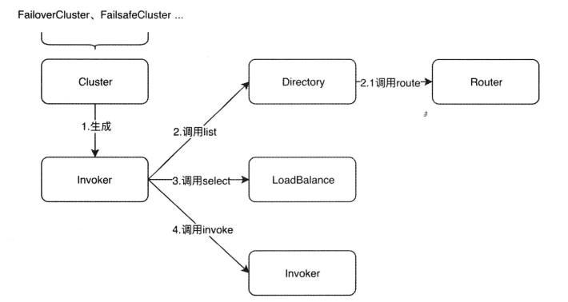

​		`Dubbo`容错机制能增强整个应用的鲁棒性，容错过程对上层用户是完全透明的，但用户也可以通过不同的配置项来选择不同的容错机制。每种容错机制又有

自己个性化的配置项。

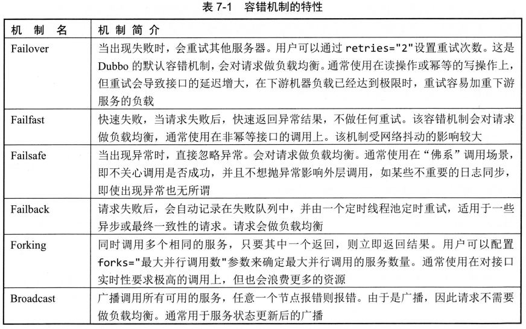

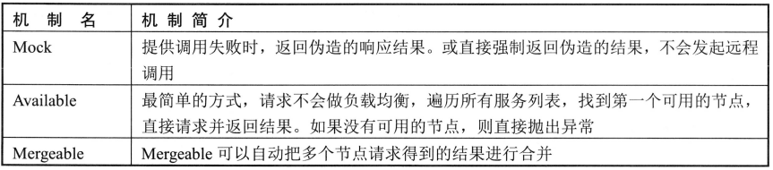


​		在微服务环境中，可能多个节点同时都提供同一个服务。当上层调用`Invoker`时，无论实际存在多少个`Invoker`，只需要通过`Cluster`层，即可完成整个调用

的容错逻辑，包括获取服务列表、路由、负载均衡等，整个过程对上层都是透明的。当然，`Cluster`接口只是串联起整个逻辑， 其中`Clusterlnvoker`只实现了容

错策略部分，其他逻辑则是调用了`Directory、Router、LoadBalance`等接口实现。

​		容错的接口主要分为两大类，第一类是`Cluster`类，第二类是`Clusterinvoker`类。`Cluster`和`Clusterinvoker`之间的关系也非常简单：`Cluster`接口下面有

多种不同的实现，每种实现中都需要实现接口的`join`方法，在方法中会`new`一个对应的`Clusterinvoker`实现。

```java
public class FailoverCluster extends AbstractCluster {

    public final static String NAME = "failover";

    @Override
    public <T> AbstractClusterInvoker<T> doJoin(Directory<T> directory) throws RpcException {
        return new FailoverClusterInvoker<>(directory);
    }

}


public abstract class AbstractCluster implements Cluster {
    ...
}
```

​		`Cluster`是最上层的接口。`Cluster`接口上有`@SPI`注解，也就是说， 实现类是通过扩展机制动态生成的。每个实现类里都只有一个`join`方法，实现也很简

单，直接`new`一个对应的`Clusterinvoker`。其中`AvailableCluster`例外，直接使用匿名内部类实现了所有功能。

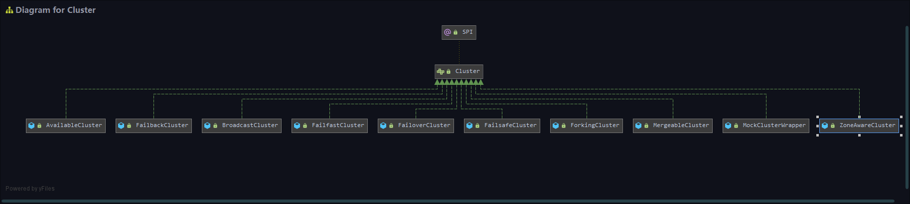

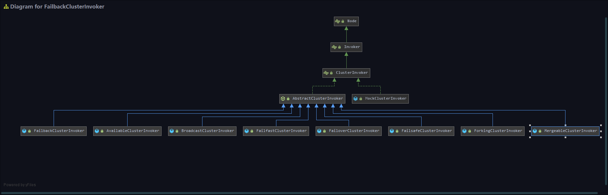

## Failover策略

​		默认实现是`Failover`：

​				1、校验。校验从`AbstractClusterlnvoker`传入的`Invoker`列表是否为空。

​				2、获取配置参数。从调用`URL`中获取对应的`retries`重试次数。

​				3、初始化一些集合和对象。用于保存调用过程中出现的异常、记录调用了哪些节点`(`这个会在负载均衡中使用，在某些配置下，尽量不要一直调用同一

​		个服务)。

​				4、使用`for`循环实现重试，`for`循环的次数就是重试的次数。成功则返回，否则继续循环。 如果`for`循环完，还没有一个成功的返回，则抛出异常，

​		把`3`中记录的信息抛出去。 

​						校验：如果for循环次数大于1，即有过一次失败，则会再次校验节点是否被销毁、传入的`Invoker`列表是否为空。

​						负载均衡：调用`select`方法做负载均衡，得到要调用的节点，并记录这个节点到步骤`3`的集合里，再把己经调用的节点信息放进`RPC`上下文中。 

​						远程调用：调用`invoker#invoke`方法做远程调用，成功则返回，异常则记录异常信息， 再做下次循环。

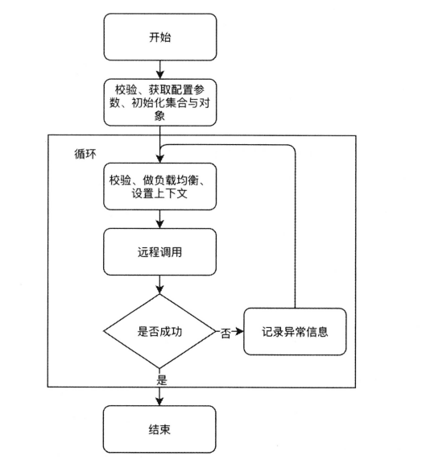

## Failfast策略

​		`Failfast`会在失败后直接抛出异常并返回：

​				1、校验。校验从`AbstractClusterlnvoker`传入的`Invoker`列表是否为空。

​				2、负载均衡。调用`select`方法做负载均衡，得到要调用的节点。

​				3、进行远程调用。在`try`代码块中调用`invoker#invoke`方法做远程调用。如果捕获到异常，则直接封装成`RpcException`抛出。


## Failsafe策略

​		`Failsafe`调用时如果出现异常，则会直接忽略：

​				1、校验传入的参数。校验从`AbstractClusterlnvoker`传入的`Invoker`列表是否为空。

​				2、负载均衡。调用`select`方法做负载均衡，得到要调用的节点。

​				3、远程调用。在`try`代码块中调用`invoker#invoke`方法做远程调用，`catch`到任何异常都直接吞掉，返回一个空的结果集。

```java
public class FailsafeClusterInvoker<T> extends AbstractClusterInvoker<T> {
    
    ...

    @Override
    public Result doInvoke(Invocation invocation, List<Invoker<T>> invokers, LoadBalance loadbalance) throws RpcException {
        try {
            checkInvokers(invokers, invocation); // 校验传入的参数
            Invoker<T> invoker = select(loadbalance, invocation, invokers, null); // 做负载均衡
            return invokeWithContext(invoker, invocation); // 进行远程调用，调用成功则直接返回
        } catch (Throwable e) {
            logger.error("Failsafe ignore exception: " + e.getMessage(), e);
            return AsyncRpcResult.newDefaultAsyncResult(null, null, invocation); // 捕获到异常，直接返回一个空的结果集
        }
    }
}
```


## Fallback策略

​		`Fallback`如果调用失败，则会定期重试。`FailbackClusterlnvoker`里面定义了一个`List`，专门用来保存失败的调用。另外定义了一个定时线程池，默认每

`5`秒把所有失败的调用拿出来，重试一次。如果调用重试成功，则会从`List`中移除。

​				1、校验传入的参数。校验从`AbstractClusterlnvoker`传入的`Invoker`列表是否为空。

​				2、负载均衡。调用`select`方法做负载均衡，得到要调用的节点。

​				3、远程调用。在`try`代码块中调用`invoker#invoke`方法做远程调用，`catch`到异常后直接把`invocation`保存到重试的`List`中，并返回一个空的结果

​		集。

​				4、定时线程池会定时把`List`中的失败请求拿出来重新请求，请求成功则从`List`中移除。如果请求还是失败，则异常也会被`catch`住，不会影响`List`

​		中后面的重试。

```java
	protected Result doInvoke(Invocation invocation, List<Invoker<T>> invokers, LoadBalance loadbalance) throws RpcException {
        Invoker<T> invoker = null;
        URL consumerUrl = RpcContext.getServiceContext().getConsumerUrl();
        try {
            checkInvokers(invokers, invocation);
            invoker = select(loadbalance, invocation, invokers, null);
            // Asynchronous call method must be used here, because failback will retry in the background.
            // Then the serviceContext will be cleared after the call is completed.
            return invokeWithContextAsync(invoker, invocation, consumerUrl);
        } catch (Throwable e) {
            logger.error("Failback to invoke method " + invocation.getMethodName() + ", wait for retry in background. Ignored exception: "
                + e.getMessage() + ", ", e);
            if (retries > 0) {
                addFailed(loadbalance, invocation, invokers, invoker, consumerUrl); // 失败，加入 List 中
            }
            return AsyncRpcResult.newDefaultAsyncResult(null, null, invocation); // ignore
        }
    }

	private void addFailed(LoadBalance loadbalance, Invocation invocation, List<Invoker<T>> invokers, Invoker<T> lastInvoker, URL consumerUrl) {
        if (failTimer == null) {
            synchronized (this) {
                if (failTimer == null) {
                    failTimer = new HashedWheelTimer(
                        new NamedThreadFactory("failback-cluster-timer", true),
                        1,
                        TimeUnit.SECONDS, 32, failbackTasks);
                }
            }
        }
        RetryTimerTask retryTimerTask = new RetryTimerTask(loadbalance, invocation, invokers, lastInvoker, retries, RETRY_FAILED_PERIOD, consumerUrl);
        try {
            failTimer.newTimeout(retryTimerTask, RETRY_FAILED_PERIOD, TimeUnit.SECONDS);
        } catch (Throwable e) {
            logger.error("Failback background works error, invocation->" + invocation + ", exception: " + e.getMessage());
        }
    }
```


## Available策略

​		`Available`是找到第一个可用的服务直接调用，并返回结果：

​				1、遍历从`AbstractClusterlnvoker`传入的`Invoker`列表，如果`Invoker`是可用的，则直接调用并返回。

​				2、如果遍历整个列表还没找到可用的`Invoker`，则抛出异常。


## Broadcast策略

​		`Broadcast`会广播给所有可用的节点，如果任何一个节点报错，则返回异常：

​				1、前置操作。校验从`AbstractClusterlnvoker`传入的`Invoker`列表是否为空；在`RPC`上下文中设置`Invoker`列表；初始化一些对象，用于保存调用过

​		程中产生的异常和结果信息等。

​				2、循环遍历所有`Invoker`，直接做`RPC`调用。任何一个节点调用出错，并不会中断整个 广播过程，会先记录异常，在最后广播完成后再抛出。如果多

​		个节点异常，则只有最后一个节点的异常会被抛出，前面的异常会被覆盖。


## Forking策略

​		`Forking`可以同时并行请求多个服务，有任何一个返回，则直接返回。相对于其他调用策略，`Forking`的实现是最复杂的：

​				1、准备工作。校验传入的`Invoker`列表是否可用；初始化一个`Invoker`集合，用于保存真正要调用的`Invoker`列表；从`URL`中得到最大并行数、超时时

​		间。

​				2、获取最终要调用的`Invoker`列表。假设用户设置最大的并行数为`n`，实际可以调用的最大服务数为`v`。如果`n<0`或`n>v`，则说明可用的服务数小于

​		用户的设置，因此最终要调用的`Invoker`只能有`v`个；如果`n<v`则会循环调用负载均衡方法，不断得到可调用的`Invoker`，加入`Invoker`集合里。 在

​		`Invoker`加入集合时，会做去重操作。因此，如果用户设置的负载均衡策略每次返回的都是同一个`Invoker`，那么集合中最后只会存在一个`Invoker``，也就

​		是只会调用一个节点。

​				3、调用前的准备工作。设置要调用的`Invoker`列表到`RPC`上下文；初始化一个异常计数器；初始化一个阻塞队列，用于记录并行调用的结果。

​				4、执行调用。循环使用线程池并行调用，调用成功，则把结果加入阻塞队列；调用失败， 则失败计数`+1`。如果所有线程的调用都失败了，即失败计

​		数`>=`所有可调用的`Invoker`时，则把异常信息加入阻塞队列。 

​				5、同步等待结果。由于步骤`4`中的步骤是在线程池中执行的，因此主线程还会继续往下执行，主线程中会使用阻塞队列的`poll(`超时时间`)`方法，同步

​		等待阻塞队列中的第一个结果， 如果是正常结果则返回，如果是异常则抛出。

​		`Forking`的超时是通过在阻塞队列的`poll`方法中传入超时时间实现的； 线程池中的并发调用会获取第一个正常返回结果。只有所有请求都失败了，

`Forking`才会失败。

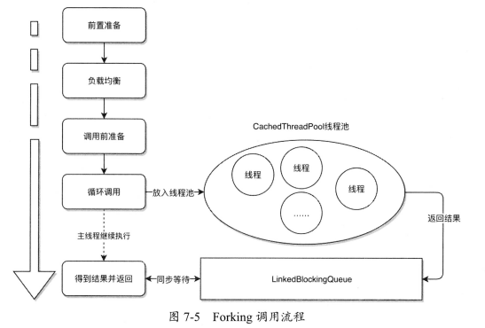


​		整个容错过程中首先会使用`Directory#list`来获取所有的`Invoker`列表。`Directory`也有多种实现子类，既可以提供静态的`Invoker`列表，也可以提供动态

的`Invoker`列表。静态列表是用户自己设置的`Invoker`列表；动态列表根据注册中心的数据动态变化，动态更新`Invoker`列表的数据，整个过程对上层透明。

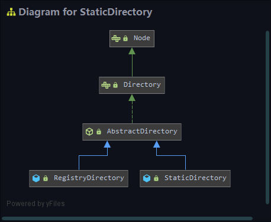

​		`AbstractDirectory`封装了通用逻辑，主要实现了四个方法：检测`Invoker`是否可用， 销毁所有`Invoker,list`方法，还留了一个抽象的`doList`方法给子类自

行实现。`list`方法是最主要的方法，用于返回所有可用的`list`，逻辑分为两步：

​				调用抽象方法`doList`获取所有`Invoker`列表，不同子类有不同的实现。

​				遍历所有的`router`，进行`Invoker`的过滤，最后返回过滤好的`Invoker`列表。

​		`doList`抽象方法则是返回所有的`Invoker`列表，由于是抽象方法，子类继承后必须要有自己的实现。

​		`RegistryDirectory`属于`Directory`的动态列表实现，会自动从注册中心更新`Invoker`列表、配置信息、路由列表。

​		`StaticDirectory`：`Directory`的静态列表实现，即将传入的`Invoker`列表封装成静态的`Directory`对象，里面的列表不会改变。因为

`Cluste#join(Directopy〈T> directory)`方法需要传入`Directory`对象，因此该实现主要使用在一些上层已经知道自己要调用哪些`Invoker`，只需要包装一个

`Directory`对象返回即可的场景。在`ReferenceConfig#createProxy`和`RegistryDirectory#toMergeMethodInvokerMap`中使用了`Cluster#join`方法。

`StaticDirectory `的逻辑非常简单，在构造方法中需要传入`Invoker`列表，`doList`方法则直接返回初始化时传入的列表。


​		`RegistryDirectory`中有两条比较重要的逻辑线：

​				第一条，框架与注册中心的订阅，并动态更新本地`Invoker`列表、路由列表、配置信息的逻辑。

​				第二条，子类实现父类的`doList`方法。

​		订阅和动态更新逻辑。这个逻辑主要涉及`subscribe、notify、refreshinvoker`三个方法。

​		`subscribe`是订阅某个`URL`的更新信息。`Dubbo`在引用每个需要`RPC`调用的`Bean`的时候，会调用`directory.subscribe`来订阅这个`Bean`的各种`URL`的变化

`(Bean`的配置在配置中心中都是以`URL`的形式存放的`)`。

​		`notify`就是监听到配置中心对应的`URL`的变化，然后更新本地的配置参数。监听的`URL`分为三类：配置`configurators`、路由规则`router`、`Invoker`列表：

​				1、新建三个`List`，分别用于保存更新的`Invoker URL`、路由配置`URL`、配置`URL`。遍历监听返回的所有`URL`，分类后放入三个`List`中。

​				2、解析并更新配置参数：

​						1、对于`router`类参数，首先遍历所有`router`类型的`URL`，然后通过`Router`工厂把每个`URL`包装成路由规则，最后更新本地的路由信息。这个过

​				程会忽略以`empty`开头的`URL`。

​						2、对于`Configurator`类的参数，管理员可以在`dubbo-admin`动态配置功能上修改生产者的参数，这些参数会保存在配置中心的`configurators`类

​				目下。`notify`监听到`URL`配置参 数的变化，会解析并更新本地的`Configurator`配置。

​						3、对于`Invoker`类型的参数，如果是`empty`协议的`URL`，则会禁用该服务，并销毁本地缓存的`Invoker`；如果监听到的`Invoker`类型`URL`都是空

​				的，则说明没有更新，直接使用本地的老缓存；如果监听到的`Invoker`类型`URL`不为空，则把新的`URL`和本地老的`URL`合并，创建新的`Invoker`，找出

​				差异的老`Invoker`并销毁。

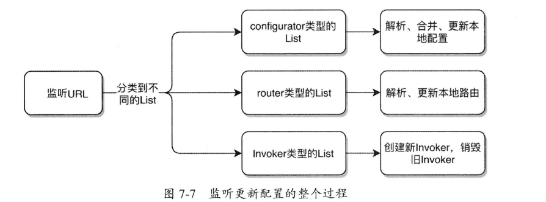

​		`dubbo-admin`上更新路由规则或参数是通过`override://`协议实现的。`override`协议的`URL`会覆盖更新本地`URL`中对应的参数。如果是`empty://`协议的

`URL`，则会清空本地的配置，这里会调用`Configurator`接口来实现该功能。


​		`notify`中更新的`Invoker`列表最终会转化为一个字典`Map<URL, Invoker<T>> `的`urlInvokerMap`，`doList`的最终目标就是在字典里匹配出可以调用的

`Invoker`列表，并返回给上层：

​				1、检查服务是否被禁用。如果配置中心禁用了某个服务，则该服务无法被调用。如果服务被禁用则会抛出异常。

​				2、根据方法名和首参数构建`URL`去匹配`Invoker`。如果在这一步没有匹配到`Invoker`列表，则进入第`3`步。

​				3、根据方法名匹配`Invoker`，以方法名构建`URL`去`urlInvokerMap`中匹配`Invoker`列表，如果还是没有匹配到，则进入第4步。

​				4、根据`*`匹配`Invoker`，用星号去匹配`Invoker`列表，如果还没有匹配到，则进入最后一步兜底操作。

​				5、遍历`urlInvokerMap`，找到第一个`Invoker`列表返回。如果还没有，则返回一个空列表。


# 路由

​		路由接口会根据用户配置的不同路由策略对`Invoker`列表进行过滤，只返回符合规则的`Invoker`。

​		路由分为条件路由、文件路由、脚本路由，对应`dubbo-admin`中三种不同的规则配置方式。 条件路由是用户使用`Dubbo`定义的语法规则去写路由规则；文件

路由则需要用户提交一个文件, 里面写着对应的路由规则，框架基于文件读取对应的规则；脚本路由则是使用`JDK`自身的脚本引擎解析路由规则脚本，所有`JDK`脚

本引擎支持的脚本都能解析，默认是`JavaScrip`。

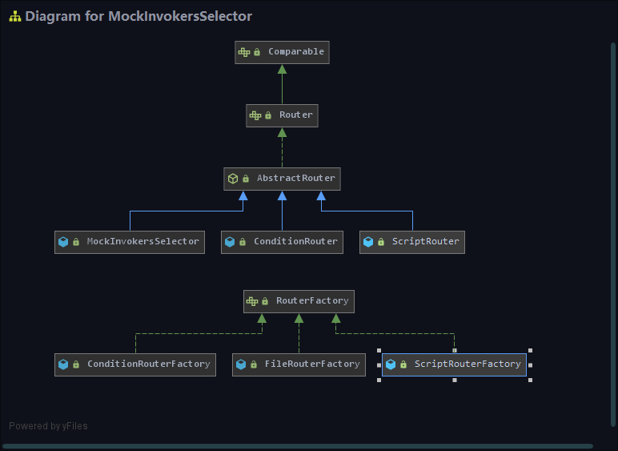

​		`RouterFactory`是一个`SPI`接口，没有设置默认值，但由于有`@Adaptive("protocol")`注解， 因此它会根据`URL`中的`protocol`参数确定要初始化哪一个具体

的`Router`实现：

```java
@SPI
public interface RouterFactory {
    
    @Adaptive("protocol")
    Router getRouter(URL url);
}
```

​		`RouterFactory`的实现类也非常简单，就是直接`new`一个对应的`Router`并返回。`FileRouterFactory`除外，直接在工厂类中实现了所有逻辑。


# 负载均衡

​		在整个集群容错流程中，首先经过`Directory`获取所有`Invoker`列表，然后经过`Router`根据路由规则过滤`Invoker`，最后幸存下来的`Invoker`还需要经过负

载均衡这一关，选出最终要调用的`Invoker`。

​		很多容错策略中都会使用负载均衡方法，并且所有的容错策略中的负载均衡都使用了抽象父类`Abstractclusterinvoker`中定义的`Invoker<T> select` 方法，

而并不是直接使用`LoadBalance`方法。因为抽象父类在`LoadBalance`的基础上又封装了一些新的特性：

​				1、粘滞连接。`Dubbo`中有一种特性叫粘滞连接：用于有状态服务，尽可能让客户端总是向同一提供者发起调用，除非该提供者挂了，再连接另一台。

​				2、可用检测。`Dubbo`调用的`URL`中，如果含有`cluster.availablecheck=false`，则不会检测远程服务是否可用，直接调用。如果不设置，则默认会开启

​		检查，对所有的服务都做是否可用的检查，如果不可用，则再次做负载均衡。

​				3、避免重复调用。对于已经调用过的远程服务，避免重复选择，每次都使用同一个节点。 这种特性主要是为了避免并发场景下，某个节点瞬间被大量

​		请求。

​		整个逻辑过程大致可以分为`4`步：

​				1、检查`URL`中是否有配置粘滞连接，如果有则使用粘滞连接的`Invoker`。如果没有配置粘滞连接，或者重复调用检测不通过、可用检测不通过，则进入

​		第`2步`。

​				2、通过`ExtensionLoader`获取负载均衡的具体实现，并通过负载均衡做节点的选择。对选择出来的节点做重复调用、可用性检测，通过则直接返回，否

​		则进入第`3`步。

​				3、进行节点的重新选择。如果需要做可用性检测，则会遍历`Directory`中得到的所有节点，过滤不可用和已经调用过的节点，在剩余的节点中重新做负

​		载均衡；如果不需要做可用性检测，那么也会遍历`Directory`中得到的所有节点，但只过滤已经调用过的，在剩余的节点中重新做负载均衡。这里存在一种情

​		况，就是在过滤不可用或已经调用过的节点时，节点全部被过滤，没有剩下任何节点，此时进入第`4`步。

​				4、遍历所有已经调用过的节点，选出所有可用的节点，再通过负载均衡选出一个节点并返回。如果还找不到可调用的节点，则返回`null`。 

```java
@SPI(RandomLoadBalance.NAME) // 默认的负载均衡实现就是RandomLoadBalan，随机负载均衡
public interface LoadBalance {
    
    @Adaptive("loadbalance") // 们在URL中可以通过 loadbalance=xxx 来动态指定 select 时的负载均衡算法
    <T> Invoker<T> select(List<Invoker<T>> invokers, URL url, Invocation invocation) throws RpcException;
}
```

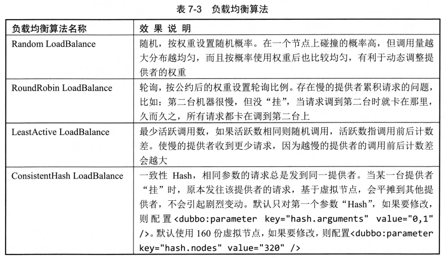

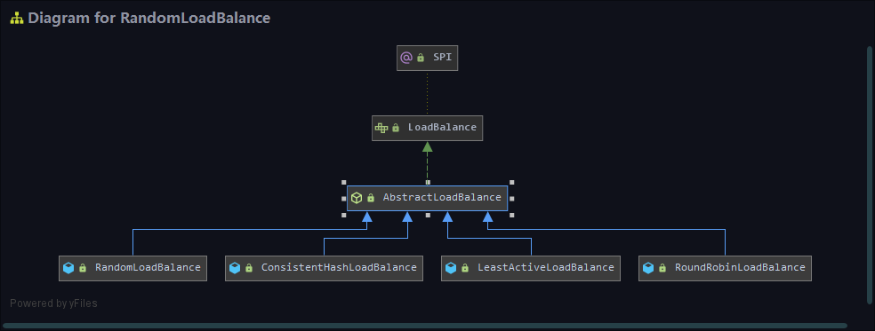

​		抽象父类`AbstractLoadBalance`有两个权重相关的方法：`calculateWarmupWeight`和`getWeight`。`getWeight`方法就是获取当前`Invoker`的权重，

`calculateWarmupWeight`是计算具体的权重。`getWeight`方法中会调用`calculateWarmupWeigh`：

```java
	protected int getWeight(Invoker<?> invoker, Invocation invocation) {
        int weight;
        URL url = invoker.getUrl();
        // Multiple registry scenario, load balance among multiple registries.
        if (REGISTRY_SERVICE_REFERENCE_PATH.equals(url.getServiceInterface())) {
            weight = url.getParameter(REGISTRY_KEY + "." + WEIGHT_KEY, DEFAULT_WEIGHT); // 通过 URL 获取当前 Invoker 设置的权重
        } else {
            weight = url.getMethodParameter(invocation.getMethodName(), WEIGHT_KEY, DEFAULT_WEIGHT);
            if (weight > 0) {
                long timestamp = invoker.getUrl().getParameter(TIMESTAMP_KEY, 0L); // 获取启动的时间点
                if (timestamp > 0L) {
                    long uptime = System.currentTimeMillis() - timestamp; // 求差值，得到已经预热了多久
                    if (uptime < 0) {
                        return 1;
                    }
                    int warmup = invoker.getUrl().getParameter(WARMUP_KEY, DEFAULT_WARMUP); // 获取设置的总预热时间
                    if (uptime > 0 && uptime < warmup) {
                        weight = calculateWarmupWeight((int)uptime, warmup, weight); // 计算出最后的权重
                    }
                }
            }
        }
        return Math.max(weight, 0);
    }
```

​		框架考虑了服务刚启动的时候需要有一个预热的过程，如果一启动就给予`100%`的流量，则可能会让服务崩溃，因此实现了`calculateWarmupWeight`方法用于

计算预热时候的权重，计算逻辑是：`(`启动至今时间`/`给予的预热总时间`)X`权重。


## Random负载均衡

​		`Random`负载均衡是按照权重设置随机概率做负载均衡的。这种负载均衡算法并不能精确地平均请求，但是随着请求数量的增加，最终结果是大致平均的：

​				1、计算总权重并判断每个`Invoker`的权重是否一样。遍历整个`Invoker`列表，求和总权重。在遍历过程中，会对比每个`Invoker`的权重，判断所有

​		`Invoker`的权重是否相同。

​				2、如果权重相同，则说明每个`Invoker`的概率都一样，因此直接用`nextlnt`随机选一个`Invoker`返回即可。

​				3、如果权重不同，则首先得到偏移值，然后根据偏移值找到对应的`Invoke`。

```java
	protected <T> Invoker<T> doSelect(List<Invoker<T>> invokers, URL url, Invocation invocation) {
        // Number of invokers
        int length = invokers.size();

        if (!needWeightLoadBalance(invokers,invocation)){
            return invokers.get(ThreadLocalRandom.current().nextInt(length));
        }

        // Every invoker has the same weight?
        boolean sameWeight = true;
        // the maxWeight of every invokers, the minWeight = 0 or the maxWeight of the last invoker
        int[] weights = new int[length];
        // The sum of weights
        int totalWeight = 0;
        for (int i = 0; i < length; i++) {
            int weight = getWeight(invokers.get(i), invocation);
            // Sum
            totalWeight += weight;
            // save for later use
            weights[i] = totalWeight;
            if (sameWeight && totalWeight != weight * (i + 1)) {
                sameWeight = false;
            }
        }
        if (totalWeight > 0 && !sameWeight) {
            // If (not every invoker has the same weight & at least one invoker's weight>0), select randomly based on totalWeight.
            int offset = ThreadLocalRandom.current().nextInt(totalWeight); // 根据总权重计算出一个随机的偏移量，此处使用了 ThreadLocalRandom 性能会更好
            for (int i = 0; i < length; i++) { // 遍历所有的Invoker,得到被选中的Invoker
                if (offset < weights[i]) {
                    return invokers.get(i);
                }
            }
        }
        // If all invokers have the same weight value or totalWeight=0, return evenly.
        return invokers.get(ThreadLocalRandom.current().nextInt(length));
    }
```


## RoundRobin负载均衡

​		权重轮询负载均衡会根据设置的权重来判断轮询的比例。普通轮询负载均衡的好处是每个节点获得的请求会很均匀，如果某些节点的负载能力明显较弱，则这

个节点会堆积比较多的请求。因此普通的轮询还不能满足需求，还需要能根据节点权重进行干预。权重轮询又分为普通权重轮询和平滑权重轮询。普通权重轮询会

造成某个节点会突然被频繁选中，这样很容易突然让一个节点流量暴增。`Nginx`中有一种叫平滑轮询的算法，这种算法在轮询时会穿插选择其他节点，让整个服务

器选择的过程比较均匀，不会逮住一个节点一直调用。`Dubbo`框架中最新的`RoundRobin`代码已经改为平滑权重轮询算法：

​				1、初始化权重缓存`Map`。以每个`Invoker`的`URL`为`key`，对象`WeightedRoundRobin`为`value`生成一个`ConcurrentMap`，并把这个`Map`保存到全局的

​		`methodWeightMap`中：`ConcurrentMap<String, ConcurrentMap<String, WeightedRoundRobin>> methodWeightMap`。`methodWeightMap`的`key`是每个接口`+`方法

​		名。这一步只会生成这个缓存`Map`，但里面是空的，第`2`步才会生成每个`Invoker`对应的键值。

```java
protected static class WeightedRoundRobin {
        private int weight; // Invoker 设定的权重
        private AtomicLong current = new AtomicLong(0); // 考虑到并发场景下某个 Invoker 会被同时选中，表示该节点被所有线程选中的权重总和
        private long lastUpdate; // 最后一次更新的时间，用于后续缓存超时的判断

        ...
}
```


​				2、遍历所有`Invoker`。首先，在遍历的过程中把每个`Invoker`的数据填充到第`1`步生成的权重缓存`Map`中。其次，获取每个`Invoker`的预热权重，新版

​		的框架`RoundRobin`也支持预热， 通过和`Random`负载均衡中相同的方式获得预热阶段的权重。如果预热权重和`Invoker`设置的权重不相等，则说明还在预热

​		阶段，此时会以预热权重为准。然后，进行平滑轮询。每个`Invoker`会把权重加到自己的`current`属性上，并更新当前`Invoker`的`lastUpdate`。同时累加每

​		个`Invoker`的权重到`totalweight`。最终，遍历完后，选出所有`Invoker`中`current`最大的作为最终要调用的节点。

​				3、清除已经没有使用的缓存节点。由于所有的`Invoker`的权重都会被封装成一个`weightedRoundRobin`对象，因此如果可调用的`Invoker`列表数量和缓

​		存`weightedRoundRobin`对象的`Map`大小不相等，则说明缓存`Map`中有无用数据。清除老旧数据时，各线程会先用`CAS`抢占锁`(`抢到锁的线程才做清除操作，

​		抢不到的线程就直接跳过，保证只有一个线程在做清除操作`)`，然后复制原有的`Map`到一个新的`Map`中，根据`lastupdate`清除新`Map`中的过期数据`(`默认

​		`60`秒算过期），最后把`Map`从旧的`Map`引用修改到新的`Map`上面。

​				4、返回`Invoker`。注意，返回之前会把当前`Invoker`的`current`减去总权重。这是平滑权重轮询中重要的一步。

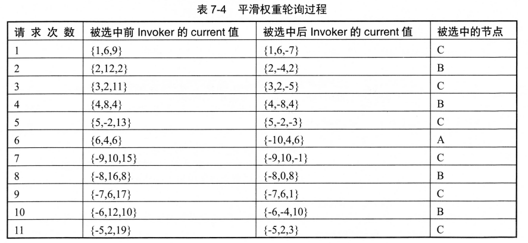


## LeastActive负载均衡

​		`LeastActive`负载均衡称为最少活跃调用数负载均衡，即框架会记下每个`Invoker`的活跃数， 每次只从活跃数最少的`Invoker`里选一个节点。这个负载均衡

算法需要配合`ActiveLimitFilter`过滤器来计算每个接口方法的活跃数。最少活跃负载均衡可以看作`Random`负载均衡的加强版，因为最后根据权重做负载均衡的

时候，使用的算法和`Random`的一样：

```java
	protected <T> Invoker<T> doSelect(List<Invoker<T>> invokers, URL url, Invocation invocation) {
        
        ... // 初始化各种计数器

        // Filter out all the least active invokers
        for (int i = 0; i < length; i++) { 
            Invoker<T> invoker = invokers.get(i);
            int active = RpcStatus.getStatus(invoker.getUrl(), invocation.getMethodName()).getActive(); // 获得Invoker的活跃数
            int afterWarmup = getWeight(invoker, invocation); // 获得Invoker的预热权重
            // save for later use
            weights[i] = afterWarmup;
            // If it is the first invoker or the active number of the invoker is less than the current least active number
            if (leastActive == -1 || active < leastActive) { // 第一次，或者发现有更小的活跃数
                
                ... // 置空计数器
                
            } else if (active == leastActive) { // 当前Invoker的活跃数与计数相同说明有N个Invoker都是最小计数，全部保存到集合中I后续就在它们里面根据权重选一个节点
                ...
            }
        }
        if (leastCount == 1) { // 如果只有一个Invoker则直接返回
            return invokers.get(leastIndexes[0]);
        }
        if (!sameWeight && totalWeight > 0) { // 如果权重不一样，则使用和Random负载均衡一样的权重算法找到一个Invoker并返回
            int offsetWeight = ThreadLocalRandom.current().nextInt(totalWeight);
            for (int i = 0; i < leastCount; i++) {
                int leastIndex = leastIndexes[i];
                offsetWeight -= weights[leastIndex];
                if (offsetWeight < 0) {
                    return invokers.get(leastIndex);
                }
            }
        }
        
        return invokers.get(leastIndexes[ThreadLocalRandom.current().nextInt(leastCount)]); // 如果权重相同，则直接随机选一个返回
    }
```

​		在`ActiveLimitFilter`中，只要进来一个请求，该方法的调用的计数就会原子性`+1`。整个`Invoker`调用过程会包在`try-catch-finally`中，无论调用结束或

出现异常，`finally`中都会把计数原子`-1`。该原子计数就是最少活跃数。


## 一致性Hash负载均衡

​		一致性`Hash`负载均衡可以让参数相同的请求每次都路由到相同的机器上。这种负载均衡的方式可以让请求相对平均，相比直接使用`Hash`而言，当某些节点

下线时，请求会平摊到其他服务提供者，不会引起剧烈变动。

​		普通一致性`Hash`会把每个服务节点散列到环形上，然后把请求的客户端散列到环上，顺时针往前找到的第一个节点就是要调用的节点。

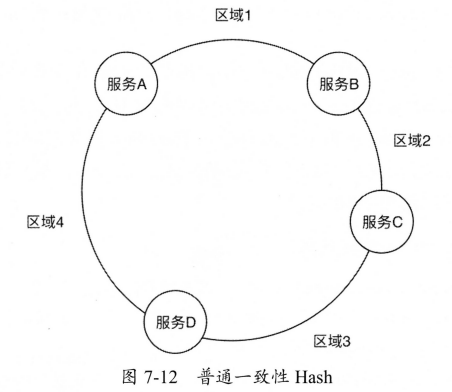

​		`Dubbo`框架使用了优化过的`Ketama`一致性`Hash`。这种算法会为每个真实节点再创建多个虚拟节点，让节点在环形上的分布更加均匀，后续的调用也会随之

更加均匀。

```java
	protected <T> Invoker<T> doSelect(List<Invoker<T>> invokers, URL url, Invocation invocation) {
        String methodName = RpcUtils.getMethodName(invocation); // 获得方法名
        String key = invokers.get(0).getUrl().getServiceKey() + "." + methodName; // 以接口名+方法名拼接出key

        int invokersHashCode = getCorrespondingHashCode(invokers); // 把所有可以调用的Invoker列表进行 Hash
        ConsistentHashSelector<T> selector = (ConsistentHashSelector<T>) selectors.get(key); // 现在Invoker列表的Hash码和之前的不一样，说明Invoker列表已经发生了变化，则重新创建Selector
        if (selector == null || selector.identityHashCode != invokersHashCode) {
            selectors.put(key, new ConsistentHashSelector<T>(invokers, methodName, invokersHashCode));
            selector = (ConsistentHashSelector<T>) selectors.get(key);
        }
        return selector.select(invocation); // 通过 selector 选出一个 Invoker
    }
```

​		整个逻辑的核心在`ConsistentHashSelector`中。`ConsistentHashSelector`初始化的时候会对节点进行散列，散列的环形是使用一个`TreeMap`实现的，所有的

真实、虚拟节点都会放入`TreeMap`。把节点的`IP+`递增数字做`MD5`， 以此作为节点标识，再对标识做`Hash`得到`TreeMap`的`key`，最后把可以调用的节点作为

`TreeMap`的`value`。

```java
		ConsistentHashSelector(List<Invoker<T>> invokers, String methodName, int identityHashCode) {
            ...
                
            for (Invoker<T> invoker : invokers) { // 遍历所有的节点
                String address = invoker.getUrl().getAddress(); // 得到每个节点的 ip
                for (int i = 0; i < replicaNumber / 4; i++) { // repiicaNumber 是生成的虚拟节点数，默认为 160 个
                    byte[] digest = Bytes.getMD5(address + i); // 以IP+递增数字做MD5,以此作为节点标识
                    for (int h = 0; h < 4; h++) {
                        long m = hash(digest, h); // 对标识做“Hash” 得到 TreeMap 的 key,以 Invoker 为 value
                        virtualInvokers.put(m, invoker);
                    }
                }
            }

            ...
        }
```

​		在客户端调用时候，只要对请求的参数也做`MD5`即可。虽然此时得到的`MD5`值不一定能对应到`TreeMap`中的一个`key`，因为每次的请求参数不同。但是由于

`TreeMap`是有序的树形结构，所以可以调用`TreeMap`的`ceilingEntry`方法，用于返回一个至少大于或等于当前给定`key`的`Entry`，从而达到顺时针往前找的效

果。如果找不到，则使用`firstEntry`返回第一个节点。


​		当一个接口有多种实现，消费者又需要同时引用不同的实现时，可以用`group`来区分不同的实现：

```xml
<dubbo:service group="group1" interface="xxx">
<dubbo:service group="group2" interface="xxx">
```

​		如果需要并行调用不同`group`的服务，并且要把结果集合并起来，则需要用到`Merger`特性。`Merger`实现了多个服务调用后结果合并的逻辑。虽然业务层可

以自行实现这个能力，但`Dubbo`直接封装到框架中，作为一种扩展点能力，简化了业务开发的复杂度。

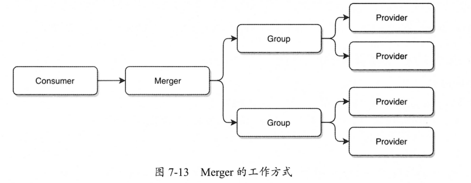

​		`MergerCluster`是`Cluster`接口的一种实现，因此也遵循`Cluster`的设计模式，在`invoke`方法中完成具体逻辑。整个过程会使用`Merger`接口的具体实现来合

并结果集。在使用的时候，通过`MergerFactory`获得各种具体的`Merger`实现。

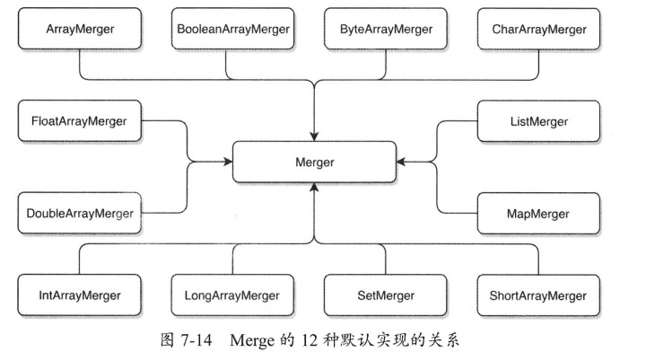

​		如果开启了`Merger`特性，并且未指定合并器`(Merger`的具体实现`)`，则框架会根据接口的返回类型自动匹配合并器。可以扩展属于自己的合并器，

`MergerFactory`在加载具体实现的时候，会用`ExtensionLoader`把所有`SPI`的实现都加载到缓存中。后续使用时直接从缓存中读取，如果读不到则会重新全量加载

一次`SPI`。


​		`MergeableCluster#join`方法中直接生成并返回了`MergeableClusterlnvoker`，`MergeableClusterInvoker#invoke`方法又通过`MergerFactory`工厂获取不同的

`Merger`接口实现，完成了合并的具体逻辑。

​		`MergeableCluster`并没有继承抽象的`Cluster`实现，而是独立完成了自己的逻辑：

​				1、前置准备。通过`directory`获取所有`Invoker`列表。

​				2、合并器检查。判断某个方法是否有合并器，如果没有，则不会并行调用多个`group`，找到第一个可以调用的`Invoker`直接调用就返回了。如果有合并

​		器，则进入第`3`步。

​				3、获取接口的返回类型。通过反射获得返回类型，后续要根据这个返回值查找不同的合并器。

​				4、并行调用。把`Invoker`的调用封装成一个个`Callable`对象，放到线程池中执行，保存线程池返回的`future`对象到`HashMap`中，用于等待后续结果返

​		回。

​				5、等待`fixture`对象的返回结果。获取配置的超时参数，遍历`4`中得到的`fixture`对象， 设置`Future#get`的超时时间，同步等待得到并行调用的结

​		果。异常的结果会被忽略，正常的结果会被保存到`list`中。如果最终没有返回结果，则直接返回一个空的`RpcResult`；如果只有一个结果， 那么也直接返

​		回，不需要再做合并；如果返回类型是`void`，则说明没有返回值，也直接返回。

​				6、合并结果集。如果配置的是`merger=".addAll"`，则直接通过反射调用返回类型中的`.addAll`方法合并结果集。


​		在`Cluster`中，还有最后一个`MockClusterWrapper`，由它实现了`Dubbo`的本地伪装。这个功能的使用场景较多，通常会应用在以下场景中：服务降级；部分

非关键服务全部不可用，希望主流程继续进行；在下游某些节点调用异常时，可以以`Mock`的结果返回。

​		`Mock`只有在拦截到`RpcException`的时候会启用，属于异常容错方式的一种。业务层面其实也可以用`try-catch`来实现这种功能，如果使用下沉到框架中的

`Mock`机制，则可以让业务的实现更优雅。

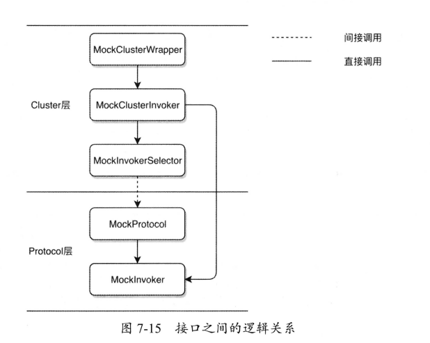

​		`MockClusterWrapper`是一个包装类，包装类会被自动注入合适的扩展点实现，它的逻辑很简单，只是把被包装扩展类作为初始化参数来创建并返回一个

`MockClusterlnvoker`。

​		`MockClusterlnvoker`和其他的`Clusterinvoker`一样，在`Invoker`方法中完成了主要逻辑。

​		`MocklnvokersSelector`是`Router`接口 的一种实现，用于过滤出`Mock`的`Invoker`。

​		`MockProtocol`根据用户传入的`URL`和类型生成一个`Mockinvoker`。

​		`Mockinvoker`实现最终的`Invoker`逻辑。


​		`MockClusterlnvoker`会处理一些`Class`级别的`Mock`逻辑，例如：选择调用哪些`Mock`类。`Mockinvoker`处理的是方法级别的`Mock`逻辑，如返回值。

​		`MockClusterlnvoker`的`invoke`方法处理了主要逻辑：

​				1、获取`Invoker`的`Mock`参数。该`Invoker`是在构造方法中传入的。如果该`Invoker`根本就没有配置`Mock`，则直接调用`Invoker`的`invoke`方法并把结

​		果返回；如果配置了`Mock`参数，则进入下一步。

​				2、判断参数是否以`force`开头，即判断是否强制`Mock`。如果是强制`Mock`，则进入`doMocklnvoke`逻辑。如果不以`force`开头，则进入失败后`Mock`的逻

​		辑。

​				3、失败后调用`doMocklnvoke`逻辑返回结果。在`try`代码块中直接调用`Invoker`的`invoke`方法，如果抛出了异常，则在`catch`代码块中调用

​		`doMocklnvoke`逻辑。


​		强制`Mock`和失败后`Mock`都会调用`doMocklnvoke`逻辑：

​				1、通过`selectMocklnvoker`获得所有`Mock`类型的`Invoker`。`selectMocklnvoker`在对象的`attachment`属性中偷偷放进一个

​		`invocation.need.mock=true`的标识。`directory`在`list`方法中列出所有`Invoker`的时候，如果检测到这个标识，则使用`MockinvokersSelector`来过滤

​		`Invoker`，而不是使用普通`route`实现，最后返回`Mock`类型的`Invoker`列表。如果一个`Mock`类型的`Invoker`都没有返回，则通过`directory`的`URL`新创建

​		一个`Mockinvoker`；如果有`Mock`类型的`Invoker`，则使用第一个。

​				2、调用`Mockinvoker`的`invoke`方法。在`try-catch`中调用`invoke`方法并返回结果。如果出现了异常，并且是业务异常，则包装成一个`RpcResult`返

​		回，否则返回`RpcException`异常。


​		`MocklnvokersSelector`是`Router`接口的其中一种实现：

​				1、判断是否需要做`Mock`过滤。如果`attachment`为空，或者没有`invocation.need.mock=true`的标识，则认为不需要做`Mock`过滤，进入步骤`2`；如果

​		找到这个标识，则进入步骤`3`。

​				2、获取非`Mock`类型的`Invoker`。遍历所有的`Invoker`，如果它们的`protocol`中都没有`Mock`参数，则整个列表直接返回。否则，把`protocol`中所有没

​		有`Mock`标识的取出来并返回。

​				3、获取`Mock`类型的`Invoker`。遍历所有的`Invoker`，如果它们的`protocol`中都没有`Mock`参数，则直接返回`null`。否则，把`protocol`中所有含有

​		`Mock`标识的取出来并返回。


​		在`Mockinvoker`的`invoke`方法中，主要处理逻辑如下：

​				1、获取`Mock`参数值。通过`URL`获取`Mock`配置的参数，如果为空则抛出异常。优先会获取方法级的`Mock`参数；如果取不到， 则尝试以`mock`为`key`获

​		取对应的参数值。

​				2、处理参数值是`return`的配置。如果只配置了一个`return`，即`mock=return`，则返回一个空的`RpcResult`；如果`return`后面还跟了别的参数，则首

​		先解析返回类型，然后结合`Mock`参数和返回类型，返回`Mock`值。现支持以下类型的参数：`Mock`参数值等于`empty`，根据返回类型返回`new xxx()`空对象；

​		如果参数值是`null、true、false`，则直接返回这些值；如果是其他字符串，则返回字符串；如果是数字`、List、Map`类型，则返回对应的`JSON`串；如果都没

​		匹配上， 则直接返回`Mock`的参数值。

​				3、处理参数值是`throw`的配置。如果`throw`后面没有字符串，则包装成一个`RpcException`异常，直接抛出；如果`throw`后面有自定义的异常类，则使

​		用自定义的异常类，并包装成一个`RpcException`异常抛出。

​				4、处理`Mock`实现类。先从缓存中取，如果有则直接返回。如果缓存中没有，则先获取接口的类型，如果`Mock`的参数配置的是`true`或`default`，则尝

​		试通过接口名`+Mock`查找`Mock`实现类，如果是其他配置方式，则通过`Mock`的参数值进行查找。


# 扩展点

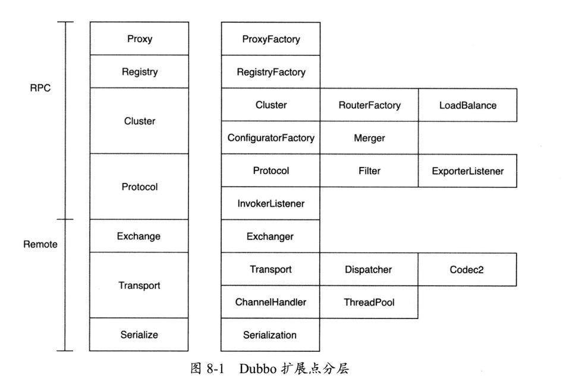

## Proxy层扩展点

​		`Proxy`层主要的扩展接口是`ProxyFactory`。远程调用的过程对开发者完全是透明的，就像本地调用一样。这正是由于`ProxyFactory`帮我们生成了代理类，当

调用某个远程接口时，实际上使用的是代理类。

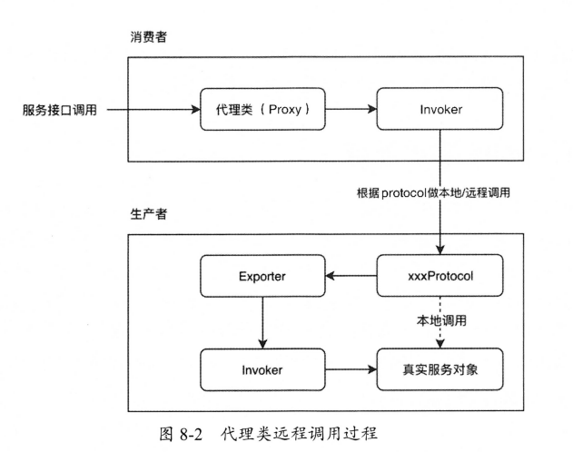

​		`Dubbo`中的`ProxyFactory`有两种默认实现：`Javassist`和`JDK`，用户可以自行扩展自己的实现，`Dubbo`选用`Javassist`作为默认字节码生成工具，主要是基

于性能和使用的简易性考虑，`Javassist`的字节码生成效率相对于其他库更快，使用也更简单。

```java
/**
	方法会根据 URL 中的 proxy 参数决定使用哪种字节码生成工具
*/
@SPI(value = "javassist", scope = FRAMEWORK)
public interface ProxyFactory {

    @Adaptive({PROXY_KEY})
    <T> T getProxy(Invoker<T> invoker) throws RpcException;

    @Adaptive({PROXY_KEY})
    <T> T getProxy(Invoker<T> invoker, boolean generic) throws RpcException; // generic参数是为了标识这个代理是否是泛化调用

    @Adaptive({PROXY_KEY})
    <T> Invoker<T> getInvoker(T proxy, Class<T> type, URL url) throws RpcException;
}
```

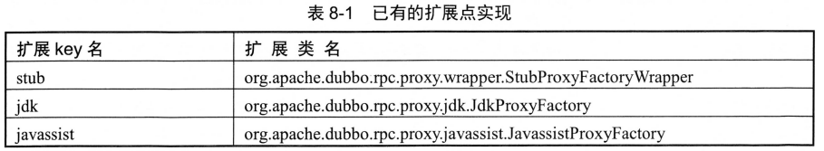

​		`stub`比较特殊，它的作用是创建一个代理类，这个类可以在发起远程调用之前在消费者本地做一些事情，比如先读缓存。它可以决定要不要调用`Proxy`。


## Registry层扩展点

​		`Registry`层可以理解为注册层，这一层中最重要的扩展点就是`org.apache.dubbo.registry.RegistryFactory`整个框架的注册与服务发现客户端都是由这个扩

展点负责创建的。该扩展点有`@Adaptive({"protocol"))`注解，可以根据`URL`中的`protocol`参数创建不同的注册中心客户端。因此，如果扩展了自定义的注册中

心，那么只需要配置不同的`Protocol`即可。

```java
@SPI(scope = APPLICATION)
public interface RegistryFactory {

    @Adaptive({"protocol"})
    Registry getRegistry(URL url);
}
```

​		使用这个扩展点，还有一些需要遵循的规则：

​				如果`URL`中设置了`check-false`，则连接不会被检查。否则，需要在断开连接时抛出异常。

​				需要支持通过`usemame:password`格式在`URL`中传递鉴权。

​				需要支持设置`backup`参数来指定备选注册集群的地址。

​				需要支持设置`file`参数来指定本地文件缓存。

​				需要支持设置`timeout`参数来指定请求的超时时间。

​				需要支持设置`session`参数来指定连接的超时或过期时间。 

​		在`Dubbo`，有`AbstractRegistryFactory`已经抽象了一些通用的逻辑，可以直接继承该抽象类实现自定义的注册中心工厂。

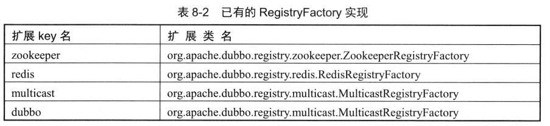


## Cluster层扩展点

​		`Cluster`层负责了整个`Dubbo`框架的集群容错，涉及的扩展点较多，包括容错`(Cluster)`、 路由`(Router)`、负载均衡`(LoadBalance)`、配置管理工厂

`(ConfiguratorFactory)`和合并器`(Merger)`。

### Cluster扩展点

​		`Cluster`主要负责一些容错的策略，也是整个集群容错的入口。当远程调用失败后，由`Cluster`负责重试、快速失败等，整个过程对上层透明。默认使用

`Failover`机制。

```java
@SPI(Cluster.DEFAULT)
public interface Cluster {

    String DEFAULT = "failover";

    @Adaptive
    <T> Invoker<T> join(Directory<T> directory, boolean buildFilterChain) throws RpcException;

    static Cluster getCluster(ScopeModel scopeModel, String name) {
        return getCluster(scopeModel, name, true);
    }

    static Cluster getCluster(ScopeModel scopeModel, String name, boolean wrap) {
        if (StringUtils.isEmpty(name)) {
            name = Cluster.DEFAULT;
        }
        return ScopeModelUtil.getApplicationModel(scopeModel).getExtensionLoader(Cluster.class).getExtension(name, wrap);
    }
}
```

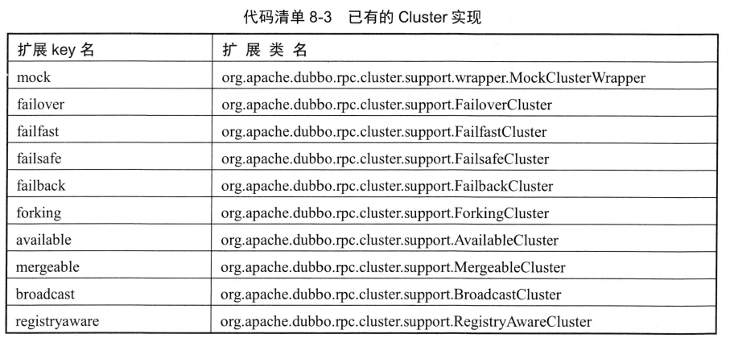


### RouterFactory扩展点

​		`RouterFactory`是一个工厂类，用于创建不同的`Router`。如果配置了路由规则`(`某个消费者只能调用某个几个服务提供者`)`，则`Router`会过滤其他服务提

供者，只留下符合路由规则的服务提供者列表。

​		现有的路由规则支持文件、脚本和自定义表达式等方式。接口上有`@Adaptive("protocol")`注解，会根据不同的`protocol`自动匹配路由规则。

```java
@SPI
public interface RouterFactory {

    @Adaptive("protocol")
    Router getRouter(URL url);
}
```

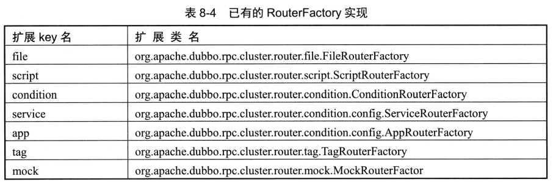


### LoadBalance扩展点

​		`LoadBalance`是`Dubbo`框架中的负载均衡策略扩展点，框架中已经内置随机`(Random)`、轮询`(RoundRobin)`、最小连接数`(LeastActive)`、

一致性`Hash(ConsistentHash)`这几种负载均 衡的方式，默认使用随机负载均衡策略。`LoadBalance`主要负责在多个节点中，根据不同的负载均衡策略选择一个合

适的节点来调用。

```java
@SPI(RandomLoadBalance.NAME)
public interface LoadBalance {

    @Adaptive("loadbalance")
    <T> Invoker<T> select(List<Invoker<T>> invokers, URL url, Invocation invocation) throws RpcException;
}
```

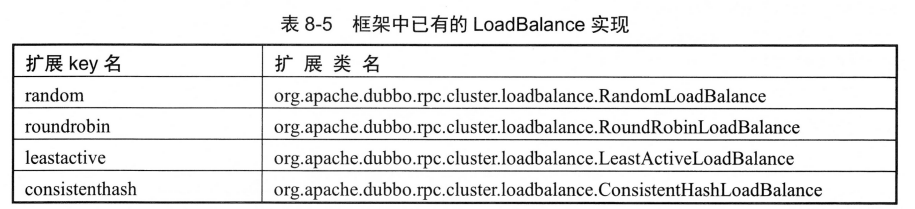


### ConfiguratorFactory扩展点

​		`ConfiguratorFactory`是创建配置实例的工厂类，现有`override`和`absent`两种工厂实现，分别会创建`OverrideConfigupato`和`AbsentConfigurator`两种配置

对象。默认的两种实现，`OverrideConfigurator`会直接把配置中心中的参数覆盖本地的参数；`AbsentConfigurator`会先看本地是否存在该配置，没有则新增本地

配置，如果己经存在则不会覆盖。

```java
@SPI
public interface ConfiguratorFactory {

    @Adaptive("protocol")
    Configurator getConfigurator(URL url);
}
```

​		该扩展点的方法上也有`@Adaptive("protocol")`注解，会根据`URL`中的`protocol`配置值使用不同的扩展点实现。

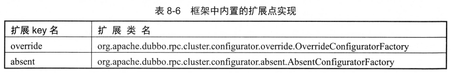


### Merger扩展点

​		`Merger`是合并器，可以对并行调用的结果集进行合并，默认已经支持`map、set、list、byte`等`11`种类型的返回值。可以基于该扩展点，添加自定义类型的

合并器。

```java
@SPI
public interface Merger<T> {

    T merge(T... items);
}
```

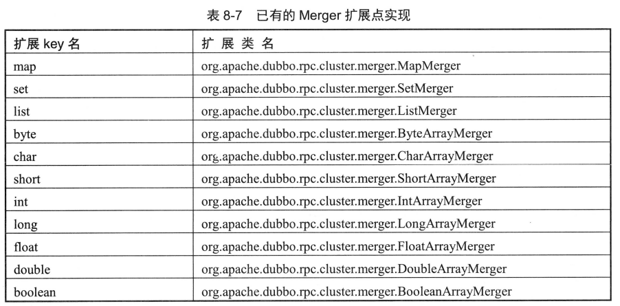


## Remote层扩展点

​		`Remote`处于整个`Dubbo`框架的底层，涉及协议、数据的交换、网络的传输、序列化、线程池等，涵盖了一个远程调用的所有要素。

​		`Remote`层是对`Dubbo`传输协议的封装，内部再划为`Transport`传输层和`Exchange`信息交换层。其中`Transport`层只负责单向消息传输，是对`Mina、Netty`等

传输工具库的抽象。而`Exchange`层在传输层之上实现了`Request-Response`语义，这样可以在不同传输方式之上都能做到统一的请求`/`响应处理。`Serialize`层是

`RPC`的一部分，决定了在消费者和服务提供者之间的二进制数据传输格式。不同的序列化库的选择会对`RPC`调用的性能产生重要影响，目前默认选择是`Hessian2`

序列化。


## Protocol层扩展点

​		`Protocol`层主要包含四大扩展点，分别是`Protocol、Filter、ExporterListener`和`InvokerListener`。

### Protocol扩展点

​		`Protocol`是`Dubbo RPC`的核心调用层，具体的`RPC`协议都可以由`Protocol`点扩展。如果想增加一种新的`RPC`协议，则只需要扩展一个新的`Protocol`扩展点

实现即可。

```java
@SPI(value = "dubbo", scope = ExtensionScope.FRAMEWORK)
public interface Protocol {

    int getDefaultPort(); // 当用户没有设置端口的时候，返回默认的端口

    @Adaptive
    <T> Exporter<T> export(Invoker<T> invoker) throws RpcException; // 把一个服务暴露成远程invocation

    @Adaptive
    <T> Invoker<T> refer(Class<T> type, URL url) throws RpcException; // 引用一个远程服务

    void destroy(); // 销毁

    default List<ProtocolServer> getServers() {
        return Collections.emptyList();
    }

}
```

​		`Protocol`的每个接口会有一些规则：

​				`export`方法：

​						1、协议收到请求后应记录请求源`IP`地址。通过`RpcContext.getContext(). setRemoteAddress()`方法存入`RPC`上下文。

​						2、`export`方法必须实现幕等，即无论调用多少次，返回的`URL`都是相同的。

​						3、`Invoker`实例由框架传入，无须关心协议层。

​				`refer`方法：

​						1、当我们调用`refer`。方法返回`Invoker`对象的`invoke()`方法时，协议也需要相应地执行`invoke()`方法。这一点在设计自定义协议的`Invoker`时

​				需要注意。

​						2、正常来说`refer`。方法返回的自定义`Invoker`需要继承`Invoker`接口。

​						3、当`URL`的参数有`check=false`时，自定义的协议实现必须不能抛出异常，而是在出现连接失败异常时尝试恢复连接。

​				`destroy`方法：

​						1、调用`destroy`方法的时候，需要销毁所有本协议暴露和引用的方法。

​						2、需要释放所有占用的资源，如连接、端口等。

​						3、自定义的协议可以在被销毁后继续导出和引用新服务。

​		整个`Protocol`的逻辑由`Protocok、Exporter、Invoker`三个接口串起来。其中`Protocol`接口是入口，其实现封装了用来处理`Exporter`和`Invoker`的方法：

​				`Exporter`代表要暴露的远程服务引用，`Protocol#export`方法是将服务暴露的处理过程，`Invoker`代表要调用的远程服务代理对象，`Protocol#refer`方

​		法通过服务类型和`URL`获得要调用的服务代理。

​				由于`Protocol`可以实现`Invoker`和`Exporter`对象的创建，因此除了作为远程调用对象的构造，还能用于其他用途，例如：可以在创建`Invoker`的时候

​		对原对象进行包装增强，添加其他`Filter`进去，`ProtocolFilterWrapper`实现就是把`Filter`链加入`Invoker`。

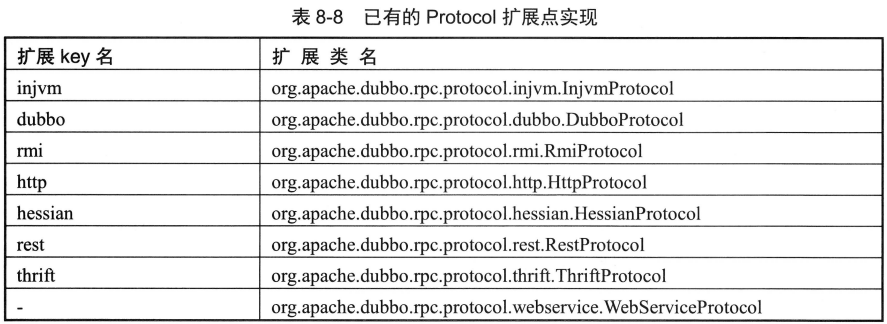

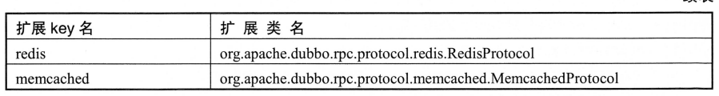


### Filter扩展点

​		`Filter`是`Dubbo`的过滤器扩展点，可以自定义过滤器，在`Invoker`调用前后执行自定义的逻辑。在`Filter`的实现中，必须要调用传入的`Invoker`的`invoke`

方法，否则整个链路就断了。

```java
@SPI(scope = ExtensionScope.MODULE)
public interface Filter extends BaseFilter {
}

public interface BaseFilter {

    Result invoke(Invoker<?> invoker, Invocation invocation) throws RpcException;

    interface Listener {

        void onResponse(Result appResponse, Invoker<?> invoker, Invocation invocation);

        void onError(Throwable t, Invoker<?> invoker, Invocation invocation);
    }
}
```


### ExporterListener/lnvokerListener扩展点

​		`ExporterListener`和`InvokerListener`这两个扩展点非常相似，`ExporterListener`是在暴露和取消暴露服务时提供回调；`InvokerListener`则是在服务的引

用与销毁引用时提供回调。

```java
@SPI(scope = ExtensionScope.FRAMEWORK)
public interface ExporterListener {

    void exported(Exporter<?> exporter) throws RpcException;

    void unexported(Exporter<?> exporter);
}

@SPI
public interface InvokerListener {

    void referred(Invoker<?> invoker) throws RpcException;

    void destroyed(Invoker<?> invoker);
}
```


## Exchange层扩展点

​		`Exchange`层只有一个扩展点接口`Exchanger`，这个接口主要是为了封装请求`/`响应模式，默认的扩展点实现是

`org.apache.dubbo.remoting.exchange.support.header.HeaderExchanger`。每个方法上都有`@Adaptive`注解，会根据`URL`中的`Exchanger`参数决定实现类。

```java
@SPI(value = HeaderExchanger.NAME, scope = ExtensionScope.FRAMEWORK)
public interface Exchanger {

    @Adaptive({Constants.EXCHANGER_KEY})
    ExchangeServer bind(URL url, ExchangeHandler handler) throws RemotingException;

    @Adaptive({Constants.EXCHANGER_KEY})
    ExchangeClient connect(URL url, ExchangeHandler handler) throws RemotingException;
}
```


## Transport层扩展点

​		`Transport`层为了屏蔽不同通信框架的异同，封装了统一的对外接口。主要的扩展点接口有`Transporter、Dispatcher、Codec2`和`ChannelHandler`。

​		其中，`ChannelHandler`主要处理连接相关的事件，例如：连接上、断开、发送消息、收到消息、出现异常等。虽然接口上有`@SPI`注解，但是在框架中实现类

的使用却是直接`new`的方式。


### Transporter扩展接口

​		`Transporter`屏蔽了通信框架接口、实现的不同，使用统一的通信接口。

```java
@SPI(value = "netty", scope = ExtensionScope.FRAMEWORK)
public interface Transporter {

    @Adaptive({Constants.SERVER_KEY, Constants.TRANSPORTER_KEY})
    RemotingServer bind(URL url, ChannelHandler handler) throws RemotingException;

    @Adaptive({Constants.CLIENT_KEY, Constants.TRANSPORTER_KEY})
    Client connect(URL url, ChannelHandler handler) throws RemotingException;
}
```

​		`bind`方法会生成一个服务，监听来自客户端的请求；`connect`方法则会连接到一个服务。 两个方法上都有`@Adaptive`注解，首先会根据`URL`中`server`的参

数值去匹配实现类，如果匹配不到则根据`transporter`参数去匹配实现类。默认的实现是`netty4`。

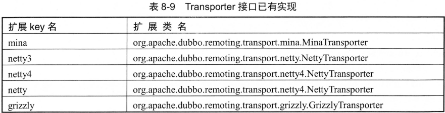


### Dispatcher扩展接口

​		如果有些逻辑的处理比较慢，则需要使用线程池。因为`I/O`速度相对`CPU`是很慢的，如果不使用线程池，则线程会因为`I/O`导致同步阻塞等待。`Dispatcher`

扩展接口通过不同的派发策略，把工作派发到不同的线程池，以此来应对不同的业务场景。

```java
@SPI(value = AllDispatcher.NAME, scope = ExtensionScope.FRAMEWORK)
public interface Dispatcher {

    @Adaptive({Constants.DISPATCHER_KEY, "dispather", "channel.handler"})
    ChannelHandler dispatch(ChannelHandler handler, URL url);
}
```

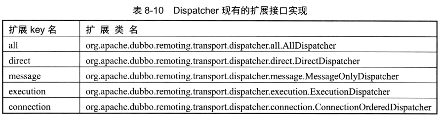


### Codec2扩展接口

​		`Codec2`主要实现对数据的编码和解码，但这个接口只是需要实现编码`/`解码过程中的通用逻辑流程，如解决半包、粘包等问题。该接口属于在序列化上封装

的一层。

```java
@SPI(scope = ExtensionScope.FRAMEWORK)
public interface Codec2 {

    @Adaptive({Constants.CODEC_KEY})
    void encode(Channel channel, ChannelBuffer buffer, Object message) throws IOException;

    @Adaptive({Constants.CODEC_KEY})
    Object decode(Channel channel, ChannelBuffer buffer) throws IOException;

    enum DecodeResult {
        NEED_MORE_INPUT, SKIP_SOME_INPUT
    }
}
```


### ThreadPool扩展接口

​		在`Transport`层由`Dispatcher`实现不同的派发策略，最终会派发到不同的`ThreadPool`中执行。`ThreadPool`扩展接口就是线程池的扩展。

```java
@SPI(value = "fixed", scope = ExtensionScope.FRAMEWORK)
public interface ThreadPool {

    @Adaptive({THREADPOOL_KEY})
    Executor getExecutor(URL url);
}
```

​		现阶段，框架中默认含有四种线程池扩展的实现：

​				`fixed`：固定大小线程池，启动时建立线程，不关闭，一直持有。对应`org.apache.dubbo.common.threadpool.support.fixed.FixedThreadPool`类。

​				`cached`：缓存线程池，空闲一分钟自动删除，需要时重建。对应`org.apache.dubbo.common.threadpool.support.cached.CachedThreadPool`类。

​				`limited`：可伸缩线程池，但池中的线程数只会增长不会收缩。只增长不收缩的目的是为了避免收缩时突然来了大流量引起的性能问题。对应

​		`org.apache.dubbo.common.threadpool.support.limited.LimitedThreadPool`类。

​				`eager`：优先创建`Worker`线程池。在任务数量大于`corePoolSize`小于`maximumPoolSize`时，优先创建`Worker`来处理任务。当任务数量大于

​		`maximumPoolSize`时，将任务放入阻塞队列。阻塞队列充满时抛出`RejectedExecutionException(cached`在任务数量超过`maximumPoolSize`时直接抛出异常而

​		不是将任务放入阻塞队列`)`。对应`org.apache.dubbo.common.threadpool.support.eager.EagerThreadPool`类。


## Serialize层扩展点

​		`Serialize`层主要实现具体的对象序列化，只有`Serialization`一个扩展接口。`Serialization`是具体的对象序列化扩展接口，即把对象序列化成可以通过网

络进行传输的二进制流。


### Serialization 扩展接口

​		`Serialization`就是具体的对象序列化：

```java
@SPI(value = "hessian2", scope = ExtensionScope.FRAMEWORK)
public interface Serialization {

    byte getContentTypeId();

    String getContentType();

    @Adaptive
    ObjectOutput serialize(URL url, OutputStream output) throws IOException;

    @Adaptive
    ObjectInput deserialize(URL url, InputStream input) throws IOException;
}
```

​		`Serialization`默认使用`Hessian2`做序列化。

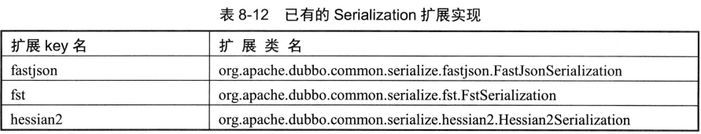

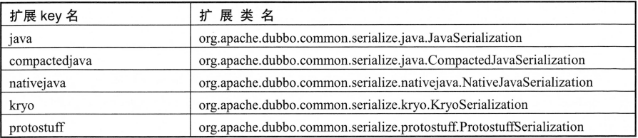

​		`compactedjava`是在`Java`原生序列化的基础上做了压缩，实现了自定义的类描写叙述符的写入和读取。在序列化的时候仅写入类名，而不是完整的类信息，

这样在对象数量很多的情况下，可以有效压缩体积。

​		`NativeJavaSerialization`是原生的`Java`序列化的实现方式。

​		`JavaSerialization`是原生`Java`序列化及压缩的封装。


## TelnetHandler扩展点

​		`Dubbo`框架支持`Telnet`命令连接，`TelnetHandler`接口就是用于扩展新的`Telnet`命令的接口。

```properties
clear=org.apache.dubbo.remoting.telnet.support.command.ClearTelnetHandler
exit=org.apache.dubbo.remoting.telnet.support.command.ExitTelnetHandler
help=org.apache.dubbo.remoting.telnet.support.command.HelpTelnetHandler
status=org.apache.dubbo.remoting.telnet.support.command.StatusTelnetHandler
log=org.apache.dubbo.remoting.telnet.support.command.LogTelnetHandler
```


## StatusChecker扩展点

​		通过这个扩展点，可以让`Dubbo`框架支持各种状态的检查，默认已经实现了内存和`load`的检查。用户可以自定义扩展，如硬盘、`CPU`等的状态检查。

```properties
memory=org.apache.dubbo.common.status.support.MemoryStatusChecker
load=org.apache.dubbo.common.status.support.LoadStatusChecker
```


## Container扩展点

​		服务容器就是为了不需要使用外部的`Tomcat、JBoss`等`Web`容器来运行服务，因为有可能服务根本用不到它们的功能，只是需要简单地在`main`方法中暴露一

个服务即可。此时就可以使用服务容器。`Dubbo`中默认使用`Spring`作为服务容器。


## CacheFactory扩展点

​		可以通过`dubbo:method`配置每个方法的调用返回值是否进行缓存，用于加速数据访问速度。

```properties
threadlocal=org.apache.dubbo.cache.support.threadlocal.ThreadLocalCacheFactory
lru=org.apache.dubbo.cache.support.lru.LruCacheFactory
jcache=org.apache.dubbo.cache.support.jcache.JCacheFactory
expiring=org.apache.dubbo.cache.support.expiring.ExpiringCacheFactory
lfu=org.apache.dubbo.cache.support.lfu.LfuCacheFactory
```

​		`Iru`：基于最近最少使用原则删除多余缓存，保持最热的数据被缓存。

​		`threadlocal`：当前线程缓存，比如一个页面渲染，用到很多`portal`，每个`portal`都要去查用户信息，通过线程缓存可以减少这种多余访问。

​		`jcache`：与`JSR107`集成，可以桥接各种缓存实现。

​		`expiring`：实现了会过期的缓存，有一个守护线程会一直检查缓存是否过期。


## Validation扩展点

​		该扩展点主要实现参数的校验，可以在配置中使用`<dubbo:service validation="校验实现名" />`实现参数的校验。己知的扩展实现有

`org.apache.dubbo.validation.support.jvalidation.JValidation`，扩展`key`为`jvalidation`。


## LoggerAdapter扩展点

​		日志适配器主要用于适配各种不同的日志框架，使其有统一的使用接口。

```properties
slf4j=org.apache.dubbo.common.logger.slf4j.Slf4jLoggerAdapter
jcl=org.apache.dubbo.common.logger.jcl.JclLoggerAdapter
log4j=org.apache.dubbo.common.logger.log4j.Log4jLoggerAdapter
jdk=org.apache.dubbo.common.logger.jdk.JdkLoggerAdapter
log4j2=org.apache.dubbo.common.logger.log4j2.Log4j2LoggerAdapter
```


## Compiler扩展点

​		`@Adaptive`注解会生成`Java`代码，然后使用编译器动态编译出新的`Class`。`Compiler`接口就是可扩展的编译器。

```properties
adaptive=org.apache.dubbo.common.compiler.support.AdaptiveCompiler
jdk=org.apache.dubbo.common.compiler.support.JdkCompiler
javassist=org.apache.dubbo.common.compiler.support.JavassistCompiler
```


# 高级特性

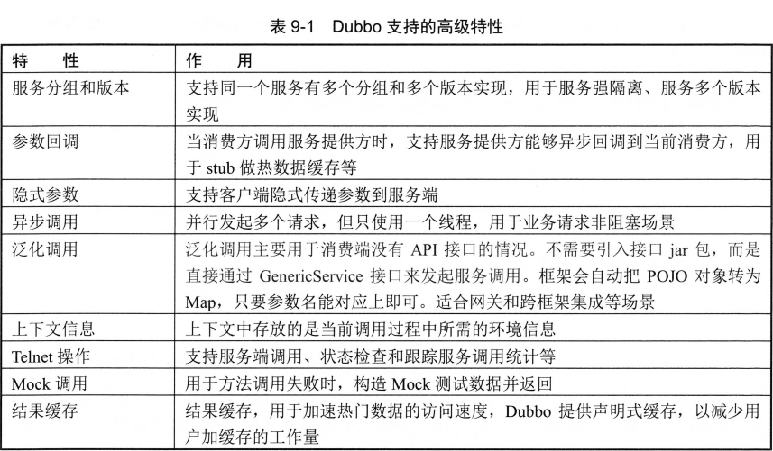

## 服务分组和版本

​		`Dubbo`中提供的服务分组和版本是强隔离的，如果服务指定了服务分组和版本，则消费方调用也必须传递相同的分组名称和版本名称。 

```java
@DubboService(version = "1.0",group = "1.0")
public class UserInfoServiceImpl implements UserInfoService {
    ...
}

public class CousmerConfig {
    @DubboReference(version = "1.0",group = "1.0")
    private UserInfoService userInfoService;
}
```

​		当服务提供方进行服务暴露时，服务端会根据`serviceGroup/serviceName:serviceversion:port`组合成`key`，然后服务实现作为`value`保存在`DubboProtocol`

类的`exporterMap`字段中。这个字段是一个`HashMap`对象，当服务消费调用时，根据消费方传递的服务分组、服务接口、版本号和服务暴露时的协议端口号重新构

造这个`key``，然后从内存`Map`中查找对应实例进行调用。 

​		当客户端指定了分组和版本时，在`Dubbolnvoker`构造函数中会将`URL`中包含的接口、分组、`Token`和`timeout`加入`attachment`，同时将接口上的版本号存储

在`version`字段。当发起`RPC`请求时，通过`DubboCodec`把这些信息发送到服务器端，服务器端收到这些关键信息后重新组装成`key`，然后查找业务实现并调用。

​		当`Dubbo`客户端启动时，实际上会把调用接口所有的协议节点都拉取下来，然后根据本地`URL`配置的接口、`category`、分组和版本做过滤，具体过滤是在注

册中心层面实现的。


## 参数回调

​		`Dubbo`支持异步参数回调，当消费方调用服务端方法时，允许服务端在某个时间点回调回客户端的方法。在服务端回调到客户端时，服务端不会重新开启

`TCP`连接，会复用已经建立的从客户端到服务端的`TCP`连接。

```xml
<beans xmlns:xsi="http://www.w3.org/2001/XMLSchema-instance"
       xmlns:dubbo="http://dubbo.apache.org/schema/dubbo"
       xmlns="http://www.springframework.org/schema/beans" xmlns:context="http://www.springframework.org/schema/context"
       xsi:schemaLocation="http://www.springframework.org/schema/beans http://www.springframework.org/schema/beans/spring-beans.xsd
       http://dubbo.apache.org/schema/dubbo http://dubbo.apache.org/schema/dubbo/dubbo.xsd http://www.springframework.org/schema/context http://www.springframework.org/schema/context/spring-context.xsd">
    <context:property-placeholder/>
    <dubbo:application name="callback-provider"/>
    <dubbo:registry address="zookeeper://${zookeeper.address:127.0.0.1}:2181"/>
    <dubbo:protocol name="dubbo" port="20880"/>
    <dubbo:provider token="true"/>
    <bean id="callbackService" class="org.apache.dubbo.samples.callback.impl.CallbackServiceImpl"/>
    <dubbo:service interface="org.apache.dubbo.samples.callback.api.CallbackService" ref="callbackService"
                   connections="1" callbacks="1000">
        <dubbo:method name="addListener">
            <dubbo:argument index="1" callback="true"/>
        </dubbo:method>
    </dubbo:service>
</beans>
```

```xml
<beans xmlns:xsi="http://www.w3.org/2001/XMLSchema-instance"
       xmlns:dubbo="http://dubbo.apache.org/schema/dubbo"
       xmlns="http://www.springframework.org/schema/beans" xmlns:context="http://www.springframework.org/schema/context"
       xsi:schemaLocation="http://www.springframework.org/schema/beans http://www.springframework.org/schema/beans/spring-beans.xsd
       http://dubbo.apache.org/schema/dubbo http://dubbo.apache.org/schema/dubbo/dubbo.xsd http://www.springframework.org/schema/context http://www.springframework.org/schema/context/spring-context.xsd">
    <context:property-placeholder/>
    <dubbo:application name="callback-consumer"/>
    <dubbo:registry address="zookeeper://${zookeeper.address:127.0.0.1}:2181"/>
    <dubbo:reference id="callbackService" interface="org.apache.dubbo.samples.callback.api.CallbackService"/>
</beans>
```

```java
public class CallbackServiceImpl implements CallbackService {
    private final Map<String, CallbackListener> listeners = new ConcurrentHashMap<String, CallbackListener>();

    public CallbackServiceImpl() {
        Thread t = new Thread(() -> {
            while (true) {
                try {
                    for (Map.Entry<String, CallbackListener> entry : listeners.entrySet()) {
                        try {
                            entry.getValue().changed(getChanged(entry.getKey()));
                        } catch (Throwable t1) {
                            listeners.remove(entry.getKey());
                        }
                    }
                    Thread.sleep(5000); // timely trigger change event
                } catch (Throwable t1) {
                    t1.printStackTrace();
                }
            }
        });
        t.setDaemon(true);
        t.start();
    }

    @Override
    public void addListener(String key, CallbackListener listener) {
        listeners.put(key, listener);
        listener.changed(getChanged(key)); // send notification for change
    }

    private String getChanged(String key) {
        return "Changed: " + new SimpleDateFormat("yyyy-MM-dd HH:mm:ss").format(new Date());
    }
}
```

```java
public class CallbackConsumer {

    public static void main(String[] args) throws Exception {
        ClassPathXmlApplicationContext context = new ClassPathXmlApplicationContext("spring/callback-consumer.xml");
        context.start();
        CallbackService callbackService = context.getBean("callbackService", CallbackService.class);
        callbackService.addListener("foo.bar", msg -> System.out.println("callback:" + msg));
    }

}
```

​		服务提供方要想实现回调，就需要指定回调方法参数是否为回调，对于客户端消费方来说没有任何区别

​		客户端在启动时，会拉取服务`Callbackservice`元数据， 因为服务端配置了异步回调信息，这些信息会透传给客户端。客户端在编码请求时，会发现第`2`个

方法参数为回调对象。此时，客户端会暴露一个`Dubbo`协议的服务，服务暴露的端口号是本地`TCP`连接自动生成的端口。在客户端暴露服务时，会将客户端回调参

数对象内存`id`存储在`attachment`中，对应的`key`为`sys_callback_arg-`回调参数索引。这个`key`在调用普通服务`addListener`时会传递给服务端，服务端回调客

户端时，会把这个`key`对应的值再次放到`attachment`中传给客户端。从服务端回调到客户端的`attachment`会用`keycallback.service.instid`保存回调参数实例

`id`，用于查找客户端暴露的服务。

​		客户端调用服务端方法时，并不会把第`2`个异步参数实例序列化并传给服务端。当服务端解码时，会先检查参数是不是异步回调参数。如果发现是异步参数

回调，那么在服务端解码参数值时，会自动创建到消费方的代理。服务端创建回调代理实例`Invoker`类型是`ChannelWrappedlnvoker`，比较特殊的是，构造函数的

`service`值是客户端暴露对象`id`，当回调发生时，会把`keycallback.service.instid`保存的对象`id`传给客户端，这样就能正确地找到客户端暴露的服务了。


## 隐式参数

​		`Dubbo`服务提供者或消费者启动时，配置元数据会生成`URL`, 一般是不可变的。在很多实际的使用场景中，在服务运行期需要动态改变属性值。`Dubbo`框架支

持消费方在`RpcContext#setAttachment`方法中设置隐式参数，在服务端`RpcContext#getAttachment`方法中获取隐式传递。

​		当客户端发起调用前，设置隐藏参数，框架会在拦截器中把当前线程隐藏参数传递到`Rpclnvocation`的`attachment`中，服务端在拦截器中提取隐藏参数并设

置到当前线程`RpcContext`中。

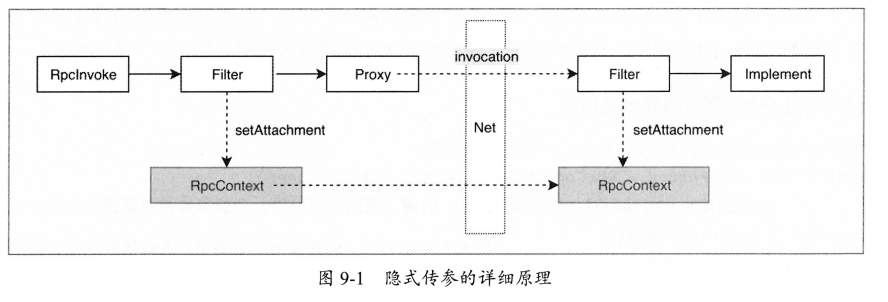

​		在消费方调用服务方传递隐式参数时，会在`Abstractlnvoker#invoke`方法调用中合并`RpcContext#getAttachments()`参数。用户的隐式参数会被合并到

`Rpclnvocation`中的`attachment`字段，这个字段发送给服务端。在服务提供方收到请求时，在`ContextFilter#invoke`中提取`Rpclnvocation`中的`attachment`信

息，并设置到当前线程上下文中。因为后端业务方法调用和拦截器在同一个线程中执行，所以直接使用`RpcContext.getContext().getAttachment`获取值即可。


## 异步调用

​		在客户端实现异步调用非常简单，在消费接口时配置异步标识，在调用时从上下文中获取`Future`对象，在期望结果返回时再调用阻塞方法`Future.get()`即

可。

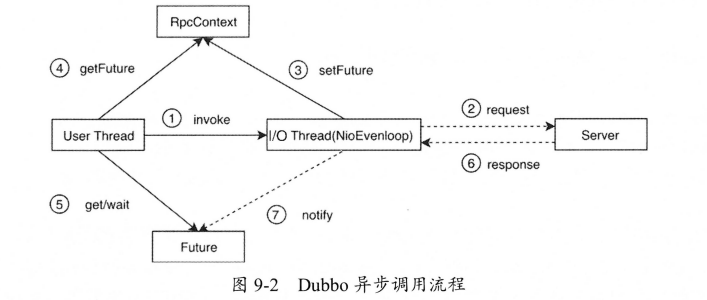


## 泛化调用

​		`Dubbo`泛化调用特性可以在不依赖服务接口`API`包的场景中发起远程调用。这种特性特别适合框架集成和网关类应用开发。`Dubbo`在客户端发起泛化调用并

不要求服务端是泛化暴露。

​		服务端在处理服务调用时，在`GenericFilter`拦截器中先把`Rpclnvocation`中传递过来的参数类型和参数值提取出来，然后根据传递过来的接口名、 方法名

和参数类型查找服务端被调用的方法。获取真实方法后，主要提取真实方法参数类型`(`可能包含泛化类型`)`，然后将参数值做`Java`类型转换。最后用解析后的参

数值构造新的`Rpclnvocation`对象发起调用。


## 上下文信息

​		`Dubbo`上下文信息的获取和存储同样是基于`JDK`的`ThreadLocal`实现的。上下文中存放的是当前调用过程中所需的环境信息。`RpcContext`是一个

`ThreadLocal`的临时状态记录器，当收到或发送`RPC`时，当前线程关联的`RpcContext`状态都会变化。

​		在客户端和服务端分别有一个拦截设置当前上下文信息，对应的分别为`ConsumerContextFilter`和`ContextFilter`。在客户端拦截器实现中，因为`Invoker`包

含远程服务信息，因此直接设置远程`IP`等信息。在服务端拦截器中主要设置本地地址，这个时候无法获取远程调用地址。设置远程地址主要在

`DubboProtocol#ExchangeHandlerAdapter.reply`方法中完成，可以直接通过`channel.getRemoteAddress`方法获取。


## Telnet操作

​		`Dubbo`支持通过`Telnet`登录进行简单的运维。

​		`ls`主要提供了查询已经暴露的服务列表、查询服务详细信息和查询指定服务接口信息等功能。实现主要基于`ListTelnetHandler`，`Dubbo`框架的`Telnet`调用

只对`Dubbo`协议提供支持。它的原理非常简单，当服务端收到`ls`命令和参数时，会加载`ListTelnetHandler`并执行， 然后触发

`DubboProtocol.getDubboProtocol().getExporters()`方法获取所有已经暴露的服务， 获取暴露的接口名和暴露服务别名`(path`属性`)`进行匹配，将匹配的结果进

行输出。如果是查看服务暴露的方法，则框架会获取暴露接口名，然后反射获取所有方法并输出。


​		`ps`命令用于查看提供服务本地端口的连接情况。实现类对应`PortTelnetHandler`类，当`Dubbo`服务暴露时，会把关联端口的服务端实例加入`DubboProtocol`

类的`serverMap`字段。当执行`ps`命令时，`PortTelnetHandler`类会通过`DubboProtocol.getDubboProtocol().getServers()`提取暴露的`server`实例。它持有了端口

号和所有客户端连接信息等。当无法确认命令对应的后端实现时，可以查找和扩展点名称相同的文件, 它包含扩展点所有的实现定义。


​		`trace`用于统计服务方法的调用信息。对应的实现类是`TraceTelnetHandler`，它本身不会执行任何方法调用，首先根据传递的接口和方法查找对应的

`Invoker`，然后把当前的`Telnet`连接`(Channel`、接口、方法和最大执行次数信息记录在`TraceFilter`中，当接口方法被调用时，`TraceFilter`会取出对应的

`Telnet`连接`(Channel)`，并把调用结果信息发送的`Telnet`客户端。


​		`count`命令也用于统计服务信息，但它主要统计方法调用成功数、失败数、正在并发执行数、平均耗时和最大耗时。如果在服务方暴露服务时配置了

`executes`属性，那么使用`count`命令可以统计并发调用信息。对应的实现类是`CountTelnetHandler`，每次执行`count`命令时在服务端会启动一个线程去循环统计

当前调用次数。框架会使用`RpcStatus`类记录并发调用信息，`CountTelnetHandler`负责提取这些统计信息并输出给`Telnet`客户端。


## Mock调用

​		`Dubbo`提供服务容错的能力，通常用于服务降级。

​		当`Dubbo`服务提供者调用抛出`RpcException`时，框架会降级到本地`Mock`伪装。当直接指定`mock=true`时， 客户端启动时会查找`Mock`类。查找规则根据接口

名加`Mock`后缀组合成新的实现类，当然也可以使用自己的`Mock`实现类指定给`mock`属性。

​		当在`Mock`中指定`return null`时,允许调用失败返回空值。

​		当在`Mock`中指定`throw`或`throw`自定义异常类时，分别会抛出即`RpcException`和用户自定义异常。目前默认场景都是在没有服务提供者或调用失败时，触发

`Mock`调用，如果不想发起`RPC`调用直接使用`Mock`数据，则需要在配置中指定`force:`语法。

​		处理`Mock`伪装对应的实现类是`MockClusterlnvoker`，因为`MockClusterWrapper`是对扩展点`Cluster`的包装，当框架在加载`Cluster`扩展点时会自动使用

`MockClusterWrapper`类对`Cluster`实例进行包装`(`默认是`FailoverCluster)`。

```java
	public Result invoke(Invocation invocation) throws RpcException {
        Result result;

        String value = getUrl().getMethodParameter(invocation.getMethodName(), MOCK_KEY, Boolean.FALSE.toString()).trim();
        if (value.length() == 0 || "false".equalsIgnoreCase(value)) {
            //no mock
            result = this.invoker.invoke(invocation); // 如果没有指定Mock,则不需要本地伪装

        } else if (value.startsWith(FORCE_KEY)) {
            if (logger.isWarnEnabled()) {
                logger.warn("force-mock: " + invocation.getMethodName() + " force-mock enabled , url : " + getUrl());
            }
            //force:direct mock
            result = doMockInvoke(invocation, null); // 指定了 force,不发起 RPC 调用，直接本地伪装
        } else {
            //fail-mock
            try {
                result = this.invoker.invoke(invocation); // 配置了 Mock,先发起 RPC 调用

                //fix:#4585
                if(result.getException() != null && result.getException() instanceof RpcException){
                    RpcException rpcException= (RpcException)result.getException();
                    if(rpcException.isBiz()){
                        throw  rpcException;
                    }else {
                        result = doMockInvoke(invocation, rpcException); 
                    }
                }

            } catch (RpcException e) {
                if (e.isBiz()) {
                    throw e;
                }

                if (logger.isWarnEnabled()) {
                    logger.warn("fail-mock: " + invocation.getMethodName() + " fail-mock enabled , url : " + getUrl(), e);
                }
                result = doMockInvoke(invocation, e); // 调用报错，降级 Mock 伪装
            }
        }
        return result;
    }
```


## 结果缓存

​		`Dubbo`框架提供了对服务调用结果进行缓存的特性，用于加速热门数据的访问速度，`Dubbo`提供声明式缓存，以减少用户加缓存的工作量。因为每次调用都

会使用`JSON.toJSONString`方法将请求参数转换成字符串，然后拼装唯一的`key`，用于缓存唯一键。如果不能接受缓存造成的开销，则谨慎使用这个特性。 

​		`lru`缓存策略是框架默认使用的。它的原理比较简单，缓存对应实现类是`LRUCache`。缓存实现类`LRUCache`继承了`JDK`的`LinkedHashMap`类， 

`LinkedHashMap`是基于链表的实现，它提供了钩子方法`removeEldestEntry`，它的返回值用于判断每次向集合中添加元素时是否应该删除最少访问的元素。

`LRUCache`重写了这个方法，当缓存值达到`1000`时，这个方法会返回`true`，链表会把头部节点移除。链表每次添加数据时都会在队列尾部添加，因此队列头部就

是最少访问的数据`(LinkedHashMap`在更新数据时，会把更新数据更新到列表尾部`)`。


# Hello World(注解开发)

​		服务端：

```java
public interface HelloService {
    String sayHello();
}

// 配置服务,可以配置 methods 属性控制多个方法的超时时间，重试次数等信息
@DubboService
public class AnnotationHelloServiceImpl implements HelloService {
    @Override
    public String sayHello() {
        System.out.println("Hello World");
        return "Annotation, hello " + name;
    }
}
```

```java
@Configuration
@EnableDubbo(scanBasePackages = "org.apache.dubbo.samples.annotation.impl") // 配置扫描服务的包
@PropertySource("classpath:/spring/dubbo-provider.properties")
public class ProviderConfiguration {
    @Bean
    public ProviderConfig providerConfig() {
        ProviderConfig providerConfig = new ProviderConfig();
        providerConfig.setTimeout(1000); // 设置全局服务的超时时间
        return providerConfig;
    }
}
```

```properties
# dubbo-provider.properties
dubbo.application.name=samples-annotation-provider
dubbo.registry.address=zookeeper://${zookeeper.address:127.0.0.1}:2181
dubbo.protocol.name=dubbo
dubbo.protocol.port=20880
dubbo.provider.token=true
```

```java
public static void main(String[] args) throws Exception {
        AnnotationConfigApplicationContext context = new AnnotationConfigApplicationContext(ProviderConfiguration.class); // Spring加载IOC
        context.start();

        System.out.println("dubbo service started.");
        new CountDownLatch(1).await();
    }
```


​		消费端：

```java
@Component("annotationAction")
public class AnnotationAction {

    // 配置调用的远程服务，同样可以配置 methods 属性，这里配置的信息会覆盖服务器配置的信息
    @DubboReference(interfaceClass = HelloService.class, version = AnnotationConstants.VERSION)
    private HelloService helloService;

    public String doSayHello() {
        try {
            return helloService.sayHello();
        } catch (Exception e) {
            e.printStackTrace();
            return "Throw Exception";
        }
    }
}
```

```java
@Configuration
@EnableDubbo(scanBasePackages = "org.apache.dubbo.samples.annotation.action") // 配置扫描服务的包
@PropertySource("classpath:/spring/dubbo-consumer.properties")
@ComponentScan(value = {"org.apache.dubbo.samples.annotation.action"}) // Spring 扫描 Bean 的路径
public class ConsumerConfiguration {

}
```

```properties
# dubbo-consumer.properties
dubbo.application.name=samples-annotation-consumer
dubbo.registry.address=zookeeper://${zookeeper.address:127.0.0.1}:2181
dubbo.application.qosEnable=true
dubbo.application.qosPort=33333
dubbo.application.qosAcceptForeignIp=false
```

```java
public static void main(String[] args) {
        AnnotationConfigApplicationContext context = new AnnotationConfigApplicationContext(ConsumerConfiguration.class);
        context.start();
        final AnnotationAction annotationAction = (AnnotationAction) context.getBean("annotationAction");
		System.out.println("hello : " + annotationAction.doSayHello());
}
```


# API开发

​		服务端：

```java
public interface GreetingsService {
    String sayHi(String name);
}
public class GreetingsServiceImpl implements GreetingsService {
    @Override
    public String sayHi(String name) {
        return "hi, " + name;
    }
}
```

```java
public class Application {
    private static String zookeeperHost = System
            .getProperty("zookeeper.address", "127.0.0.1");
    private static String zookeeperPort = System.getProperty("zookeeper.port",
            "2181");

    public static void main(String[] args) throws Exception {
        ServiceConfig<GreetingsService> service = new ServiceConfig<>();
        service.setApplication(new ApplicationConfig("first-dubbo-provider"));
        service.setRegistry(new RegistryConfig(
                "zookeeper://" + zookeeperHost + ":" + zookeeperPort)); // 设置注册中心
        service.setInterface(GreetingsService.class);
        service.setRef(new GreetingsServiceImpl()); // 服务实例
        service.export();

        System.out.println("dubbo service started");
        new CountDownLatch(1).await();
    }
}
```

​		消费端：

```java
public class Application {
    private static String zookeeperHost = System
            .getProperty("zookeeper.address", "127.0.0.1");
    private static String zookeeperPort = System.getProperty("zookeeper.port",
            "2181");

    public static void main(String[] args) {
        ReferenceConfig<GreetingsService> reference = new ReferenceConfig<>();
        reference.setApplication(new ApplicationConfig("first-dubbo-consumer"));
        reference.setRegistry(new RegistryConfig(
                "zookeeper://" + zookeeperHost + ":" + zookeeperPort));
        reference.setInterface(GreetingsService.class);
        GreetingsService service = reference.get(); // 获取服务实例
        String message = service.sayHi("dubbo"); // 调用远程服务
        System.out.println(message);
    }
}
```


# 获取消费端参数

​		服务端：

```java
public interface ShowParamter {
    void show();
}

@DubboService
public class ShowParamterImpl implements ShowParamter
{
    @Override
    public void show() {
        
        /**
        服务端：
        RpcContext.getContext()，RpcContext.getServiceContext()，RpcContext.getServerAttachment() 可以通过这几种方式获取到消费端传递的参数
        RpcContext.getServerContext()，RpcContext.getClientAttachment() 不能获取到消费端传递的参数
        */
        
        RpcContext context = RpcContext.getContext();

        System.out.println(context.getLocalAddress());

        Map<String, String> attachments = context.getAttachments();
        for(Map.Entry<String,String> temp : attachments.entrySet())
        {
            System.out.println("key:" + temp.getKey() + " value:" + temp.getValue());
        }
    }
}
```

```java
@Configuration
@EnableDubbo(scanBasePackages = "com.shanji.over.impl")
public class ServerConfig {

    @Bean
    public ApplicationConfig applicationConfig(){
        ApplicationConfig applicationConfig = new ApplicationConfig();
        applicationConfig.setName("dubbo-server-annotation");
        return applicationConfig;
    }

    @Bean
    public ProviderConfig providerConfig() {
        ProviderConfig providerConfig = new ProviderConfig();
        providerConfig.setTimeout(1000); // 设置全局服务的超时时间
        return providerConfig;
    }

    @Bean
    public RegistryConfig registryConfig()
    {
        RegistryConfig registryConfig = new RegistryConfig();
        registryConfig.setAddress("zookeeper://127.0.0.1:2181");
        return registryConfig;
    }

}
```

```java
public class Server
{
    public static void main(String[] args) throws Exception {
        AnnotationConfigApplicationContext context = new AnnotationConfigApplicationContext(ServerConfig.class);
        context.start();

        System.out.println("dubbo service started.");
        new CountDownLatch(1).await();
    }
}
```

​		消费端：

```java
@Component
public class ShowAction
{
    @DubboReference(interfaceClass = ShowParamter.class)
    private ShowParamter showParamter;

    public void show()
    {
        showParamter.show();
    }
}
```

```java
@Configuration
@ComponentScan("com.shanji.over.action")
@EnableDubbo(scanBasePackages = "com.shanji.over.action") // 这个注解别忘
public class ClientConfig {

    @Bean
    public ApplicationConfig applicationConfig(){
        ApplicationConfig applicationConfig = new ApplicationConfig();
        applicationConfig.setName("dubbo-client-annotation");
        applicationConfig.setQosEnable(true);
        applicationConfig.setQosPort(33333);
        applicationConfig.setQosAcceptForeignIpCompatible(false);
        return applicationConfig;
    }

    @Bean
    public RegistryConfig registryConfig()
    {
        RegistryConfig registryConfig = new RegistryConfig();
        registryConfig.setAddress("zookeeper://127.0.0.1:2181");
        registryConfig.setPort(2181);
        return registryConfig;
    }

}
```

```java
public class Client
{
    public static void main(String[] args) {
        AnnotationConfigApplicationContext context = new AnnotationConfigApplicationContext(ClientConfig.class);
        context.start();


        /**
        客户端：
        RpcContext.getContext(),RpcContext.getServiceContext(),RpcContext.getClientAttachment() 使用这三种方式获取的 context 都可以传递参数，并且参数只在当次调用有效，下一次调用将清空
        RpcContext.getServerContext() 这种方式获取的 context 不能传递参数
        RpcContext.getServerAttachment() 这种方式获取的 context 传递的参数将在多次调用中都有效
        */
	   RpcContext.getContext().setAttachment("index","1"); 
        
        
        
        ShowAction showAction = context.getBean("showAction", ShowAction.class);
        showAction.show();

    }
}
```


# 自动注入（结合Spring）

```java
@Configuration
@ComponentScan("com.shanji.over.action")
@EnableDubbo(scanBasePackages = "com.shanji.over.action")
public class ClientConfig {

    @DubboReference(interfaceClass = ShowParamter.class)
    private ShowParamter showParamter; // 通过在这里获取远程服务接口，并注入 Spring

    @Bean
    public ApplicationConfig applicationConfig(){
        ApplicationConfig applicationConfig = new ApplicationConfig();
        applicationConfig.setName("dubbo-client-annotation");
        applicationConfig.setQosEnable(true);
        applicationConfig.setQosPort(33333);
        applicationConfig.setQosAcceptForeignIpCompatible(false);
        return applicationConfig;
    }

    @Bean
    public RegistryConfig registryConfig()
    {
        RegistryConfig registryConfig = new RegistryConfig();
        registryConfig.setAddress("zookeeper://127.0.0.1:2181");
        registryConfig.setPort(2181);
        return registryConfig;
    }

}
```

```java
@Component
public class ShowAction
{
    @Autowired
    private ShowParamter showParamter; // 在这里使用 Spring 的依赖注入

    public void show()
    {
        showParamter.show();
    }
}
```

​		在消费端配置时，获取到远程服务接口并注入`Spring`的`IOC`容器中，此后在消费端的任何地方都可以通过`Spring`的依赖注入，来引用这个远程服务接口。


# 集成Mybatis

​		服务端：

```java
@SpringBootApplication
@MapperScan("com.shanji.over.mapper")
@ComponentScan("com.shanji.over.config")
public class SpiExamplesApplication {
    public static void main(String[] args) {
        SpringApplication.run(SpiExamplesApplication.class, args);
    }

}
```

```java
@Configuration
public class DBConfig{
    @Bean
    public DataSource dataSource()
    {
        DruidDataSource dataSource = new DruidDataSource();
        dataSource.setUrl("jdbc:mysql://127.0.0.1:3306/xiaoshanshan?useSSL=false&useUnicode=true&characterEncoding=utf-8&zeroDateTimeBehavior=convertToNull&autoReconnect=true");
        dataSource.setDriverClassName("com.mysql.cj.jdbc.Driver");
        dataSource.setUsername("root");
        dataSource.setPassword("");
        return dataSource;
    }
}
```

```java
@Configuration
@EnableDubbo(scanBasePackages = "com.shanji.over.impl")
public class ProviderCofig{
    @Bean
    public ApplicationConfig applicationConfig(){
        ApplicationConfig applicationConfig = new ApplicationConfig();
        applicationConfig.setName("mybatis-provider");
        return applicationConfig;
    }

    @Bean
    public ProtocolConfig protocolConfig(){
        ProtocolConfig protocolConfig = new ProtocolConfig();
        protocolConfig.setName("dubbo");
        protocolConfig.setPort(20880);
        return protocolConfig;
    }

    @Bean
    public RegistryConfig registryConfig(){
        RegistryConfig registryConfig = new RegistryConfig();
        registryConfig.setAddress("zookeeper://127.0.0.1:2181");
        return registryConfig;
    }

    @Bean
    public ProviderConfig providerConfig(){
        ProviderConfig providerConfig = new ProviderConfig();
        providerConfig.setToken(true);
        return providerConfig;
    }
}
```

```java
public interface UserInfoService {
    public User selectByid(long id);
}
@Service
@DubboService
public class UserInfoServiceImpl implements UserInfoService {

    @Autowired
    private UserInfoMapper userInfoMapper;

    @Override
    public User selectByid(long id) {
        return userInfoMapper.selectById(id);
    }
}
```

```xml
<!DOCTYPE mapper PUBLIC "-//mybatis.org//DTD Mapper 3.0//EN" "http://mybatis.org/dtd/mybatis-3-mapper.dtd" >
<mapper namespace="com.shanji.over.mapper.UserInfoMapper">

    <resultMap id="BASE_RESULT" type="com.shanji.over.entity.User">
        <id column="id" property="id"/>
        <result column="name" property="name"/>
    </resultMap>

    <select id="findByUserId" resultMap="BASE_RESULT">
        SELECT id, name
        FROM user
        where id = #{userId}
    </select>
</mapper>
```


​		消费端：

```java
@Component
public class UserAction {

    @Autowired
    private UserInfoService userInfoService;

    public User getUser(){
        return userInfoService.selectByid(1);
    }
}
```

```java
@EnableDubbo
@Configuration
@ComponentScan("com.shanji.over.action")
public class CousmerConfig {

    @DubboReference
    private UserInfoService userInfoService;

    @Bean
    public ApplicationConfig applicationConfig(){
        ApplicationConfig applicationConfig = new ApplicationConfig();
        applicationConfig.setName("mybatis-consumer");
        return applicationConfig;
    }

    @Bean
    public RegistryConfig registryConfig(){
        RegistryConfig registryConfig = new RegistryConfig();
        registryConfig.setAddress("zookeeper://121.5.30.71:2181");
        return registryConfig;
    }
}
```

```java
public class MainController {
    public static void main(String[] args) {
        AnnotationConfigApplicationContext context = new AnnotationConfigApplicationContext(CousmerConfig.class);
        context.start();

        UserAction action = context.getBean("userAction", UserAction.class);
        System.out.println(action.getUser());
    }
}
```

​	
